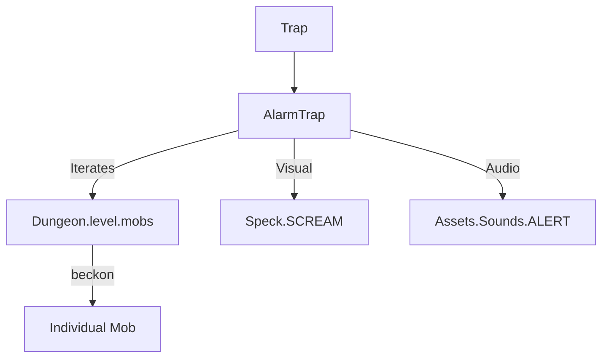

# AlarmTrap (警报陷阱) 源码详解

## 1. 基本信息

| 属性 | 值 |
|------|-----|
| **文件路径** | `core/src/main/java/com/shatteredpixel/shatteredpixeldungeon/levels/traps/AlarmTrap.java` |
| **包名** | `com.shatteredpixel.shatteredpixeldungeon.levels.traps` |
| **文件类型** | class |
| **继承关系** | `extends Trap` |
| **代码行数** | 42 |
| **所属模块** | core |

## 2. 文件职责说明

### 核心职责
`AlarmTrap` 负责实现“警报陷阱”的逻辑。当它被触发时，会发出一声传遍全层的尖叫，并吸引当前关卡内的所有怪物向陷阱位置靠拢。

### 系统定位
属于陷阱系统中的信息/引诱分支。它不直接造成物理伤害，但通过改变全关卡怪物的分布和行为模式来制造巨大的潜在威胁。

### 不负责什么
- 不负责计算怪物的寻路路径（由 `Mob.beckon()` 内部调用寻路算法）。
- 不负责怪物的视野判定。

## 3. 结构总览

### 主要成员概览
- **activate() 方法**: 包含全层怪物广播、日志输出、音效播放和粒子特效逻辑。

### 主要逻辑块概览
- **全层召集 (Global Beckon)**: 遍历关卡内的 `mobs` 列表，强制对每一个怪物执行 `beckon(pos)` 操作。
- **视觉反馈**: 在英雄视野内时，产生“尖叫”粒子效果。
- **听觉反馈**: 播放全层通用的警报音效。

### 生命周期/调用时机
1. **触发**：角色踩踏。
2. **激活 (`activate`)**:
   - 播放警报声。
   - 所有怪物被吸引。
   - 动画效果播放。

## 4. 继承与协作关系

### 父类提供的能力
继承自 `Trap`：
- 提供 `pos` 存储和 `trigger` 流程。
- 定义外观为 `RED`（红色）和 `DOTS`（点状）。

### 协作对象
- **Mob**: 接收 `beckon` 指令的核心实体。
- **Dungeon.level.mobs**: 提供关卡内所有活跃怪物的索引。
- **Speck.SCREAM**: 提供表示尖叫声波的粒子特效。
- **Sample**: 播放 `ALERT` 音效。



## 5. 字段/常量详解

### 初始属性
- **color**: RED（红色，代表警戒）。
- **shape**: DOTS（点状）。

## 6. 构造与初始化机制
通过实例初始化块设置外观。该类逻辑极其精简，完全通过 `activate` 的单次调用实现效果。

## 7. 方法详解

### activate() [全层吸引逻辑]

**核心实现算法分析**：
1. **全员广播**：
   ```java
   for (Mob mob : Dungeon.level.mobs) {
       mob.beckon( pos );
   }
   ```
   **分析**：这是该陷阱最强大的地方。它没有距离限制，不论怪物离陷阱多远，只要它在 `mobs` 列表中且具备寻路能力，都会被强制移动向陷阱位置。
2. **条件视觉反馈**：
   只有当英雄在 FOV 内时，才会向日志发送警告并在陷阱中心产生 `Speck.SCREAM` 粒子。这种设计节省了视线外的渲染开销。
3. **强制音效**：播放 `Assets.Sounds.ALERT`。

## 8. 对外暴露能力
主要通过 `activate()` 接口。

## 9. 运行机制与调用链
`Trap.trigger()` -> `AlarmTrap.activate()` -> 遍历 `mobs` -> `Mob.beckon()` -> 怪物 AI 路径更新。

## 10. 资源、配置与国际化关联

### 本地化词条
- `traps.AlarmTrap.name`: 警报陷阱
- `traps.AlarmTrap.alarm`: “一连串刺耳的尖叫声在地牢中回荡！”

## 11. 使用示例

### 战术反用：调虎离山
如果玩家发现了一个装满怪物的房间（如怪物房），可以故意触发附近的警报陷阱并迅速躲入暗处。怪物们会倾巢而出前往陷阱点，此时玩家可以乘虚而入。

## 12. 开发注意事项

### 怪物的反应
`beckon` 方法通常会让怪物进入“调查（Investigating）”状态。如果怪物在途中发现了玩家，它会转为“狩猎（Hunting）”状态。

### 走廊干扰
虽然源码中未显式设置 `avoidsHallways`，但警报陷阱在狭窄走廊触发的效果通常比开阔房间更具压迫感，因为它会把前后的怪物都引向同一个瓶颈点。

## 13. 修改建议与扩展点

### 改进吸引范围
可以增加判断，使警报陷阱只吸引一定半径（如 10 格）内的怪物，而不是全层召集，以降低前期难度。

## 14. 事实核查清单

- [x] 是否分析了影响范围：是（全层，Dungeon.level.mobs）。
- [x] 是否说明了对怪物的具体影响：是 (beckon)。
- [x] 是否解析了 FOV 对特效的影响：是。
- [x] 图像索引属性是否核对：是 (RED, DOTS)。
- [x] 示例战术是否符合逻辑：是。
