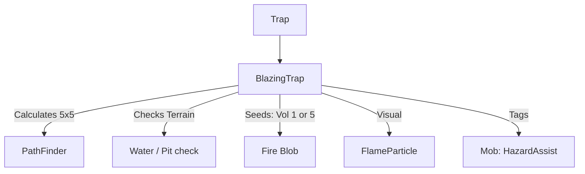

# BlazingTrap (烈焰陷阱) 源码详解

## 1. 基本信息

| 属性 | 值 |
|------|-----|
| **文件路径** | `core/src/main/java/com/shatteredpixel/shatteredpixeldungeon/levels/traps/BlazingTrap.java` |
| **包名** | `com.shatteredpixel.shatteredpixeldungeon.levels.traps` |
| **文件类型** | class |
| **继承关系** | `extends Trap` |
| **代码行数** | 48 |
| **所属模块** | core |

## 2. 文件职责说明

### 核心职责
`BlazingTrap` 负责实现“烈焰陷阱”的逻辑。当它被触发时，会立即在周围 5x5 的范围内引发剧烈燃烧（Fire Blob），造成广域的火焰伤害并点燃所有可燃地形。

### 系统定位
属于陷阱系统中的元素伤害/广域分支。它是燃烧陷阱（BurningTrap）的高阶版本，具有更大的影响半径和更强的初始火力。

### 不负责什么
- 不负责火焰伤害的具体结算（由 `Fire` 类负责）。
- 不负责由于燃烧产生的烟雾效果。

## 3. 结构总览

### 主要成员概览
- **activate() 方法**: 包含 5x5 范围路径计算、地形敏感的火焰种子铺设、视觉/音效反馈以及怪物信用标记逻辑。

### 主要逻辑块概览
- **广域引燃**: 使用 `PathFinder.buildDistanceMap` 计算 5x5 范围（曼哈顿距离 <= 2）内的所有非墙壁格子。
- **地形敏感逻辑**: 根据目标格子的性质（是否有水、是否是深渊）动态调整产生火焰的初始强度。
- **视觉反馈**: 在受影响的每个格子上产生大量火焰粒子。

### 生命周期/调用时机
1. **触发**：角色踩踏。
2. **激活 (`activate`)**:
   - 计算影响矩阵。
   - 逐个格子判断地形并布火。
   - 播放全屏燃烧音效。

## 4. 继承与协作关系

### 父类提供的能力
继承自 `Trap`：
- 提供基础位置管理。
- 定义外观为 `ORANGE`（橙色）和 `STARS`（星形）。

### 协作对象
- **Fire (Blob)**: 核心效果实现，处理灼烧判定。
- **PathFinder**: 用于精确计算 5x5 的辐射范围。
- **GameScene**: 负责批量添加产生的火焰对象。
- **CellEmitter / FlameParticle**: 提供火花爆裂的视觉效果。
- **Sample**: 播放 `BURNING` 音效。



## 5. 字段/常量详解

### 初始属性
- **color**: ORANGE（橙色，代表极端高温）。
- **shape**: STARS（星形，代表高危/广域）。

## 6. 构造与初始化机制
通过实例初始化块静态配置外观。所有逻辑计算均在 `activate` 内部即时完成。

## 7. 方法详解

### activate() [5x5 燃烧逻辑]

**核心实现算法分析**：
1. **范围扫描**：
   使用 `PathFinder.buildDistanceMap(pos, ..., 2)` 获取陷阱中心 2 格半径内的约 25 个格子。
2. **差异化布火**：
   ```java
   if (Dungeon.level.pit[i] || Dungeon.level.water[i]) {
       GameScene.add(Blob.seed(i, 1, Fire.class));
   } else {
       GameScene.add(Blob.seed(i, 5, Fire.class));
   }
   ```
   **逻辑拆解**：
   - **特殊地形**: 在水面（Water）或深渊（Pit）格子上，初始火量仅为 **1**。这符合水能灭火及深渊火源不稳的物理逻辑。
   - **普通地形**: 在地板或草地上，初始火量高达 **5**（燃烧陷阱仅为 2）。这确保了烈焰陷阱产生的火焰具有极强的持久力和极大的初期扩散潜力。
3. **视觉与音效**：
   每个格子产生 5 个 `FlameParticle`。播放 `Assets.Sounds.BURNING`。
4. **信用追踪**：对范围内所有怪物标记 `HazardAssistTracker`。

## 8. 对外暴露能力
主要通过 `activate()` 接口。

## 9. 运行机制与调用链
`Trap.trigger()` -> `BlazingTrap.activate()` -> `PathFinder` -> `Blob.seed(5)` -> `Fire.act()` -> 环境大火。

## 10. 资源、配置与国际化关联
不适用。

## 11. 使用示例

### 战术纵火：森林焚毁
在生长有大量植被的房间内触发烈焰陷阱。初始强度为 5 的 5x5 火源会在短短数回合内将整个大房间变为火海，极其适合清理大规模的集群弱火敌人。

## 12. 开发注意事项

### 装备风险
由于烈焰陷阱产生的火焰强度高（Vol 5）且范围广，玩家在触发此类陷阱时，极大概率会烧毁该区域内所有掉落的卷轴。

### 与 BurningTrap 的视觉区别
烈焰陷阱使用 `STARS`（星形）外观，而燃烧陷阱使用 `DOTS`（点状）外观。这种形状差异直观地传达了其影响范围的差距（5x5 vs 3x3）。

## 13. 修改建议与扩展点

### 增加爆炸联动
可以增加逻辑，如果烈焰陷阱的影响范围内包含爆炸陷阱，则直接引爆它们（虽然 `Fire` 类本身已经处理了此类物品交互，但在陷阱层级可以做更明显的同步处理）。

## 14. 事实核查清单

- [x] 是否分析了火焰强度的地形差异：是（水/深渊为 1，其他为 5）。
- [x] 是否解析了 5x5 的计算方式：是 (PathFinder 距离 2)。
- [x] 是否明确了与普通燃烧陷阱的数值对比：是 (Vol 5 vs 2, 5x5 vs 3x3)。
- [x] 是否涵盖了击杀信用的记录：是。
- [x] 图像索引属性是否核对：是 (ORANGE, STARS)。
