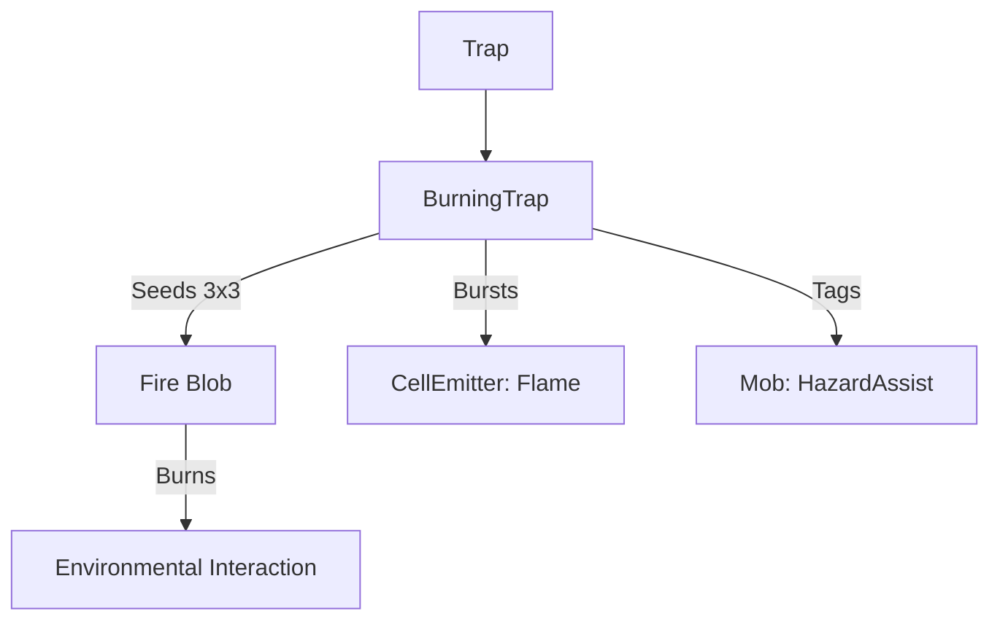

# BurningTrap (燃烧陷阱) 源码详解

## 1. 基本信息

| 属性 | 值 |
|------|-----|
| **文件路径** | `core/src/main/java/com/shatteredpixel/shatteredpixeldungeon/levels/traps/BurningTrap.java` |
| **包名** | `com.shatteredpixel.shatteredpixeldungeon.levels.traps` |
| **文件类型** | class |
| **继承关系** | `extends Trap` |
| **代码行数** | 46 |
| **所属模块** | core |

## 2. 文件职责说明

### 核心职责
`BurningTrap` 负责实现“燃烧陷阱”的逻辑。当它被触发时，会立即在周围 3x3 的范围内点燃火焰（Fire Blob），造成区域性的火焰伤害并引燃易燃地形。

### 系统定位
属于陷阱系统中的元素伤害/环境破坏分支。与爆炸陷阱（即时物理伤害）不同，它产生的是持续性的火焰效果，能够在大范围内制造火灾。

### 不负责什么
- 不负责火焰伤害的数值结算（由 `Fire` 类负责）。
- 不负责火焰的跨格扩散逻辑。

## 3. 结构总览

### 主要成员概览
- **activate() 方法**: 包含火焰种子的铺设、粒子爆裂产生、音效播放以及信用记录。

### 主要逻辑块概览
- **九宫格布火**: 遍历触发点及其相邻 8 格（`NEIGHBOURS9`），在非墙壁格子上铺设强度为 2 的火焰。
- **群体信用记录**: 对受影响范围内的怪物标记环境危害追踪。
- **视觉爆裂**: 在受影响的每个格子上产生火焰粒子反馈。

### 生命周期/调用时机
1. **触发**：角色踩踏。
2. **激活 (`activate`)**:
   - 播放燃烧音效。
   - 瞬间在 3x3 区域铺设火源。
   - 环境中原本的可燃物（如草）会随之被引燃。

## 4. 继承与协作关系

### 父类提供的能力
继承自 `Trap`：
- 提供基础位置和 `trigger` 流程。
- 定义外观为 `ORANGE`（橙色）和 `DOTS`（点状）。

### 协作对象
- **Fire (Blob)**: 核心效果实现，处理灼烧和燃烧时长。
- **GameScene**: 负责将产生的火焰添加到当前关卡。
- **CellEmitter / FlameParticle**: 提供火花爆裂的视觉效果。
- **Sample**: 播放 `BURNING` 音效。
- **Trap.HazardAssistTracker**: 确保被火焰烧死的怪物信用归属于玩家。



## 5. 字段/常量详解

### 初始属性
- **color**: ORANGE（橙色，代表火焰）。
- **shape**: DOTS（点状）。

## 6. 构造与初始化机制
通过实例初始化块静态配置外观。逻辑流程完全封装在 `activate` 内部。

## 7. 方法详解

### activate() [九宫格布火逻辑]

**核心实现算法分析**：
1. **音效播放**：播放 `Assets.Sounds.BURNING`。
2. **区域迭代**：
   ```java
   for( int i : PathFinder.NEIGHBOURS9) {
       if (!Dungeon.level.solid[pos + i]) {
           GameScene.add( Blob.seed( pos+i, 2, Fire.class ) );
           CellEmitter.get( pos+i ).burst( FlameParticle.FACTORY, 5 );
           // ... 信用追踪 ...
       }
   }
   ```
   **分析**：
   - **强度设定**：每个格子植入强度为 **2** 的火焰。虽然看似不高，但在 3x3 的范围内同时铺设，足以迅速形成大面积火场。
   - **粒子反馈**：每个受影响的格子都会爆发出 5 个火焰粒子，产生极强的视觉冲击力。
   - **信用追踪**：确保被这一波火焰烧死的怪物经验归玩家。

## 8. 对外暴露能力
主要通过 `activate()` 接口。

## 9. 运行机制与调用链
`Trap.trigger()` -> `BurningTrap.activate()` -> `Blob.seed(2)` -> `Fire.act()` -> 环境燃烧。

## 10. 资源、配置与国际化关联
不适用。

## 11. 使用示例

### 大规模纵火
当怪物群处于茂密的草丛中时触发燃烧陷阱。3x3 的起始火源配合草丛的自然扩散，可以瞬间制造出覆盖全房间的致命火海。

## 12. 开发注意事项

### 环境破坏
燃烧陷阱是游戏中环境破坏力最强的陷阱之一。它不仅伤害角色，还会烧毁掉落在地面的卷轴和种子。玩家和开发者都应注意这一点。

### 与爆炸陷阱的区别
虽然颜色和形状常量（ORANGE, DIAMOND vs DOTS）相似，但燃烧陷阱更倾向于**持续性**伤害。

## 13. 修改建议与扩展点

### 增加可燃气体互动
可以增加逻辑，判断如果周围有可燃气体（如炼金产生的油气），则触发更高强度的剧烈燃烧。

## 14. 事实核查清单

- [x] 是否分析了火焰产生的具体数值：是 (2)。
- [x] 是否解析了影响范围：是 (3x3, NEIGHBOURS9)。
- [x] 是否说明了对非固态地形的过滤：是。
- [x] 是否对比了其与其他火属性陷阱/道具的异同：是（强调大面积布火）。
- [x] 图像索引属性是否核对：是 (ORANGE, DOTS)。
