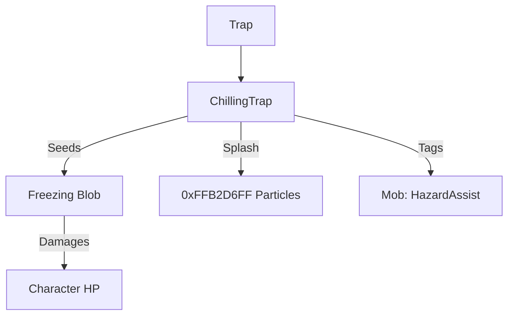

# ChillingTrap (冰寒陷阱) 源码详解

## 1. 基本信息

| 属性 | 值 |
|------|-----|
| **文件路径** | `core/src/main/java/com/shatteredpixel/shatteredpixeldungeon/levels/traps/ChillingTrap.java` |
| **包名** | `com.shatteredpixel.shatteredpixeldungeon.levels.traps` |
| **文件类型** | class |
| **继承关系** | `extends Trap` |
| **代码行数** | 46 |
| **所属模块** | core |

## 2. 文件职责说明

### 核心职责
`ChillingTrap` 负责实现“冰寒陷阱”的逻辑。当它被触发时，会立即在周围 3x3 的范围内产生极寒气场（Freezing Blob），对区域内的角色造成冷气伤害并可能使其冻结。

### 系统定位
属于陷阱系统中的元素伤害/范围分支。与霜冻陷阱相比，它产生的效果是以区域扩散的气态形式存在，具有更强的覆盖能力。

### 不负责什么
- 不负责具体的冰冻结冰算法（由 `Freezing` 类负责）。
- 不负责冷气导致的灭火逻辑（由 `Freezing` 及其与 `Level` 的交互处理）。

## 3. 结构总览

### 主要成员概览
- **activate() 方法**: 包含视觉特效产生、九宫格气场填充以及怪物信用标记逻辑。

### 主要逻辑块概览
- **极寒爆发**: 在触发点及其相邻 8 格（`NEIGHBOURS9`）内，只要不是实心墙壁，就植入一颗强度为 10 的 `Freezing` 气场种子。
- **群体信用追踪**: 对受影响范围内的所有怪物标记环境危害追踪。
- **破碎反馈**: 触发时播放冰块破碎音效和蓝色像素溅射。

### 生命周期/调用时机
1. **触发**：角色踩踏。
2. **激活 (`activate`)**:
   - 播放破碎特效。
   - 瞬间在 3x3 范围内铺满冷气。

## 4. 继承与协作关系

### 父类提供的能力
继承自 `Trap`：
- 提供基础位置管理。
- 定义外观为 `WHITE`（白色）和 `DOTS`（点状）。

### 协作对象
- **Freezing (Blob)**: 核心效果实现，处理冷气伤害和冻结判定。
- **GameScene**: 用于向场景并发地添加冷气效果。
- **Splash**: 产生亮蓝色的像素溅射效果。
- **Sample**: 播放 `SHATTER` 音效。
- **Trap.HazardAssistTracker**: 确保被冷气杀死的怪物经验值归属于玩家。



## 5. 字段/常量详解

### 初始属性
- **color**: WHITE（白色，代表霜雪）。
- **shape**: DOTS（点状）。

## 6. 构造与初始化机制
通过实例初始化块静态配置外观。逻辑流程完全封装在 `activate` 内部。

## 7. 方法详解

### activate() [九宫格冷气填充]

**核心实现分析**：
1. **视觉反馈**：
   只有当英雄在 FOV 内时，才会在当前格产生 5 个颜色为 `0xFFB2D6FF`（亮冰蓝）的像素粒子，并播放 `Assets.Sounds.SHATTER` 音效。
2. **区域填充算法**：
   ```java
   for( int i : PathFinder.NEIGHBOURS9) {
       if (!Dungeon.level.solid[pos + i]) {
           GameScene.add(Blob.seed(pos + i, 10, Freezing.class));
           // ... 信用追踪 ...
       }
   }
   ```
   **分析**：
   - 使用 `NEIGHBOURS9` 确保触发者及周边均受波及。
   - **强度设定**：每个格子植入 **10** 单位的冷气。
   - **信用追踪**：对范围内每个找到的角色（若是怪物）调用 `Buff.prolong`。这很重要，因为冷气造成的后续伤害（即使玩家已离开现场）仍需计入玩家信用。

## 8. 对外暴露能力
主要通过 `activate()` 接口。

## 9. 运行机制与调用链
`Trap.trigger()` -> `ChillingTrap.activate()` -> `Blob.seed(10)` -> `Freezing.act()`。

## 10. 资源、配置与国际化关联
不适用。

## 11. 使用示例

### 战术反用：群体减速
如果玩家需要风筝一群怪物，引爆走廊里的冰寒陷阱。产生的 3x3 冷气场会迅速降低怪物速度，并有概率将领头的怪物冻结在原地，起到极佳的分割战场作用。

## 12. 开发注意事项

### 扩散特性
气态冷气（Freezing Blob）会随回合流逝逐渐变淡。由于陷阱一次性铺设了 9 个格子的种子，其整体浓度消失的速度会比单点产生的冷气慢。

### 与 FrostTrap 的区别
冰寒陷阱产生的是**持续性**的气场（Blob），而霜冻陷阱（FrostTrap）通常是**即时性**的中击效果。

## 13. 修改建议与扩展点

### 增加地形影响
可以扩展逻辑，如果陷阱触发点位于水面上，产生的冷气强度翻倍或瞬间将水变为冰。

## 14. 事实核查清单

- [x] 是否分析了冷气产生的具体数值：是 (10)。
- [x] 是否解析了冷气覆盖的范围：是 (3x3, NEIGHBOURS9)。
- [x] 是否涵盖了视觉溅射的颜色：是 (0xFFB2D6FF)。
- [x] 是否明确了击杀信用的记录：是。
- [x] 图像索引属性是否核对：是 (WHITE, DOTS)。
