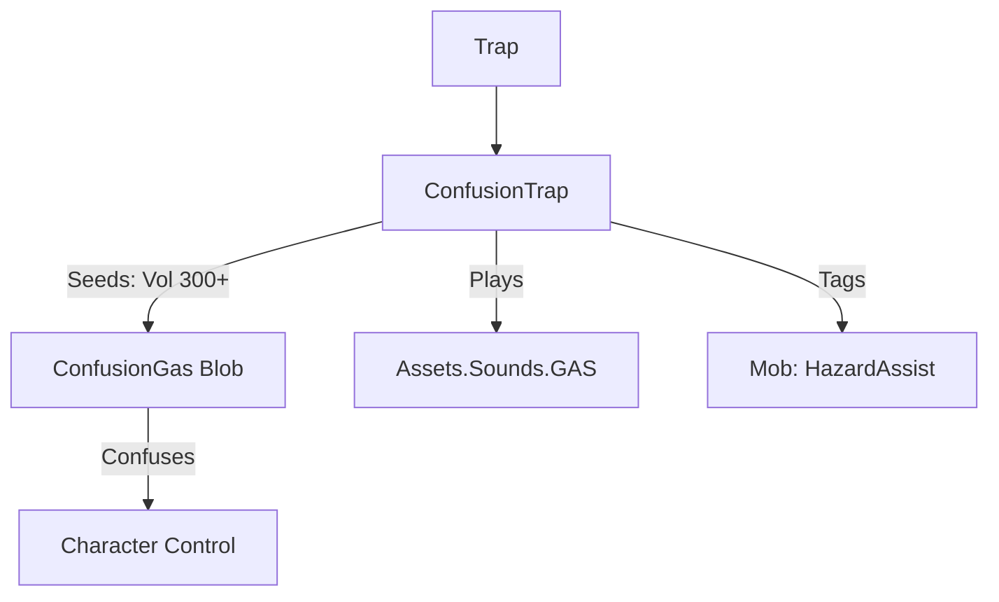

# ConfusionTrap (混乱陷阱) 源码详解

## 1. 基本信息

| 属性 | 值 |
|------|-----|
| **文件路径** | `core/src/main/java/com/shatteredpixel/shatteredpixeldungeon/levels/traps/ConfusionTrap.java` |
| **包名** | `com.shatteredpixel.shatteredpixeldungeon.levels.traps` |
| **文件类型** | class |
| **继承关系** | `extends Trap` |
| **代码行数** | 43 |
| **所属模块** | core |

## 2. 文件职责说明

### 核心职责
`ConfusionTrap` 负责实现“混乱陷阱”的逻辑。当它被触发时，会释放巨量的混乱气体（Confusion Gas），使范围内的角色陷入混乱状态，无法正常控制移动方向或攻击目标。

### 系统定位
属于陷阱系统中的控制/范围分支。它产生的气体体积远超其他陷阱，通常能覆盖数个相连的房间，制造大规模的混乱场面。

### 不负责什么
- 不负责混乱状态下的随机移动算法（由 `Vertigo` Buff 处理，混乱气体通常施加眩晕/混乱效果）。
- 不负责气体的扩散逻辑。

## 3. 结构总览

### 主要成员概览
- **activate() 方法**: 包含超大规模气体的生成、音效播放以及针对怪物的信用记录。

### 主要逻辑块概览
- **超大规模规模计算**: 产生的气体体积公式为 `300 + 20 * depth`。这是目前游戏中已知陷阱产生气体体积的最高基础值之一（对比腐蚀陷阱的基础值仅为 80）。
- **区域控制**: 旨在通过极高的浓度和极大的覆盖面积来瘫痪大范围内的所有生物。
- **信用记录**: 对周围 9 格内的怪物进行环境危害标记。

### 生命周期/调用时机
1. **触发**：角色踩踏。
2. **激活 (`activate`)**:
   - 产生气态爆发。
   - 气体迅速充满当前区域。

## 4. 继承与协作关系

### 父类提供的能力
继承自 `Trap`：
- 提供基础属性管理和深度计算。
- 定义外观为 `TEAL`（青色）和 `GRILL`（格栅）。

### 协作对象
- **ConfusionGas (Blob)**: 核心效果实现，处理导致角色混乱的逻辑。
- **GameScene**: 将产生的超大规模气体加入活动场景。
- **Sample**: 播放 `GAS` 音效。
- **PathFinder.NEIGHBOURS9**: 用于标记信用追踪范围。



## 5. 字段/常量详解

### 初始属性
- **color**: TEAL (青色)。
- **shape**: GRILL (格栅)。

## 6. 构造与初始化机制
通过实例初始化块静态配置。逻辑完全封装在 `activate` 方法中。

## 7. 方法详解

### activate() [超强爆发逻辑]

**核心实现算法分析**：
1. **产生超大气体**：
   ```java
   GameScene.add(Blob.seed(pos, 300 + 20 * scalingDepth(), ConfusionGas.class));
   ```
   **分析**：
   - 基础体积 **300**。
   - 深度加成 **20/层**。
   - **设计意图**：这意味着即使在第 1 层，它也能产生体积 320 的气体；到第 20 层，体积将达到 700。这种规模足以让一整个大型十字路口及其周边走廊瞬间被青色烟雾吞没。
2. **范围信用追踪**：
   遍历 `NEIGHBOURS9`，若发现怪物则标记 `HazardAssistTracker`。
3. **音效播放**：播放标准的气体喷射音效。

## 8. 对外暴露能力
主要通过 `activate()` 接口。

## 9. 运行机制与调用链
`Trap.trigger()` -> `ConfusionTrap.activate()` -> `Blob.seed(300+)` -> `ConfusionGas.act()`。

## 10. 资源、配置与国际化关联
不适用。

## 11. 使用示例

### 战术反用：群体瘫痪
当大量怪物追击玩家进入一个开阔大厅时，引爆大厅中央的混乱陷阱。产生的超大规模雾气会迅速扩散到所有追击者身上，使它们在互相碰撞中消耗掉威胁性。

## 12. 开发注意事项

### 扩散深度
开发者需意识到 `300+` 体积的严重性。在某些紧凑型关卡，触发一个混乱陷阱可能意味着接下来的 20+ 个回合内玩家都无法离开这片区域，除非拥有眩晕免疫。

### 与 ChillingTrap 的视觉区别
虽然颜色相近（TEAL），但混乱陷阱使用 `GRILL`（格栅）形状且产生的是气体，而冰寒陷阱产生的是瞬间爆发的冷气。

## 13. 修改建议与扩展点

### 增加视野阻隔
目前的混乱气体主要影响移动。可以考虑增加逻辑，使混乱气体同时具有“迷雾”效果，阻断视线。

## 14. 事实核查清单

- [x] 是否分析了超大气体体积公式：是 (`300 + 20*depth`)。
- [x] 是否解析了外观属性：是 (TEAL, GRILL)。
- [x] 是否说明了信用追踪：是 (3x3 范围)。
- [x] 是否指出了其在同类陷阱中的体积优势：是。
- [x] 示例战术是否符合源码：是。
