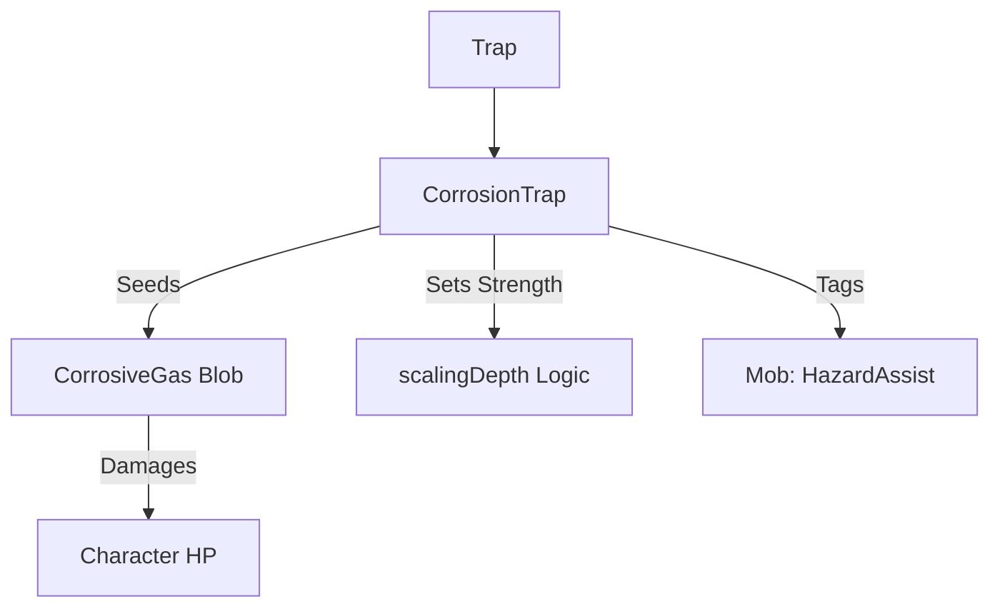

# CorrosionTrap (腐蚀陷阱) 源码详解

## 1. 基本信息

| 属性 | 值 |
|------|-----|
| **文件路径** | `core/src/main/java/com/shatteredpixel/shatteredpixeldungeon/levels/traps/CorrosionTrap.java` |
| **包名** | `com.shatteredpixel.shatteredpixeldungeon.levels.traps` |
| **文件类型** | class |
| **继承关系** | `extends Trap` |
| **代码行数** | 48 |
| **所属模块** | core |

## 2. 文件职责说明

### 核心职责
`CorrosionTrap` 负责实现“腐蚀陷阱”的逻辑。当它被触发时，会释放大量的腐蚀性气体（Corrosive Gas），对周围的角色造成随时间剧增的酸液伤害。

### 系统定位
属于陷阱系统中的元素伤害/范围分支。与剧毒陷阱相比，它产生的气体具有更强的扩散性和特殊的伤害递增机制。

### 不负责什么
- 不负责腐蚀伤害的具体数值增长逻辑（由 `CorrosiveGas` 类负责）。
- 不负责气体的视觉粒子渲染（由 `CorrosiveGas` 关联的 `BlobEmitter` 负责）。

## 3. 结构总览

### 主要成员概览
- **activate() 方法**: 包含腐蚀气体的生成、强度设定、音效播放以及信用记录逻辑。

### 主要逻辑块概览
- **动态规模计算**: 产生的气体体积随地牢深度增加（80 + 5 * depth）。
- **强度动态缩放**: 气体的基础酸性强度随地牢深度增强（1 + depth/4）。
- **信用追踪**: 对周围 9 格内的怪物进行环境危害标记。

### 生命周期/调用时机
1. **触发**：角色踩踏。
2. **激活 (`activate`)**:
   - 播放喷气音效。
   - 生成具有特定强度的 `CorrosiveGas` 实例。
   - 气体开始扩散。

## 4. 继承与协作关系

### 父类提供的能力
继承自 `Trap`：
- 提供 `pos` 存储和 `scalingDepth()` 计算。
- 定义外观为 `GREY`（灰色）和 `GRILL`（格栅）。

### 协作对象
- **CorrosiveGas (Blob)**: 核心效果实现，处理酸液伤害结算。
- **GameScene**: 负责将产生的气体添加到活动场景。
- **Sample**: 播放 `GAS` 音效。
- **PathFinder.NEIGHBOURS9**: 用于确定信用标记的范围。



## 5. 字段/常量详解

### 初始属性
- **color**: GREY（灰色，代表酸液或金属侵蚀）。
- **shape**: GRILL（格栅）。

## 6. 构造与初始化机制
通过实例初始化块静态配置外观。所有状态计算均在 `activate` 内部即时完成。

## 7. 方法详解

### activate() [气体生成逻辑]

**核心实现算法分析**：
1. **生成实例**：
   ```java
   CorrosiveGas corrosiveGas = Blob.seed(pos, 80 + 5 * scalingDepth(), CorrosiveGas.class);
   ```
   **分析**：基础体积为 80，每深一层增加 5。这确保了在深层关卡中，腐蚀陷阱产生的气体足以覆盖整个房间。
2. **设置强度**：
   ```java
   corrosiveGas.setStrength(1 + scalingDepth() / 4);
   ```
   **分析**：`strength` 属性直接影响 `CorrosiveGas` 的伤害上限。每 4 层深度提升 1 点强度。
3. **范围标记**：
   遍历 `NEIGHBOURS9` 格子，若存在怪物则标记 `HazardAssistTracker`。
4. **音效播放**：播放 `Assets.Sounds.GAS` 喷气声。

## 8. 对外暴露能力
主要通过 `activate()` 接口。

## 9. 运行机制与调用链
`Trap.trigger()` -> `CorrosionTrap.activate()` -> `Blob.seed()` -> `CorrosiveGas.setStrength()` -> `GameScene.add()` -> `CorrosiveGas.act()`。

## 10. 资源、配置与国际化关联
不适用。

## 11. 使用示例

### 远程封路
在狭窄的走廊门口引爆腐蚀陷阱。由于其巨大的体积（80+），产生的灰色雾气会在走廊内停留很久，形成一道难以通过的致命屏障。

## 12. 开发注意事项

### 腐蚀伤害特性
腐蚀气体的伤害是**随回合数指数级增长**的（通常是 1, 2, 4, 8... 递增）。因此，处于腐蚀陷阱正中心的生物如果不及时逃离，很快就会受重伤甚至死亡。

### 与 ToxicTrap 的区别
腐蚀陷阱使用的是 `GRILL` 形状，且产生的灰色气体比绿色毒气更具侵蚀性（伤害更高且扩散更快）。

## 13. 修改建议与扩展点

### 增加易燃联动
可以考虑让腐蚀性气体在接触火焰时产生爆炸（类似于可燃气体的逻辑），增加环境互动的复杂性。

## 14. 事实核查清单

- [x] 是否分析了体积随深度变化的公式：是 (`80 + 5*depth`)。
- [x] 是否分析了强度随深度变化的公式：是 (`1 + depth/4`)。
- [x] 是否涵盖了九宫格范围的信用标记：是。
- [x] 图像索引属性是否核对：是 (GREY, GRILL)。
- [x] 示例逻辑是否符合源码：是。
