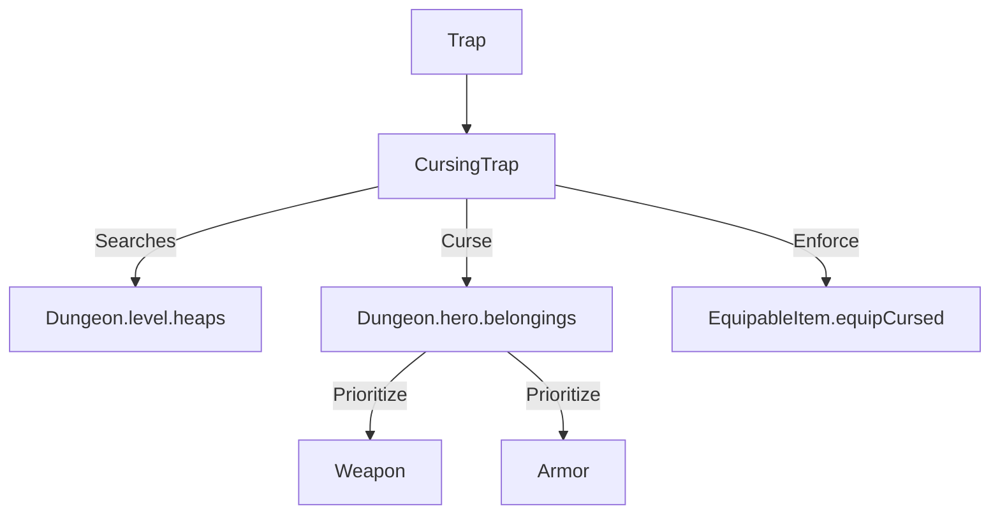

# CursingTrap (咒怨陷阱) 源码详解

## 1. 基本信息

| 属性 | 值 |
|------|-----|
| **文件路径** | `core/src/main/java/com/shatteredpixel/shatteredpixeldungeon/levels/traps/CursingTrap.java` |
| **包名** | `com.shatteredpixel.shatteredpixeldungeon.levels.traps` |
| **文件类型** | class |
| **继承关系** | `extends Trap` |
| **代码行数** | 102 |
| **所属模块** | core |

## 2. 文件职责说明

### 核心职责
`CursingTrap` 负责实现“咒怨陷阱”的逻辑。当它被触发时，会尝试诅咒处于陷阱位置的物品（掉落物）或玩家正在装备的防具与武器。

### 系统定位
属于陷阱系统中的装备/干扰分支。它是除了诅咒卷轴和地牢随机生成外，使装备变质的主要动态机制。

### 不负责什么
- 不负责戒指或神器的诅咒逻辑（虽然这些物品是可升级的，但在该类的 `curse(Hero)` 逻辑中未被纳入优先级列表，但在掉落物处理中会被诅咒）。
- 不负责解除诅咒。

## 3. 结构总览

### 主要成员概览
- **activate() 方法**: 逻辑入口，分别处理地图掉落物（Heap）和玩家英雄。
- **静态 curse(Hero) 方法**: 处理玩家身上装备的诅咒优先级和逻辑。
- **私有 curse(Item) 方法**: 处理单个物品的具体诅咒数值和属性修改。

### 主要逻辑块概览
- **掉落物诅咒**: 遍历当前格子的物品堆，将所有可升级物品（排除远程武器）转为诅咒状态。
- **英雄装备诅咒**: 按照“优先级”选择玩家身上的一件主武器或护甲施加诅咒。
- **优先级系统**: 优先选择尚未有附魔/刻印的装备进行诅咒，以产生最负面的效果（因为诅咒会覆盖掉原本的正面属性，如果本来就没有正面属性，诅咒的影响最大）。

### 生命周期/调用时机
1. **触发**：角色踩踏或投掷物品。
2. **激活 (`activate`)**:
   - 播放诅咒粒子和音效。
   - 诅咒地面物品。
   - 诅咒站在其上的玩家。

## 4. 继承与协作关系

### 父类提供的能力
继承自 `Trap`：
- 提供基础的 `pos` 存储、`trigger` 流程。
- 定义外观为 `VIOLET`（紫色）和 `WAVES`（波浪）。

### 协作对象
- **Heap / Item**: 被诅咒的目标载体。
- **Weapon / Armor**: 处理具体的附魔（Enchantment）和刻印（Glyph）覆盖。
- **EquipableItem**: 调用 `equipCursed` 强制玩家穿上刚被诅咒的装备。
- **ShadowParticle**: 提供黑色的咒怨粒子效果。



## 5. 字段/常量详解

### 初始属性
- **color**: VIOLET（紫色）。
- **shape**: WAVES（波浪纹）。

## 6. 构造与初始化机制
通过实例初始化块设置外观。逻辑高度静态化，支持外部通过 `curse(Hero)` 模拟诅咒陷阱的效果。

## 7. 方法详解

### activate() [触发入口]

**核心实现逻辑分析**：
1. **视觉反馈**：产生 `ShadowParticle.UP` 粒子并播放诅咒音效。
2. **地面物品处理**：
   ```java
   if (item.isUpgradable() && !(item instanceof MissileWeapon))
       curse(item);
   ```
   **注意**：飞镖等远程武器（MissileWeapon）虽然可堆叠且逻辑特殊，但不会被该陷阱诅咒。
3. **英雄处理**：只有非飞行的英雄踩踏时才会触发。

---

### curse(Hero hero) [英雄诅咒优先级逻辑]

**逻辑优先级解析**：
1. **分类统计**：
   - `priorityCurse`: 没有附魔或刻印的白板装备。
   - `canCurse`: 已经有附魔或刻印的装备。
2. **目标选取**：
   - 检查主武器（排除法师法杖，因为它有独特的升级逻辑）。
   - 检查衣服。
3. **随机化**：使用 `Collections.shuffle` 打乱两个列表。
4. **执行顺序**：优先从 `priorityCurse` 中选一个，如果没有，再从 `canCurse` 中选。
5. **强制穿戴**：调用 `EquipableItem.equipCursed(hero)`。这确保了如果原本脱下了装备，诅咒会强迫你穿上并锁定在身上。

---

### curse(Item item) [底层诅咒实现]

**核心修改点**：
1. **状态修改**：`item.cursed = item.cursedKnown = true;`。
2. **附魔覆盖**：
   - 如果是武器且没有附魔，赋予一个 `Weapon.Enchantment.randomCurse()`。
   - 如果是护甲且没有刻印，赋予一个 `Armor.Glyph.randomCurse()`。
   **注意**：如果装备已经有正面附魔，该方法仅将其标记为诅咒（变红且无法脱下），而**不会**覆盖掉现有的正面附魔。

## 8. 对外暴露能力
公开了静态的 `curse(Hero)` 方法，允许其他系统（如诅咒卷轴或特定的惩罚机制）复用陷阱的诅咒逻辑。

## 9. 运行机制与调用链
`Trap.trigger()` -> `CursingTrap.activate()` -> `CursingTrap.curse(hero)` -> `Collections.shuffle()` -> `item.cursed = true` -> `GLog.n()`。

## 10. 资源、配置与国际化关联

### 本地化词条
- `traps.CursingTrap.curse`: “一股恶毒的力量紧紧缠住了你的装备！”

## 11. 使用示例

### 战术规避
如果预见到要踩踏紫色波浪陷阱，玩家应提前飞过（使用药水）或通过投掷物品消耗掉它。如果身上只有一件极品装备，踩踏它极其危险。

## 12. 开发注意事项

### 法师法杖豁免
代码中明确排除了 `MagesStaff`。这是因为法师法杖的诅咒/升级逻辑与其他武器不同，通过此陷阱强制诅咒可能会破坏法师的核心职业进度。

### 强制装备
`equipCursed` 逻辑的存在意味着即使玩家暂时脱下了一件可能被诅咒的衣服（比如为了避免诅咒），如果踩到陷阱，这件衣服仍可能在背包中被诅咒并强行穿回身上。

## 13. 修改建议与扩展点

### 扩展诅咒范围
可以修改优先级逻辑，将戒指和神器也纳入诅咒范围，并为它们定义特定的“诅咒属性”。

## 14. 事实核查清单

- [x] 是否分析了诅咒优先级：是（白板优先，已附魔次之）。
- [x] 是否说明了对掉落物的处理：是（可升级物品，不含远程武器）。
- [x] 是否解析了法师法杖的特殊处理：是（显式排除）。
- [x] 是否涵盖了强制穿戴逻辑：是（equipCursed）。
- [x] 图像索引属性是否核对：是 (VIOLET, WAVES)。
