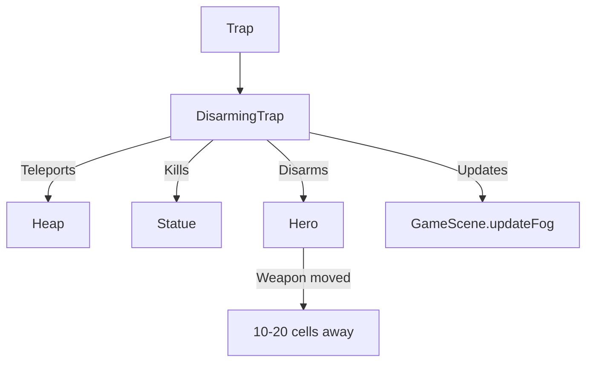

# DisarmingTrap (缴械陷阱) 源码详解

## 1. 基本信息

| 属性 | 值 |
|------|-----|
| **文件路径** | `core/src/main/java/com/shatteredpixel/shatteredpixeldungeon/levels/traps/DisarmingTrap.java` |
| **包名** | `com.shatteredpixel.shatteredpixeldungeon.levels.traps` |
| **文件类型** | class |
| **继承关系** | `extends Trap` |
| **代码行数** | 102 |
| **所属模块** | core |

## 2. 文件职责说明

### 核心职责
`DisarmingTrap` 负责实现“缴械陷阱”的逻辑。它的核心功能是将目标的武器或掉落物品“传送”到关卡的另一个位置，并具有特殊的针对性逻辑（如秒杀雕像）。

### 系统定位
属于陷阱系统中的战术/干扰分支。它不直接造成生命值伤害，但通过移除玩家的主武器或关键物品来制造战术层面的巨大麻烦。

### 不负责什么
- 不负责诅咒物品（由 `CursingTrap` 负责）。
- 不负责传送后物品的安全性检查（可能传送到陷阱上）。

## 3. 结构总览

### 主要成员概览
- **activate() 方法**: 包含针对地面物品、怪物（雕像）以及英雄的三重逻辑分支。

### 主要逻辑块概览
- **地面物品传送**: 将陷阱格上的掉落物随机传送到本层的一个空位，并自动揭开落点周围的迷雾。
- **雕像特杀**: 如果站在陷阱上的是“雕像（Statue）”，则直接调用其 `die()` 方法。
- **英雄缴械**: 如果英雄踩踏，将其主武器（且仅限非诅咒武器）传送到距离 10 到 20 格之外的随机位置。

### 生命周期/调用时机
1. **触发**：角色踩踏。
2. **激活 (`activate`)**:
   - 检查格子上的堆（Heap）。
   - 检查格子上的角色（Statue）。
   - 检查玩家。
3. **副作用**: 物品落点周围 3x3 区域会被标记为已访问/已映射。

## 4. 继承与协作关系

### 父类提供的能力
继承自 `Trap`：
- 提供基础的 `pos` 存储和 `trigger` 调度。
- 定义外观为 `RED`（红色）和 `LARGE_DOT`（大圆点）。

### 协作对象
- **Heap / Item**: 处理物品的提取和重新掉落。
- **Statue**: 处理雕像的即死逻辑。
- **PathFinder**: 用于计算英雄武器传送的精确距离（10-20格）。
- **Dungeon.quickslot**: 负责在缴械时清空玩家快捷栏。
- **GameScene**: 更新地图迷雾。



## 5. 字段/常量详解

### 初始属性
- **color**: RED。
- **shape**: LARGE_DOT。

## 6. 构造与初始化机制
使用实例初始化块设置外观。逻辑完全封装在 `activate` 内部。

## 7. 方法详解

### activate() [传送与缴械核心逻辑]

**逻辑分支分析**：

#### 1. 地面物品分支
- 寻找一个随机的重生点。
- 调用 `heap.pickUp()` 移除原物品。
- 调用 `Dungeon.level.drop()` 在新位置生成。
- **特殊处理**：如果是碎掉的蜜罐（ShatteredPot），还会同步移动关联的蜜蜂。
- **视觉反馈**：将落点周围 9 格标记为 `visited`。

#### 2. 雕像分支
- 如果是 `Statue` 角色，立即调用 `die(this)`。
- **设计意图**：这为玩家提供了一种巧妙利用陷阱击败高难度雕像的手段。

#### 3. 英雄缴械分支
- **前提条件**：英雄站在格子上、非飞行、且主武器**未被诅咒**。
- **传送范围算法**：
  ```java
  do {
      cell = Dungeon.level.randomRespawnCell( null );
      PathFinder.buildDistanceMap(pos, Dungeon.level.passable);
  } while (cell == -1 || PathFinder.distance[cell] < 10 || PathFinder.distance[cell] > 20);
  ```
  **技术点**：它使用 `PathFinder` 进行真实路径距离计算，强制将武器传送至 **10 到 20 格** 之外。这是一个很远的距离，通常意味着武器被扔到了另一个房间。
- **快捷栏清理**：调用 `Dungeon.quickslot.clearItem(weapon)`，防止玩家通过快捷栏感知或使用已消失的武器。
- **地图揭示**：将落点周围 9 格标记为 `mapped` 并更新迷雾，给玩家提供“武器掉在那儿了”的视觉提示。

## 8. 对外暴露能力
主要通过 `activate()` 接口。

## 9. 运行机制与调用链
`Trap.trigger()` -> `DisarmingTrap.activate()` -> `PathFinder.buildDistanceMap()` -> `Dungeon.level.drop()` -> `GameScene.updateFog()`。

## 10. 资源、配置与国际化关联

### 本地化词条
- `traps.DisarmingTrap.disarm`: “你的武器从手中被震飞了！”

## 11. 使用示例

### 对付强力雕像
如果发现雕像站位靠近缴械陷阱，可以用投掷物触发陷阱（如果雕像就在陷阱上）或引诱雕像移动到陷阱上，实现无伤击杀并获取其装备。

## 12. 开发注意事项

### 诅咒豁免
诅咒武器不会被缴械。这是一个双刃剑：虽然武器不会丢，但也意味着你无法通过缴械陷阱来强行脱下受诅咒的武器。

### 迷雾更新
该类通过 `Dungeon.level.mapped[cell + i] = true` 强制揭开了落点地图。在设计“黑暗关卡”或“全迷雾挑战”时，需注意此类陷阱可能泄露地图信息。

## 13. 修改建议与扩展点

### 扩展缴械范围
目前只针对主武器。可以扩展逻辑，随机选择主武器、投掷武器或盾牌进行传送。

## 14. 事实核查清单

- [x] 是否分析了英雄武器传送的距离范围：是 (10-20格)。
- [x] 是否说明了对雕像的特殊效果：是 (即死)。
- [x] 是否解析了诅咒武器的免疫逻辑：是 (weapon.cursed 检查)。
- [x] 是否涵盖了快捷栏清理的副作用：是。
- [x] 图像索引属性是否核对：是 (RED, LARGE_DOT)。
- [x] 是否说明了落点地图自动揭开的效果：是。
