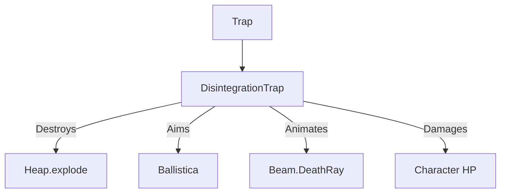

# DisintegrationTrap (解体陷阱) 源码详解

## 1. 基本信息

| 属性 | 值 |
|------|-----|
| **文件路径** | `core/src/main/java/com/shatteredpixel/shatteredpixeldungeon/levels/traps/DisintegrationTrap.java` |
| **包名** | `com.shatteredpixel.shatteredpixeldungeon.levels.traps` |
| **文件类型** | class |
| **继承关系** | `extends Trap` |
| **代码行数** | 82 |
| **所属模块** | core |

## 2. 文件职责说明

### 核心职责
`DisintegrationTrap` 负责实现“解体陷阱”的逻辑。它通过发射一道高能射线（Death Ray）对视野内的最近目标造成毁灭性的魔法伤害，并具有破坏地面物品的能力。

### 系统定位
属于陷阱系统中的致命/远程分支。它与 `GrimTrap`（死亡陷阱）逻辑高度相似，但伤害模式从“生命比率伤害”变为了“高额固定魔法伤害”，且带有独特的环境破坏效果（引爆物品）。

### 不负责什么
- 不负责计算射线的折射或穿透逻辑（由 `Ballistica` 简单判定路径）。
- 不负责射线造成的环境地形改变（如烧草等，仅负责引爆物品堆）。

## 3. 结构总览

### 主要成员概览
- **实例初始化块**: 设置外观（VIOLET, CROSSHAIR）、可见性（始终可见）和位置偏好（避开走廊）。
- **activate() 方法**: 核心逻辑入口，包含寻敌、引爆物品、发射射线和伤害结算。

### 主要逻辑块概览
- **智能寻敌系统**: 继承自经典的狙击算法。优先锁定陷阱上的角色，若无则搜索 6.5 格至视野范围内的最近活物。
- **环境破坏**: 触发瞬间会自动调用陷阱格上物品堆（Heap）的 `explode()` 方法，摧毁易损物品并产生连锁爆炸。
- **高额伤害判定**: 使用正态分布随机数配合地牢深度计算最终伤害。
- **成就验证**: 与死亡陷阱共享“特定陷阱致死”的徽章验证。

### 生命周期/调用时机
1. **触发**：角色踩踏。
2. **激活 (`activate`)**:
   - 物品堆引爆。
   - 确定射线目标。
   - 播放射线动画。
   - 扣除生命值并检查死亡。

## 4. 继承与协作关系

### 父类提供的能力
继承自 `Trap`：
- 提供基础属性管理、`trigger()` 流程和 `scalingDepth()` 深度修正。

### 协作对象
- **Ballistica**: 进行视线和路径判定。
- **Beam.DeathRay**: 提供紫色的死亡射线视觉特效。
- **Heap**: 触发物品引爆。
- **Badges**: 验证“死于特定陷阱”的徽章。



## 5. 字段/常量详解

### 初始属性
- **color**: VIOLET（紫色）。
- **shape**: CROSSHAIR（十字准星）。
- **canBeHidden**: `false`（始终可见）。
- **avoidsHallways**: `true`（仅出现在房间内）。

## 6. 构造与初始化机制
通过实例初始化块静态配置。该类无额外成员变量，逻辑计算均在 `activate` 栈内完成。

## 7. 方法详解

### activate() [狙击与引爆核心]

**核心实现分析**：

#### 1. 物品引爆逻辑
```java
Heap heap = Dungeon.level.heaps.get(pos);
if (heap != null) heap.explode();
```
**技术点**：这是解体陷阱特有的副作用。站在解体陷阱上不仅会受重伤，还会导致脚下的药水、卷轴等物品直接爆炸或损毁。

#### 2. 寻敌逻辑（同死亡陷阱）
- **范围**: `min(6, viewDistance) + 0.5f`。
- **目标优先级**: 
  - 脚下角色 > 最近角色。
  - 隐身单位权重极低（被视为处于最大距离）。
  - 同等距离下优先瞄准英雄。

#### 3. 伤害算法
```java
target.damage( Random.NormalIntRange(30, 50) + scalingDepth(), this );
```
**分析**：
- 基础伤害：30-50 之间的正态分布（均值 40 左右）。
- 深度加成：随关卡深度线性增强。
- **总伤害量**：在游戏后期，单发伤害可达 60-80 点，足以重创甚至秒杀非满血英雄。

#### 4. 视觉反馈
使用 `Beam.DeathRay`。射线连接陷阱中心和目标中心，伴随 `RAY` 音效。

## 8. 对外暴露能力
主要通过 `activate()` 接口。

## 9. 运行机制与调用链
`Trap.trigger()` -> `DisintegrationTrap.activate()` -> `Heap.explode()` -> `Ballistica` -> `Beam.DeathRay` -> `Char.damage()` -> `Dungeon.fail()` (若英雄死亡)。

## 10. 资源、配置与国际化关联

### 本地化词条
- `traps.DisintegrationTrap.name`: 解体陷阱
- `traps.DisintegrationTrap.ondeath`: “你的身体原子在致命光束中分崩离析了...”

## 11. 使用示例

### 战术反用：物品引爆
如果怪物站在解体陷阱上且脚下有物品，可以通过远程触发陷阱。陷阱不仅会伤害怪物，引爆的物品（如火焰药水）还会产生额外的二次伤害和环境效果。

## 12. 开发注意事项

### 与死亡陷阱的区别
- **伤害属性**: 解体陷阱是高额固定伤害，受护甲/魔法抗性影响（取决于 `damage` 的具体结算）；死亡陷阱是生命比率伤害。
- **环境交互**: 解体陷阱会摧毁物品，死亡陷阱不会。

### 始终可见性
由于 `canBeHidden = false`，此类陷阱在生成时就已 reveal，玩家应能一眼识别。

## 13. 修改建议与扩展点

### 射线属性扩展
可以将 `Beam.DeathRay` 改为 `Beam.LightRay` 以适应神圣风格的变体陷阱。

## 14. 事实核查清单

- [x] 是否分析了物品引爆逻辑：是 (heap.explode)。
- [x] 是否解析了伤害计算公式：是 (30-50 NormalInt + scalingDepth)。
- [x] 是否说明了智能寻敌范围：是 (最小 6.5 格)。
- [x] 是否对比了与死亡陷阱的异同：是。
- [x] 图像索引属性是否核对：是 (VIOLET, CROSSHAIR)。
