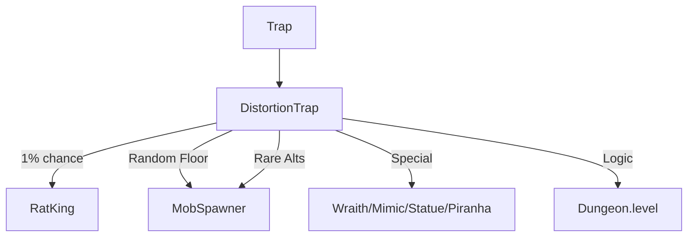

# DistortionTrap (扭曲陷阱) 源码详解

## 1. 基本信息

| 属性 | 值 |
|------|-----|
| **文件路径** | `core/src/main/java/com/shatteredpixel/shatteredpixeldungeon/levels/traps/DistortionTrap.java` |
| **包名** | `com.shatteredpixel.shatteredpixeldungeon.levels.traps` |
| **文件类型** | class |
| **继承关系** | `extends Trap` |
| **代码行数** | 125 |
| **所属模块** | core |

## 2. 文件职责说明

### 核心职责
`DistortionTrap` 负责实现“扭曲陷阱”的逻辑。它是召唤陷阱的极位强化变体，能够以“空间扭曲”的名义召唤出大量完全脱离当前关卡层级逻辑的、极度随机的怪物。

### 系统定位
属于陷阱系统中的战斗/爆发/随机分支。它是游戏中最危险的召唤类机制，其随机性可能导致极其困难或极其荒诞的战斗局面（如在第一层召唤出地狱层的怪物或老鼠王）。

### 不负责什么
- 不负责具体的怪物 AI 逻辑（由怪物类自身负责）。
- 不负责怪物掉落平衡。

## 3. 结构总览

### 主要成员概览
- **常量 DELAY**: 怪物出现前的 2 秒预警延迟。
- **activate() 方法**: 包含极其复杂的随机召唤算法，涵盖了普通怪物、稀有精英、Boss 级 NPC 甚至跨层怪物的综合判定。

### 主要逻辑块概览
- **高额召唤数量**: 基础召唤 3 个怪物，并有概率增加至 4 或 5 个。
- **乱序召唤池 (Distorted Pool)**: 针对每一个召唤位应用不同的随机逻辑：
  - 第一位：极低概率召唤老鼠王（Rat King）。
  - 第二位：随机召唤幽灵、食人鱼、拟态怪或统计。
  - 第三/五位：从全游戏 25 层中随机抽取一层并召唤其首位怪物。
  - 第四位：召唤稀有替代怪物。
- **连锁反应优化**: 与召唤陷阱一致，预先引爆落点陷阱以优化音效。

### 生命周期/调用时机
1. **触发**：角色踩踏。
2. **激活 (`activate`)**:
   - 随机池大洗牌。
   - 锁定 3-5 个落点。
   - 产生大量传送反馈。

## 4. 继承与协作关系

### 父类提供的能力
继承自 `Trap`：
- 定义外观为 `TEAL`（青色）和 `LARGE_DOT`（大圆点）。

### 协作对象
- **MobSpawner**: 提供跨层怪物的轮替列表（`getMobRotation`）和稀有变体列表（`RARE_ALTS`）。
- **Reflection**: 使用反射机制动态实例化跨层怪物。
- **RatKing / Wraith / Piranha / Mimic / Statue**: 构成扭曲召唤池的核心成员。
- **Dungeon.level**: 提供 `openSpace` 检查以限制大型怪物。

## 5. 字段/常量详解

### 静态常量
- **DELAY**: 2.0f。

### 初始属性
- **color**: TEAL (青色)。
- **shape**: LARGE_DOT (大圆点)。

## 6. 构造与初始化机制
通过实例初始化块静态配置。该类利用了 `Reflection` 来实现跨包名的类动态加载。

## 7. 方法详解

### activate() [扭曲召唤算法解析]

**核心召唤逻辑流**：
1. **确定数量**：
   - 基础 3 个。
   - 两次 50% 判定加 1，最高可达 5 个。
2. **位置筛选**：寻找周围 8 格的空位。
3. **分槽位随机化 (Summon Slots)**：
   - **槽位 1**: `1%` 概率召唤 **老鼠王 (Rat King)**（如果当前不是第 5 层）。否则进入默认逻辑。
   - **槽位 2**: 四选一：
     - `Wraith.spawnAt(point)`：直接产生幽灵。
     - `Piranha.random()`：随机种类的食人鱼（即便在陆地上也会生成，导致其立即自毙，符合“扭曲”语境）。
     - `Mimic.spawnAt()`：非隐藏状态的敌对拟态怪。
     - `Statue.random()`：随机装备的雕像。
   - **槽位 3 & 5**: **跨层抽签**。随机选择 0-24 层中的任意一层，召唤该层的代表性怪物。这意味着玩家可能在第 1 层遇到眼球或巨魔。
   - **槽位 4**: 抽取一个 **稀有变体 (Rare Alt)** 怪物。
4. **校验与设置**：
   - 设置 `maxLvl = Hero.MAX_LEVEL-1`。
   - 设为 `WANDERING` 状态。
   - 处理大型生物的空间限制。

## 8. 对外暴露能力
主要通过 `activate()` 接口。

## 9. 运行机制与调用链
`Trap.trigger()` -> `DistortionTrap.activate()` -> `Reflection.newInstance()` -> `GameScene.add()`。

## 10. 资源、配置与国际化关联
不适用。

## 11. 使用示例

### 战术风险评估
扭曲陷阱是高风险高回报的。虽然可能召唤出极其强大的敌人，但其槽位 2 中的食人鱼自毙和槽位 1 的中立老鼠王有时会产生意想不到的混乱场面，帮助玩家转移敌人注意力。

## 12. 开发注意事项

### 陆地食人鱼
源码中显式提到了 `//yes it's intended that these are likely to die right away`。这是一种幽默的程序设计，用来体现空间扭曲导致生物位置完全错误的荒谬感。

### 反射性能
由于大量使用反射实例化对象，单次触发可能会产生轻微的 CPU 峰值，但在现代移动端和桌面端影响可忽略。

## 13. 修改建议与扩展点

### 增加更多槽位逻辑
可以增加第 6 或第 7 槽位，召唤来自其他 Mod 或自定义包中的怪物。

## 14. 事实核查清单

- [x] 是否分析了老鼠王的召唤概率：是 (1%)。
- [x] 是否解析了跨层召唤的实现：是 (Random.Int(25) + MobRotation)。
- [x] 是否涵盖了食人鱼在陆地上自毙的设计意图：是。
- [x] 是否说明了 3-5 个召唤数量判定：是。
- [x] 图像索引属性是否核对：是 (TEAL, LARGE_DOT)。
