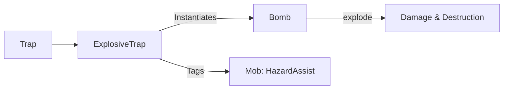

# ExplosiveTrap (爆炸陷阱) 源码详解

## 1. 基本信息

| 属性 | 值 |
|------|-----|
| **文件路径** | `core/src/main/java/com/shatteredpixel/shatteredpixeldungeon/levels/traps/ExplosiveTrap.java` |
| **包名** | `com.shatteredpixel.shatteredpixeldungeon.levels.traps` |
| **文件类型** | class |
| **继承关系** | `extends Trap` |
| **代码行数** | 45 |
| **所属模块** | core |

## 2. 文件职责说明

### 核心职责
`ExplosiveTrap` 负责实现“爆炸陷阱”的逻辑。当它被触发时，会立即在当前格引发一次强力爆炸，对中心及相邻格子的实体造成物理伤害并破坏环境。

### 系统定位
属于陷阱系统中的攻击/环境破坏分支。它是物理伤害的主要自然来源之一，具有范围杀伤和连锁引爆的特性。

### 不负责什么
- 不负责爆炸伤害的数值计算（由 `Bomb` 类负责）。
- 不负责爆炸产生的视觉特效（由 `Bomb.explode()` 内部调用渲染逻辑）。

## 3. 结构总览

### 主要成员概览
- **activate() 方法**: 核心逻辑入口，包含信用记录和引爆调用。

### 主要逻辑块概览
- **范围信用追踪**: 在引爆前，遍历周围 9 格（`NEIGHBOURS9`），对范围内的所有怪物标记环境危害追踪。
- **物理引爆**: 实例化一个临时的 `Bomb` 对象并调用其 `explode()` 方法。
- **徽章验证**: 处理由于玩家自身重置（reclaimed）陷阱导致的自杀徽章判定。

### 生命周期/调用时机
1. **触发**：角色踩踏。
2. **激活 (`activate`)**:
   - 扫描周围 3x3 区域。
   - 触发爆炸结算。

## 4. 继承与协作关系

### 父类提供的能力
继承自 `Trap`：
- 提供 `pos` 存储、`trigger` 流程和 `disarm` 逻辑。
- 定义外观为 `ORANGE`（橙色）和 `DIAMOND`（菱形）。

### 协作对象
- **Bomb**: 核心效果实现类。`ExplosiveTrap` 本质上是一个“固定位置且被动触发的炸弹”。
- **Trap.HazardAssistTracker**: 确保被爆炸杀死的怪物经验值归属于玩家。
- **PathFinder.NEIGHBOURS9**: 提供九宫格范围扫描。
- **Badges**: 验证特定死亡成就。



## 5. 字段/常量详解

### 初始属性
- **color**: ORANGE（橙色，代表火与爆炸）。
- **shape**: DIAMOND（菱形）。

## 6. 构造与初始化机制
通过实例初始化块设置外观属性。无额外实例字段。

## 7. 方法详解

### activate() [引爆逻辑]

**核心实现分析**：
1. **范围标记**：
   ```java
   for( int i : PathFinder.NEIGHBOURS9) {
       if (Actor.findChar(pos+i) instanceof Mob){
           Buff.prolong(Actor.findChar(pos+i), Trap.HazardAssistTracker.class, HazardAssistTracker.DURATION);
       }
   }
   ```
   **设计意图**：由于爆炸是范围伤害，必须在爆炸发生前对 3x3 范围内的所有怪物打上标签。这确保了不论怪物是被爆炸直接炸死，还是被爆炸引燃后烧死，玩家都能获得击杀信用。
2. **执行爆炸**：
   ```java
   new Bomb().explode(pos);
   ```
   **分析**：复用了物品系统中炸弹的逻辑。这会造成以下副作用：
   - 对中心格及周围格的角色造成物理伤害。
   - 摧毁周围的墙壁（如果是可破坏的）。
   - 引燃周围的草丛。
   - 破坏地面掉落的卷轴、药水（如果是易碎品）。
3. **徽章处理**：如果陷阱是被玩家回收后再利用的（`reclaimed`），且玩家死于此爆炸，会触发“死于友方魔法”的验证。

## 8. 对外暴露能力
主要通过 `activate()` 接口。

## 9. 运行机制与调用链
`Trap.trigger()` -> `ExplosiveTrap.activate()` -> `Bomb.explode(pos)` -> `Level.damageCell()` / `Char.damage()`。

## 10. 资源、配置与国际化关联
不适用。爆炸音效和图像由 `Bomb` 类管理。

## 11. 使用示例

### 战术反用
玩家可以通过投掷石块触发怪物群中的爆炸陷阱，利用其 3x3 的范围杀伤效果一次性重创多个敌人。

## 12. 开发注意事项

### 环境破坏力
开发者需注意，爆炸陷阱是具有**地形修改能力**的。在生成具有重要解密物品的房间时，应避免放置过多的爆炸陷阱，以免玩家误触发导致关键道具损毁。

### 延迟与即时
与 `Bomb` 物品（有引信延迟）不同，陷阱的爆炸是**即时**的。

## 13. 修改建议与扩展点

### 调整威力
如果需要不同威力的爆炸陷阱（如“超级爆炸陷阱”），可以重构 `Bomb` 类使其支持传入威力参数，并在 `activate` 中调用。

## 14. 事实核查清单

- [x] 是否解析了爆炸范围：是（3x3, NEIGHBOURS9）。
- [x] 是否说明了信用追踪的范围：是（同上）。
- [x] 是否明确了核心逻辑外包给了 Bomb：是。
- [x] 是否涵盖了环境破坏的副作用：是。
- [x] 图像索引属性是否核对：是 (ORANGE, DIAMOND)。
