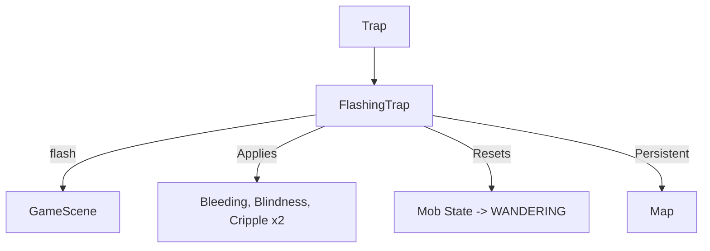

# FlashingTrap (闪光陷阱) 源码详解

## 1. 基本信息

| 属性 | 值 |
|------|-----|
| **文件路径** | `core/src/main/java/com/shatteredpixel/shatteredpixeldungeon/levels/traps/FlashingTrap.java` |
| **包名** | `com.shatteredpixel.shatteredpixeldungeon.levels.traps` |
| **文件类型** | class |
| **继承关系** | `extends Trap` |
| **代码行数** | 55 |
| **所属模块** | core |

## 2. 文件职责说明

### 核心职责
`FlashingTrap` 负责实现“闪光陷阱”的逻辑。当它被触发时，会产生强烈的闪光爆发，对触发者造成物理创伤，并使其陷入失明、残废和流血的复合负面状态。

### 系统定位
属于陷阱系统中的控制/物理/干扰分支。它是夹击陷阱（GrippingTrap）的强化版本，增加了视觉剥夺（失明）效果，且同样具有**不可磨灭性**（可重复触发）。

### 不负责什么
- 不负责计算失明或残废的具体移动修正（由各自的 Buff 类处理）。
- 不负责闪光对全局迷雾的影响（仅造成即时的屏幕闪烁视觉效果）。

## 3. 结构总览

### 主要成员概览
- **实例初始化块**: 设置外观（GREY, STARS）以及关键属性（激活后不解除、避开走廊）。
- **activate() 方法**: 核心逻辑入口，包含多重 Buff 应用、物理伤害计算、怪物 AI 重置以及全屏视觉反馈。

### 主要逻辑块概览
- **复合负面状态**: 一次性施加 `Bleeding`（流血）、`Blindness`（失明）和 `Cripple`（残废，时长翻倍）。
- **护甲穿透物理伤害**: 类似于夹击陷阱，其流血强度计算对高护甲单位有较强的穿透力。
- **怪物 AI 强干扰**: 强制让怪物失去当前目标并随机游荡。
- **全屏视觉反馈**: 触发时全屏闪烁白色强光。

### 生命周期/调用时机
1. **触发**：角色踩踏。
2. **激活 (`activate`)**:
   - 产生屏幕闪烁音效。
   - 结算物理流血强度。
   - 应用三种负面 Buff。
   - 重置怪物状态。
3. **存续**: 激活后依然留在地图上，可被后续角色再次触发。

## 4. 继承与协作关系

### 父类提供的能力
继承自 `Trap`：
- 提供位置管理。
- 覆写 `disarmedByActivation = false` 实现可重复性。

### 协作对象
- **Bleeding / Blindness / Cripple**: 三种核心状态效果实现。
- **GameScene**: 提供 `flash()` 方法实现全屏闪光特效。
- **Sample**: 播放 `BLAST` 爆炸音效。
- **Mob**: 接受 AI 状态重置和 `beckon` 指令。



## 5. 字段/常量详解

### 初始属性
- **color**: GREY。
- **shape**: STARS。
- **disarmedByActivation**: `false`（激活后不消失）。
- **avoidsHallways**: `true`。

## 6. 构造与初始化机制
通过实例初始化块静态配置。逻辑流程完全封装在 `activate` 内部。

## 7. 方法详解

### activate() [复合干扰逻辑]

**核心实现算法分析**：
1. **伤害与状态判定**：
   ```java
   int damage = Math.max( 0, (4 + scalingDepth()/2) - c.drRoll()/2 );
   Buff.affect( c, Bleeding.class ).set( damage );
   Buff.prolong( c, Blindness.class, Blindness.DURATION );
   Buff.prolong( c, Cripple.class, Cripple.DURATION*2f );
   ```
   **分析**：
   - **高额基础流血**: 基础值 4，比夹击陷阱的 2 更痛。同样只受护甲的一半减免。
   - **重度致残**: `Cripple` 持续时间翻倍（`DURATION * 2f`），使目标在极长时间内处于低速状态。
2. **怪物 AI 重置**：
   如果目标是怪物，除了标记信用外，还会强制将其从 `HUNTING` 状态改为 `WANDERING`，并调用 `beckon()` 使其向随机方向乱走。这模拟了怪物由于闪光弹致盲后惊慌失措的表现。
3. **视觉/听觉反馈**：
   - `GameScene.flash(0x80FFFFFF)`：半透明白色全屏闪烁。
   - `Assets.Sounds.BLAST`：巨大的轰鸣声。

## 8. 对外暴露能力
主要通过 `activate()` 接口。

## 9. 运行机制与调用链
`Trap.trigger()` -> `FlashingTrap.activate()` -> `GameScene.flash()` -> 施加三种 Buff -> 怪物 AI 路径随机化。

## 10. 资源、配置与国际化关联
不适用。

## 11. 使用示例

### 战术反制：强效干扰
当玩家遭遇移速极快的强力怪物（如追逐中的刺客或狂暴单位）时，引爆闪光陷阱。即便怪物通过了物理判定，其获得的双倍时长残废和 AI 重置足以让玩家彻底甩掉对手。

## 12. 开发注意事项

### 重复触发性
与夹击陷阱一样，闪光陷阱是**非消耗性**的。这意味着一个区域如果布满了闪光陷阱，不仅玩家难以通过（会被永久致盲+残废），怪物也会在这里陷入无限的随机游荡循环。

### 飞行角色
注意：闪光陷阱**没有** `!c.flying` 检查。这意味着即使是飞行单位经过也会被闪光弹“炸”到，产生物理伤口并失明/残废。这使其在某些层面上比夹击陷阱更具普适性。

## 13. 修改建议与扩展点

### 增加视野伤害
可以考虑让闪光陷阱对具有“光敏”属性的怪物（如地底生物）造成额外的眩晕或真实伤害。

## 14. 事实核查清单

- [x] 是否分析了三种 Buff 的具体配置：是 (流血、失明、双倍残废)。
- [x] 是否解析了与夹击陷阱的数值对比：是 (基础 4 vs 2)。
- [x] 是否明确了它对飞行单位也生效：是 (源码无 flying 过滤)。
- [x] 是否说明了全屏闪光的视觉实现：是 (GameScene.flash)。
- [x] 是否涵盖了怪物 AI 的重置逻辑：是。
- [x] 图像索引属性是否核对：是 (GREY, STARS)。
