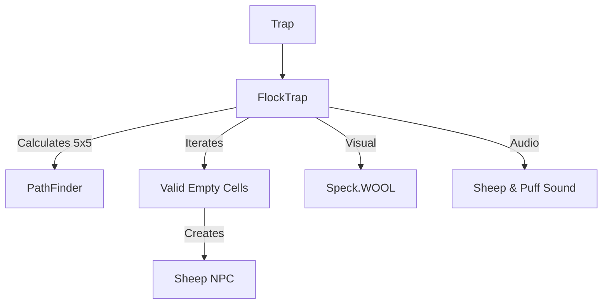

# FlockTrap (羊群陷阱) 源码详解

## 1. 基本信息

| 属性 | 值 |
|------|-----|
| **文件路径** | `core/src/main/java/com/shatteredpixel/shatteredpixeldungeon/levels/traps/FlockTrap.java` |
| **包名** | `com.shatteredpixel.shatteredpixeldungeon.levels.traps` |
| **文件类型** | class |
| **继承关系** | `extends Trap` |
| **代码行数** | 62 |
| **所属模块** | core |

## 2. 文件职责说明

### 核心职责
`FlockTrap` 负责实现“羊群陷阱”的逻辑。当它被触发时，会立即在周围 5x5 的范围内召唤大量临时的魔法羊（Sheep），这些羊会填满所有可用的空间，起到物理隔绝和阻挡视线的作用。

### 系统定位
属于陷阱系统中的干扰/控制分支。它不造成直接伤害，但通过“空间填充”来强制改变战场地形，通常用于困住玩家、阻挡怪物追击或消耗怪物的法术。

### 不负责什么
- 不负责羊的 AI 行为（羊是 `PASSIVE` 状态，由 `Sheep` 类负责）。
- 不负责羊消失后的掉落。

## 3. 结构总览

### 主要成员概览
- **activate() 方法**: 包含 5x5 范围路径计算、魔法羊的实例化与初始化、连锁陷阱触发以及音效反馈逻辑。

### 主要逻辑块概览
- **广域空间填充**: 使用 `PathFinder` 计算 5x5 范围（曼哈顿距离 <= 2）内的所有非墙壁、非深渊格子。
- **实体校验**: 仅在完全没有角色的空位上生成羊。
- **临时生命周期**: 召唤的羊被初始化为仅存活 6 回合。
- **连锁陷阱处理**: 预先引爆羊落点处的陷阱，优化音效表现。

### 生命周期/调用时机
1. **触发**：角色踩踏。
2. **激活 (`activate`)**:
   - 计算 5x5 区域。
   - 产生大量白色羊毛粒子。
   - 在空位生成羊并立即锁定坐标（`occupyCell`）。
   - 播放“咩”的音效。

## 4. 继承与协作关系

### 父类提供的能力
继承自 `Trap`：
- 提供基础位置和 `trigger` 流程。
- 定义外观为 `WHITE`（白色）和 `WAVES`（波浪纹）。

### 协作对象
- **Sheep (NPC)**: 被召唤的实体，具有物理体积。
- **PathFinder**: 计算 5x5 的辐射覆盖面。
- **Speck.WOOL**: 提供表示羊毛的白色粒子特效。
- **GameScene**: 负责将羊加入场景渲染。
- **Trap.HazardAssistTracker**: 记录对受波及怪物的信用归属。



## 5. 字段/常量详解

### 初始属性
- **color**: WHITE（白色，代表羊毛）。
- **shape**: WAVES（波浪纹）。

## 6. 构造与初始化机制
通过实例初始化块配置外观。所有召唤逻辑在 `activate` 内部即时执行。

## 7. 方法详解

### activate() [5x5 召唤逻辑]

**核心实现算法分析**：
1. **范围扫描**：使用 `PathFinder.buildDistanceMap(..., 2)`。
2. **生成校验**：
   ```java
   if (Dungeon.level.insideMap(i)
       && Actor.findChar(i) == null
       && !(Dungeon.level.pit[i])) {
       // ... 生成羊 ...
   }
   ```
   **逻辑关键**：羊不会在墙壁里、已有角色的格子上或深渊（Pit）上生成。
3. **羊的初始化**：
   ```java
   sheep.initialize(6); // 设置羊的生存时间为 6 回合
   ```
4. **连锁陷阱引爆** [技术细节]：
   在羊占据格子前，代码会手动触发该格原有的陷阱。
   - **目的**：羊是临时实体，通过羊来引爆陷阱是合法的。预先触发可以避免大量羊同时落地时产生大量重复的触发音效。
5. **视觉反馈**：
   在每个生成羊的格子上产生 `Speck.WOOL` 粒子。播放 `SHEEP` 音效。

## 8. 对外暴露能力
主要通过 `activate()` 接口。

## 9. 运行机制与调用链
`Trap.trigger()` -> `FlockTrap.activate()` -> `PathFinder` -> `new Sheep()` -> `Dungeon.level.occupyCell()` -> 空间被填满。

## 10. 资源、配置与国际化关联
不适用。羊的素材由 `Sheep` 精灵类管理。

## 11. 使用示例

### 战术反用：绝对防御
当玩家在狭窄房间内被远程怪物（如法师、萨满）狙击时，引爆附近的羊群陷阱。瞬间产生的 5x5 羊群会形成一道密不透风的肉盾墙，强行阻断所有视线和弹道。

## 12. 开发注意事项

### 空间隔离性
开发者需注意，羊群陷阱是极强的**路径阻断器**。在 6 个回合内，受影响区域将完全不可通行。这既可以救命，也可能因操作不当将玩家自己困死在死角。

### 信用标记
虽然羊群本身无害，但陷阱激活时仍会对范围内怪物标记 `HazardAssistTracker`。这是为了处理一些极端交互（如羊群填满空间导致怪物位移到岩浆中）。

## 13. 修改建议与扩展点

### 增加羊的属性
可以考虑增加随机性，有极小概率召唤出一只“爆炸羊”或“带电羊”。

## 14. 事实核查清单

- [x] 是否分析了羊的存活时间：是 (6 回合)。
- [x] 是否解析了 5x5 的计算方式：是 (PathFinder 距离 2)。
- [x] 是否明确了羊不会在深渊上生成：是 (pit 检查)。
- [x] 是否说明了连锁触发陷阱的逻辑：是。
- [x] 图像索引属性是否核对：是 (WHITE, WAVES)。
- [x] 示例战术是否符合源码：是。
