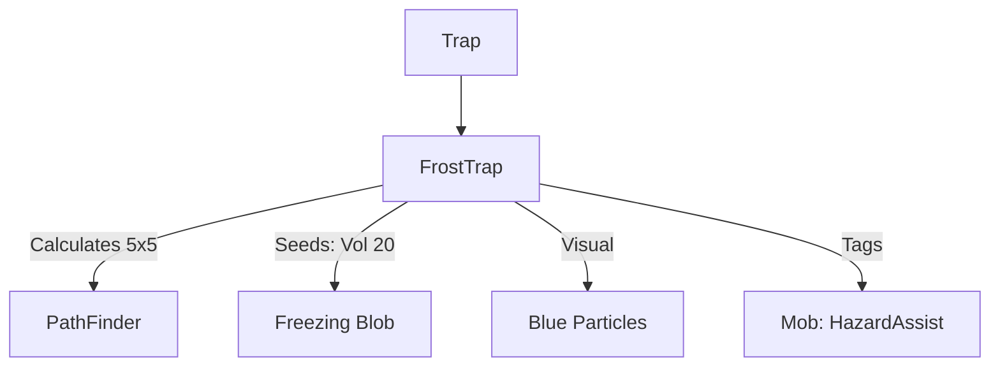

# FrostTrap (霜冻陷阱) 源码详解

## 1. 基本信息

| 属性 | 值 |
|------|-----|
| **文件路径** | `core/src/main/java/com/shatteredpixel/shatteredpixeldungeon/levels/traps/FrostTrap.java` |
| **包名** | `com.shatteredpixel.shatteredpixeldungeon.levels.traps` |
| **文件类型** | class |
| **继承关系** | `extends Trap` |
| **代码行数** | 48 |
| **所属模块** | core |

## 2. 文件职责说明

### 核心职责
`FrostTrap` 负责实现“霜冻陷阱”的逻辑。当它被触发时，会立即在周围 5x5 的范围内产生大量的寒气（Freezing Blob），对范围内的所有角色造成冰冻伤害并有极高概率将其冻结。

### 系统定位
属于陷阱系统中的元素伤害/广域分支。与冰寒陷阱（ChillingTrap）相比，霜冻陷阱具有更大的影响范围（5x5 vs 3x3）和更高的初始寒气强度（20 vs 10）。

### 不负责什么
- 不负责冰冻的具体逻辑实现（由 `Freezing` 类负责）。
- 不负责冷气导致的跨层环境变化。

## 3. 结构总览

### 主要成员概览
- **activate() 方法**: 包含 5x5 范围路径计算、寒气种子铺设、视觉/音效反馈以及针对怪物的信用记录。

### 主要逻辑块概览
- **广域冷气爆发**: 采用 `PathFinder.buildDistanceMap` 计算 5x5 范围（曼哈顿距离 <= 2）内的所有非墙壁格子。
- **高强度寒气种子**: 在受影响的每个格子里植入强度为 20 的 `Freezing` 种子。
- **信用归属**: 对受影响范围内的所有怪物标记环境危害追踪。
- **视觉增强**: 播放冰块破碎音效及亮蓝色溅射。

### 生命周期/调用时机
1. **触发**：角色踩踏。
2. **激活 (`activate`)**:
   - 播放特效。
   - 瞬间在 5x5 的范围内灌满寒气。

## 4. 继承与协作关系

### 父类提供的能力
继承自 `Trap`：
- 提供基础位置管理。
- 定义外观为 `WHITE`（白色）和 `STARS`（星形）。

### 协作对象
- **Freezing (Blob)**: 核心效果实现，处理冰冻伤害和状态判定。
- **PathFinder**: 用于精确计算 5x5 的辐射范围。
- **GameScene**: 负责批量添加产生的寒气对象。
- **Splash**: 提供视觉溅射。
- **Sample**: 播放 `SHATTER` 音效。



## 5. 字段/常量详解

### 初始属性
- **color**: WHITE（白色，代表极寒）。
- **shape**: STARS（星形）。

## 6. 构造与初始化机制
通过实例初始化块配置外观。逻辑完全封装在 `activate` 内部。

## 7. 方法详解

### activate() [5x5 爆发逻辑]

**核心算法分析**：
1. **视觉反馈**：
   在视野内时，产生 5 个 `0xFFB2D6FF`（亮冰蓝）粒子并播放破碎音效。
2. **曼哈顿距离扫描**：
   ```java
   PathFinder.buildDistanceMap( pos, BArray.not( Dungeon.level.solid, null ), 2 );
   for (int i = 0; i < PathFinder.distance.length; i++) {
       if (PathFinder.distance[i] < Integer.MAX_VALUE) {
           GameScene.add(Blob.seed(i, 20, Freezing.class));
           // ... 信用追踪 ...
       }
   }
   ```
   **分析**：
   - 使用 `PathFinder` 计算距离陷阱中心 2 格以内的所有格子（形成一个 5x5 的菱形/正方形区域，取决于具体实现，此处为 25 格左右的范围）。
   - **强度设定**：每个格子植入强度为 **20** 的寒气。这比冰寒陷阱的 10 强了一倍，意味着霜冻陷阱产生的冷气更难消散，且单次判定伤害更高。
3. **信用追踪**：对范围内所有怪物标记 `HazardAssistTracker`。

## 8. 对外暴露能力
主要通过 `activate()` 接口。

## 9. 运行机制与调用链
`Trap.trigger()` -> `FrostTrap.activate()` -> `PathFinder.buildDistanceMap(2)` -> `Blob.seed(20)` -> `Freezing.act()`。

## 10. 资源、配置与国际化关联
不适用。

## 11. 使用示例

### 战术控制：全房速冻
在怪物密集的房间内远程引爆霜冻陷阱。由于其巨大的 5x5 范围和 20 强度的寒气，可以瞬间将这一区域变为冰封地带，使多名敌人同时丧失行动力。

## 12. 开发注意事项

### 范围与强度
开发者应注意，霜冻陷阱是比冰寒陷阱更高阶的威胁。20 强度的冷气在没有抗性的情况下，几乎可以确保角色在第一回合就被冻结。

### 与 ChillingTrap 的视觉区别
霜冻陷阱使用 `STARS`（星形）外观，而冰寒陷阱使用 `DOTS`（点状）外观。虽然颜色都是白色，但星形代表了更高的危险等级。

## 13. 修改建议与扩展点

### 增加碎裂效果
可以增加逻辑，如果范围内有被冻结的单位，再次触发霜冻陷阱时会造成额外的碎裂伤害。

## 14. 事实核查清单

- [x] 是否分析了冷气产生的具体数值：是 (20)。
- [x] 是否解析了 5x5 的具体计算方式：是 (PathFinder 距离 2)。
- [x] 是否明确了与冰寒陷阱的强度对比：是。
- [x] 是否涵盖了环境危害记录：是。
- [x] 图像索引属性是否核对：是 (WHITE, STARS)。
