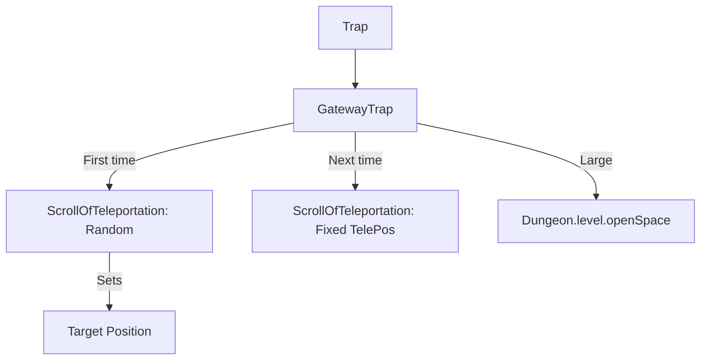

# GatewayTrap (传送门陷阱) 源码详解

## 1. 基本信息

| 属性 | 值 |
|------|-----|
| **文件路径** | `core/src/main/java/com/shatteredpixel/shatteredpixeldungeon/levels/traps/GatewayTrap.java` |
| **包名** | `com.shatteredpixel.shatteredpixeldungeon.levels.traps` |
| **文件类型** | class |
| **继承关系** | `extends Trap` |
| **代码行数** | 125 |
| **所属模块** | core |

## 2. 文件职责说明

### 核心职责
`GatewayTrap` 负责实现“传送门陷阱”的逻辑。它是一种具有**持久性**和**固定终点**的特殊位移陷阱。一旦第一个目标（角色或物品）通过陷阱被传送，陷阱将锁定该位置，并将后续触发的所有目标都传送到同一个目的地。

### 系统定位
属于陷阱系统中的高级位移分支。它是游戏中唯一一种非一次性（默认情况下）的传送陷阱，通常用于连接地图上两个特定的区域。

### 不负责什么
- 不负责确定第一个目标的随机落点算法（由 `ScrollOfTeleportation` 负责）。
- 不负责跨层传送。

## 3. 结构总览

### 主要成员概览
- **telePos 字段**: 记录锁定的传送目的地。
- **activate() 方法**: 包含目的地初始化逻辑和后续的大规模群体传送逻辑。
- **序列化支持**: 覆写 `storeInBundle` 和 `restoreFromBundle` 以保存 `telePos`。

### 主要逻辑块概览
- **目的地锁定 (Initial Trigger)**: 当 `telePos` 为 -1 时，随机传送第一个进入 3x3 范围的目标，并将该落点设为永久目的地。
- **群体传送 (Subsequent Triggers)**: 将 3x3 范围内的所有活物和物品批量传送到 `telePos` 及其周围邻域。
- **空间适配**: 传送时会区分大型生物（LARGE），确保它们能被传送到开阔地（openSpace）。

### 生命周期/调用时机
1. **产生**：关卡生成。
2. **首次激活**: 锁定终点。
3. **后续激活**: 作为稳定的传送门使用（因为 `disarmedByActivation = false`）。

## 4. 继承与协作关系

### 父类提供的能力
继承自 `Trap`：
- 设置 `disarmedByActivation = false` 使其可重复使用。
- 设置 `avoidsHallways = true` 使其生成在房间内。

### 协作对象
- **ScrollOfTeleportation**: 提供 `teleportChar()` 和定向传送 `teleportToLocation()` 方法。
- **PathFinder**: 提供邻域扫描（NEIGHBOURS8/9）。
- **Char.Property**: 用于检查 `IMMOVABLE` 和 `LARGE` 属性以适配传送位置。

## 5. 字段/常量详解

### 实例字段
| 字段名 | 类型 | 默认值 | 说明 |
|--------|------|--------|------|
| `telePos` | int | -1 | 锁定的传送目的地格子索引 |

### 初始属性
- **color**: TEAL (青色)。
- **shape**: CROSSHAIR (十字准星)。
- **disarmedByActivation**: `false` (激活后不消失)。

## 6. 构造与初始化机制
通过实例初始化块静态配置。`telePos` 随存档持久化。

## 7. 方法详解

### activate() [传送门核心逻辑]

**逻辑演进分析**：

#### 1. 建立连接 (`telePos == -1`)
- 扫描 3x3 区域。
- 对第一个发现的角色或物品执行随机传送。
- 记录成功的落点为 `telePos`。

#### 2. 群体同步位移 (`telePos != -1`)
- **生成落点候选列表**:
  - 获取 `telePos` 及其周围 8 格。
  - 过滤掉不可通行或已被占据的格子。
  - **大型单位特殊处理**: 预先筛选出 `openSpace` 格子专门供大型生物使用。
- **批量传送**:
  - 再次遍历 3x3 触发区域。
  - 将所有有效角色按顺序填入候选落点。
  - **AI 影响**: 所有被传送的怪物状态重置为 `WANDERING`。
- **物品迁移**: 同步将地面掉落物批量移动到 `telePos`。

## 8. 对外暴露能力
主要通过 `activate()` 接口。

## 9. 运行机制与调用链
`Trap.trigger()` -> `GatewayTrap.activate()` -> `telePos` 判定 -> `ScrollOfTeleportation.teleportToLocation()` -> 批量坐标变更。

## 10. 资源、配置与国际化关联
不适用。

## 11. 使用示例

### 战术捷径
一旦传送门连接了房间 A 和房间 B，玩家可以反复引导怪物进入陷阱将其送走，或者作为自己在大型房间内快速转移的固定通道。

## 12. 开发注意事项

### 永久性风险
由于该陷阱默认不解除，如果它的目的地 `telePos` 刚好位于另一个危险陷阱之上，该传送门将变成一个致命的“绞肉机”。

### 大型生物匹配
大型生物（如某些 Boss 或特殊怪物）如果找不到 `openSpace` 候选点，将无法被传送。源码中通过 `largeCharPositions` 列表严格保证了这一点。

## 13. 修改建议与扩展点

### 视觉增强
可以增加一种“双向门”逻辑，在 `telePos` 位置也生成一个关联的传送门。

## 14. 事实核查清单

- [x] 是否分析了首次触发与后续触发的区别：是（锁定逻辑）。
- [x] 是否解析了大型生物的空间适配：是（largeCharPositions 过滤）。
- [x] 是否明确了它激活后不解除的特性：是（disarmedByActivation = false）。
- [x] 是否涵盖了物品的批量迁移：是。
- [x] 是否指出了目的地持久化：是（序列化 telePos）。
- [x] 图像索引属性是否核对：是 (TEAL, CROSSHAIR)。
