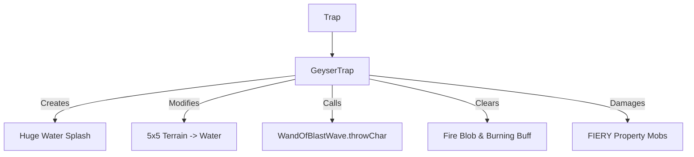

# GeyserTrap (间歇泉陷阱) 源码详解

## 1. 基本信息

| 属性 | 值 |
|------|-----|
| **文件路径** | `core/src/main/java/com/shatteredpixel/shatteredpixeldungeon/levels/traps/GeyserTrap.java` |
| **包名** | `com.shatteredpixel.shatteredpixeldungeon.levels.traps` |
| **文件类型** | class |
| **继承关系** | `extends Trap` |
| **代码行数** | 125 |
| **所属模块** | core |

## 2. 文件职责说明

### 核心职责
`GeyserTrap` 负责实现“间歇泉陷阱”的逻辑。当它被触发时，会喷发出高压水柱，产生大面积的地形改变（将地面变为水面），并利用物理冲击力将周围的所有生物击退。

### 系统定位
属于陷阱系统中的环境/物理分支。它不仅是强力的物理控制手段（击退），还是改变地表环境、大规模灭火的主要自然机制。

### 不负责什么
- 不负责计算水面产生的具体环境 Buff（由 `Level` 和具体状态逻辑负责）。
- 不负责计算跌入深渊的伤害。

## 3. 结构总览

### 主要成员概览
- **activate() 方法**: 包含 5x5 范围的地形转换、3x3 范围的击退判定、针对“火属性”怪物的特殊伤害以及视觉反馈。
- **centerKnockBackDirection 字段**: 允许手动指定中心格子的击退方向（通常用于回收陷阱效果）。

### 主要逻辑块概览
- **广域地形转换**: 将周围 5x5 范围内的地板永久性地变为水面，并清除该区域内的所有火焰效果（Fire Blob）。
- **全方位物理击退**: 
  - 周围 8 格的生物：沿射线方向向外推离 2 格。
  - 中心格生物：英雄优先推向安全地带，怪物则随机推向邻近格。
- **元素克制逻辑**: 对具有 `FIERY`（火属性）特性的敌人造成相当于炸弹级别的重创。
- **状态清除**: 强制移除受影响者身上的 `Burning`（燃烧）Buff。

### 生命周期/调用时机
1. **触发**：角色踩踏。
2. **激活 (`activate`)**:
   - 产生巨量喷水粒子。
   - 转换 5x5 地形。
   - 计算 3x3 范围内的物理冲击。
   - 结算伤害与位移。

## 4. 继承与协作关系

### 父类提供的能力
继承自 `Trap`：
- 提供基础位置和 `scalingDepth()` 计算。
- 定义外观为 `TEAL`（青色）和 `DIAMOND`（菱形）。

### 协作对象
- **WandOfBlastWave**: 复用冲击波法杖的击退算法（`throwChar`）。
- **Ballistica**: 计算精确的击退弹道。
- **Splash**: 产生 100 个蓝色像素粒子的大规模溅射效果。
- **Fire (Blob)**: 用于清除区域内的环境火焰。
- **Burning (Buff)**: 用于清除角色身上的燃烧状态。



## 5. 字段/常量详解

### 实例字段
| 字段名 | 类型 | 说明 |
|--------|------|------|
| `centerKnockBackDirection` | int | 手动设置中心格击退的目标位置（默认为 -1 随机） |
| `source` | Object | 击退来源标识，默认为陷阱自身 |

### 初始属性
- **color**: TEAL（青色，代表水）。
- **shape**: DIAMOND（菱形）。

## 6. 构造与初始化机制
通过实例初始化块静态配置外观。位移计算在 `activate` 调用时根据实时地图状态动态完成。

## 7. 方法详解

### activate() [地形与物理核心逻辑]

**逻辑拆解分析**：

#### 1. 地形转换与灭火 (5x5)
- 使用 `PathFinder.buildDistanceMap(..., 2)` 扫描 5x5 区域。
- 只要距离 <= 2 且满足随机判定，调用 `Dungeon.level.setCellToWater(true, i)`。
- 调用 `fire.clear(i)` 强行熄灭该格的地表火。

#### 2. 外部击退判定 (周边 8 格)
- 遍历 `NEIGHBOURS8`。
- **伤害加深**：如果怪物具有 `FIERY` 属性，受到 `(5+depth) ~ (10+2*depth)` 的伤害，且有 0.67 的修正系数。
- **清除燃烧**：移除 `Burning` Buff。
- **执行击退**：
  ```java
  Ballistica trajectory = new Ballistica(pos, ch.pos, Ballistica.STOP_TARGET);
  WandOfBlastWave.throwChar(ch, trajectory, 2, true, true, source);
  ```
  **技术点**：它利用 `Ballistica` 建立一个从陷阱中心穿过目标的延长线，并将目标推开 **2 格** 距离。

#### 3. 中心击退判定 (陷阱正上方)
- **英雄保护**：如果是玩家触发，算法会搜索周围两圈（pos+i 和 pos+i+i）均不包含危险（avoid 属性）的格子作为候选落点。
- **怪物逻辑**：随机推向周围 8 个方向之一。

## 8. 对外暴露能力
主要通过 `activate()` 接口。

## 9. 运行机制与调用链
`Trap.trigger()` -> `GeyserTrap.activate()` -> `Splash.at(100粒子)` -> `Level.setCellToWater()` -> `WandOfBlastWave.throwChar()`。

## 10. 资源、配置与国际化关联
不适用。溅射颜色硬编码为 `0x5bc1e3`（亮天蓝色）。

## 11. 使用示例

### 大规模灭火
当由于火爆花或火瓶导致整个大厅起火时，触发间歇泉陷阱。它瞬间转化的 5x5 水面和灭火逻辑可以快速控制灾情。

### 制造深渊杀
如果间歇泉陷阱靠近深渊，由于其强大的 2 格击退效果，站在旁边的怪物极易被直接推入深渊。

## 12. 开发注意事项

### 地形转换不可逆
注意 `setCellToWater` 的第一个参数是 `true`。这意味着除非后续有其他机制（如冰结），否则该地块将永久变为水面。

### 击退安全校验
代码中专门为英雄实现了“避险击退”逻辑，这防止了玩家踩到间歇泉却被推入另一个更危险陷阱的极端倒霉情况。

## 13. 修改建议与扩展点

### 增加潮湿状态
可以在 `activate` 逻辑中增加对幸存者的“潮湿（Wet）”状态附加，使其在接下来的数回合内易受闪电伤害。

## 14. 事实核查清单

- [x] 是否分析了地形转换的范围：是 (5x5, 距离 2)。
- [x] 是否解析了击退的具体格数：是 (2 格)。
- [x] 是否说明了灭火和移除燃烧的效果：是。
- [x] 是否涵盖了英雄的避险击退算法：是（检查两格内的 avoid 属性）。
- [x] 对火属性怪物的伤害公式是否准确：是。
- [x] 图像索引属性是否核对：是 (TEAL, DIAMOND)。
