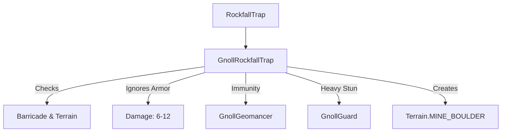

# GnollRockfallTrap (豺狼人落石陷阱) 源码详解

## 1. 基本信息

| 属性 | 值 |
|------|-----|
| **文件路径** | `core/src/main/java/com/shatteredpixel/shatteredpixeldungeon/levels/traps/GnollRockfallTrap.java` |
| **包名** | `com.shatteredpixel.shatteredpixeldungeon.levels.traps` |
| **文件类型** | class |
| **继承关系** | `extends RockfallTrap` |
| **代码行数** | 85 |
| **所属模块** | core |

## 2. 文件职责说明

### 核心职责
`GnollRockfallTrap` 负责实现“豺狼人落石陷阱”的逻辑。它是普通落石陷阱的地理特定变体，主要出现在豺狼人矿区（Mining Level），其伤害特性、目标豁免和对环境的影响均针对该层级进行了特殊设计。

### 系统定位
属于陷阱系统中的物理/环境转换分支。它不仅是豺狼人地术师（Geomancer）的战斗辅助工具，还具有动态改变地图地形（产生矿区岩石）的功能。

### 不负责什么
- 不负责普通落石陷阱的外观定义（继承自父类 `RockfallTrap`）。
- 不负责豺狼人地术师的技能触发判定。

## 3. 结构总览

### 主要成员概览
- **activate() 方法**: 覆写父类方法，引入了障碍物检测、护甲穿透伤害、差异化瘫痪时长以及地形生成逻辑。

### 主要逻辑块概览
- **环境敏感的区域计算**: 在 5x5 的落石范围内，自动避开靠近路障（Barricade）的格子，以维持矿区结构的逻辑合理性。
- **护甲穿透伤害**: 造成的伤害数值较低（6-12），但**完全无视护甲**（不进行 drRoll 扣减）。
- **目标特定交互**: 
  - **豁免**: 豺狼人地术师完全免疫此伤害。
  - **惩罚**: 豺狼人守卫受到极长时间的瘫痪效果。
- **动态地形生成**: 陷阱触发后，有概率将空地板永久转化为矿区岩石（MINE_BOULDER）。

### 生命周期/调用时机
1. **触发**：角色踩踏或由豺狼人地术师通过法术引爆。
2. **激活 (`activate`)**:
   - 扫描 5x5 区域。
   - 过滤路障相邻格。
   - 角色结算与地形转化同步进行。

## 4. 继承与协作关系

### 父类提供的能力
继承自 `RockfallTrap`：
- 定义了默认的外观（GREY, DIAMOND）。
- 提供了基础的 `point()` 定位逻辑。

### 协作对象
- **MiningLevel**: 该陷阱的核心宿主环境，提供了路障和矿区岩石的地形定义。
- **GnollGeomancer / GnollGuard**: 与特定豺狼人怪物存在特殊的伤害/控制交互。
- **Terrain.MINE_BOULDER**: 被该陷阱生成的静态地形。
- **Paralysis**: 控制效果实现。



## 5. 字段/常量详解
无。该类主要通过逻辑算法实现差异化。

## 6. 构造与初始化机制
继承父类的静态属性配置。

## 7. 方法详解

### activate() [矿区定制逻辑]

**核心实现算法分析**：

#### 1. 区域过滤算法
```java
if (Dungeon.level instanceof MiningLevel){
    boolean barricade = false;
    for (int j : PathFinder.NEIGHBOURS9){
        if (Dungeon.level.map[i+j] == Terrain.BARRICADE) barricade = true;
    }
    if (barricade) continue; // 避开路障旁边的格子
}
```
**设计意图**：这反映了矿道坍塌的物理逻辑，路障被认为是支撑结构，其相邻区域较为稳固。

#### 2. 伤害结算 (无视护甲)
```java
int damage = Random.NormalIntRange(6, 12);
ch.damage( Math.max(damage, 0) , this);
```
**技术点**：与父类 `damage - ch.drRoll()` 不同，这里**去掉了护甲减免**。这意味着无论玩家穿多厚的板甲，都会受到真实且恒定的震动伤害。

#### 3. 差异化瘫痪
- **普通生物**: 3 回合 `Paralysis`。
- **豺狼人守卫 (GnollGuard)**: **10 回合** `Paralysis`。
**设计意图**：暗示豺狼人守卫由于笨重的装备，在落石中更容易被压住无法动弹。

#### 4. 地形生成逻辑
```java
else if (ch == null && Dungeon.level instanceof MiningLevel && ... && Random.Int(2) == 0){
    Level.set( cell, Terrain.MINE_BOULDER );
}
```
**技术影响**：触发陷阱后，地图上会凭空多出一些不可通行的岩石堆。这不仅是视觉效果，还能在战斗中瞬间改变逃生路线或制造掩体。

## 8. 对外暴露能力
主要通过 `activate()` 接口。

## 9. 运行机制与调用链
`Trap.trigger()` -> `GnollRockfallTrap.activate()` -> `MiningLevel` 环境检查 -> `Char.damage()` -> `Level.set(MINE_BOULDER)`。

## 10. 资源、配置与国际化关联
不适用。

## 11. 使用示例

### 环境改造
在豺狼人矿区中，如果玩家需要制造一些障碍物来阻挡追兵，可以故意引导地术师引爆该陷阱，利用 50% 的概率产生岩石来堵塞路口。

## 12. 开发注意事项

### 职业免疫
豺狼人地术师（GnollGeomancer）是此陷阱的制造者，具有完全的魔法免疫（通过 `instanceof` 检查实现）。在扩展新豺狼人兵种时，需考虑是否也要加入此豁免。

### 地形转换条件
岩石生成的判定非常严格：必须没有角色、没有其他陷阱、没有植物。这防止了地形生成导致逻辑冲突（如岩石压死植物或覆盖传送门）。

## 13. 修改建议与扩展点

### 增加矿石产出
可以增加逻辑，使生成的 `MINE_BOULDER` 有概率包含金矿或露水。

## 14. 事实核查清单

- [x] 是否分析了无视护甲的伤害特性：是 (6-12 固定区间)。
- [x] 是否解析了针对守卫的特殊惩罚：是 (10 回合瘫痪)。
- [x] 是否说明了地形生成的触发概率：是 (50%, MiningLevel 限定)。
- [x] 是否指出了地术师的完全豁免：是。
- [x] 图像索引属性是否核对：是（继承自父类）。
