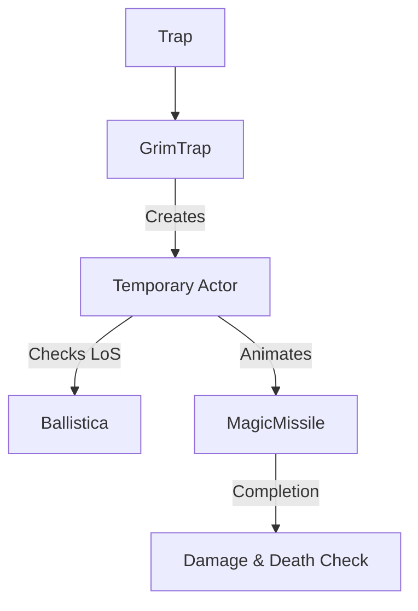

# GrimTrap (死亡陷阱) 源码详解

## 1. 基本信息

| 属性 | 值 |
|------|-----|
| **文件路径** | `core/src/main/java/com/shatteredpixel/shatteredpixeldungeon/levels/traps/GrimTrap.java` |
| **包名** | `com.shatteredpixel.shatteredpixeldungeon.levels.traps` |
| **文件类型** | class |
| **继承关系** | `extends Trap` |
| **代码行数** | 115 |
| **所属模块** | core |

## 2. 文件职责说明

### 核心职责
`GrimTrap` 负责实现“死亡陷阱”的逻辑。它是游戏中最高危的陷阱之一，具有自动寻敌、超远射程和准即死伤害的特性。

### 系统定位
属于陷阱系统中的致命/远程分支。它不局限于惩罚踩踏者，还会主动狙击视野范围内的目标。

### 不负责什么
- 不负责陷阱的视觉渲染（由 `DungeonTilemap` 根据 `color` 和 `shape` 绘制）。
- 不负责“死亡”徽章的持久化存储（仅负责调用验证）。

## 3. 结构总览

### 主要成员概览
- **实例初始化块**: 设置陷阱的外观（GREY, LARGE_DOT）和基础属性（始终可见、避开走廊）。
- **activate() 方法**: 核心逻辑入口，通过创建一个临时的 `Actor` 来处理复杂的异步寻敌和视觉表现。

### 主要逻辑块概览
- **智能寻敌**: 如果陷阱格没有目标，则自动搜索有效范围内（通常是火把光照范围或视野范围）最近的活物。
- **障碍物判定**: 使用 `Ballistica`（弹道计算）确保狙击路径没有墙壁或其他遮挡。
- **即死伤害模拟**: 根据目标的总生命值和当前生命值计算巨量伤害。
- **英雄保护机制**: 专门为玩家角色设置了伤害上限，防止满血被秒杀。

### 生命周期/调用时机
1. **产生**：关卡生成时放置在房间内。
2. **触发**：角色踩踏。
3. **激活**：执行狙击逻辑。
4. **结束**：如果是 `disarmedByActivation` 为真（默认），激活后即解除。

## 4. 继承与协作关系

### 父类提供的能力
继承自 `Trap`：
- 提供 `pos` 管理、`trigger()` 流程、`disarm()` 以及存档序列化支持。

### 协作对象
- **Actor**: 用于将逻辑包装在渲染线程可控的调度器中。
- **Ballistica**: 进行视线（LoS）判定，确保狙击合法。
- **MagicMissile / ShadowParticle**: 提供暗影导弹的移动轨迹和爆裂特效。
- **Badges**: 验证“死于死亡陷阱”或“死于友军魔法”的成就。

## 5. 字段/常量详解

### 初始属性
| 属性 | 值 | 说明 |
|--------|------|------|
| `color` | GREY | 视觉颜色为灰色 |
| `shape` | LARGE_DOT | 形状为一个大的中心圆点 |
| `canBeHidden`| false | 该陷阱**始终可见**，无法隐藏 |
| `avoidsHallways`| true | 绝不生成在走廊，通常位于开阔房间中心 |

## 6. 构造与初始化机制
使用实例初始化块设置上述属性。该类没有额外的成员变量，所有逻辑状态在 `activate` 内部通过局部变量管理。

## 7. 方法详解

### activate() [狙击与调度逻辑]

**核心实现分析**：
为了处理导弹飞行的动画延迟，逻辑被包装在一个 `VFX_PRIO` 优先级的 `Actor` 中：
1. **寻找目标**：
   - 优先检查陷阱格上的角色。
   - 若无，计算搜索半径 `range = max(6, viewDistance) + 0.5f`（最小 6.5 格）。
   - 遍历所有活着的角色，使用 `Ballistica` 检查是否可被狙击。
   - **隐身处理**：隐身的目标被视为处于最大距离（狙击优先级最低）。
2. **伤害计算**：
   - 公式：`damage = Math.round(HT/2f + HP/2f)`。
   - **英雄保护**：`damage = min(damage, HT * 0.9f)`。这确保了满血的英雄踩到死亡陷阱后会剩下 10% 的血皮，而非直接暴毙。
3. **视觉表现**：
   - 检查 FOV。
   - 产生 `MagicMissile.SHADOW`（黑烟导弹）。
   - 命中后回调：执行 `target.damage()`，播放 `CURSED` 或 `BURNING` 音效，产生 `ShadowParticle.UP` 特效。

## 8. 对外暴露能力
主要通过 `activate()` 接口。

## 9. 运行机制与调用链
`Trap.trigger()` -> `GrimTrap.activate()` -> `Actor.add()` -> `Ballistica` 判定 -> `MagicMissile` 飞行 -> `Callback.call()` -> 结算伤害。

## 10. 资源、配置与国际化关联

### 本地化词条
- `traps.GrimTrap.name`: 死亡陷阱
- `traps.GrimTrap.ondeath`: “你被死亡之光瞬间吞噬了...”

## 11. 使用示例

### 战术反用
如果玩家拥有“陷阱重置”能力或法术，可以诱导强力怪物经过死亡陷阱。由于死亡陷阱会智能锁定最近目标，它将成为一个高效的自动炮塔。

## 12. 开发注意事项

### 射程陷阱
`range` 的计算包含了 `viewDistance`。如果地牢处于黑暗状态（火把范围 6），死亡陷阱的寻敌范围会相应缩小到 6.5，但依然远超一般陷阱。

### 英雄保护失效情况
虽然有 90% HT 的上限，但由于死亡陷阱的类型是 `GrimTrap.this`（陷阱源），如果玩家此时已经负伤（HP < 90% HT），保护机制虽然生效，但计算出的伤害仍足以清空剩余生命。

## 13. 修改建议与扩展点

### 增加穿透性
目前的狙击会被中间的第一个角色挡住。可以修改 `Ballistica` 的处理，使其对路径上的所有生物造成递减伤害。

## 14. 事实核查清单

- [x] 是否解析了智能寻敌的优先顺序：是（脚下优先，随后最近，英雄权重最高）。
- [x] 是否分析了英雄的 90% 减免保护：是。
- [x] 是否涵盖了 Ballistica 碰撞检测：是。
- [x] 是否说明了隐身对寻敌的影响：是（强制设为最大距离）。
- [x] 图像索引属性是否核对：是（GREY, LARGE_DOT）。
