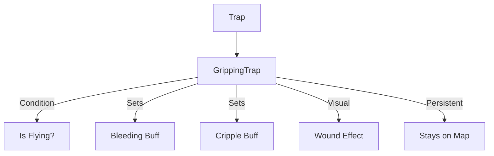

# GrippingTrap (夹击陷阱) 源码详解

## 1. 基本信息

| 属性 | 值 |
|------|-----|
| **文件路径** | `core/src/main/java/com/shatteredpixel/shatteredpixeldungeon/levels/traps/GrippingTrap.java` |
| **包名** | `com.shatteredpixel.shatteredpixeldungeon.levels.traps` |
| **文件类型** | class |
| **继承关系** | `extends Trap` |
| **代码行数** | 48 |
| **所属模块** | core |

## 2. 文件职责说明

### 核心职责
`GrippingTrap` 负责实现“夹击陷阱”（类似于捕兽夹）的逻辑。当非飞行角色踩踏时，它会造成物理性创伤，使目标陷入流血和残废状态。

### 系统定位
属于陷阱系统中的物理/控制分支。它的显著特点是**非一次性消耗**（可重复触发），是持续阻碍走廊通行的强力物理障碍。

### 不负责什么
- 不负责计算流血伤害的逐回合扣血（由 `Bleeding` Buff 负责）。
- 不负责飞行的免疫逻辑判定（由 `activate` 方法内的 `!c.flying` 检查实现）。

## 3. 结构总览

### 主要成员概览
- **实例初始化块**: 设置外观属性（GREY, DOTS）以及陷阱的关键行为属性（不自动解除、避开走廊）。
- **activate() 方法**: 包含针对角色的物理伤害公式计算、Buff 施加以及视觉反馈。

### 主要逻辑块概览
- **状态属性控制**: 显式设置 `disarmedByActivation = false`，这意味着踩踏后陷阱依然存在于地图上。
- **物理创伤算法**: 结合地牢深度和目标护甲减免（DR Roll）来确定流血强度。
- **复合控制效果**: 同时施加 `Bleeding`（流血）和 `Cripple`（残废，降低移速）。

### 生命周期/调用时机
1. **触发**：角色踩踏。
2. **激活 (`activate`)**:
   - 检查角色是否飞行。
   - 产生伤口特效。
   - 结算 Buff 强度。
3. **存续**: 激活后不消失，等待下一个目标。

## 4. 继承与协作关系

### 父类提供的能力
继承自 `Trap`：
- 提供位置管理和 `trigger` 流程。
- 通过设置 `disarmedByActivation` 覆写了父类默认的自动解除逻辑。

### 协作对象
- **Bleeding / Cripple**: 核心状态效果实现。
- **Wound**: 提供视觉上的伤口/打击特效。
- **Trap.HazardAssistTracker**: 用于怪物死亡信用追踪。



## 5. 字段/常量详解

### 初始属性
- **color**: GREY（灰色，代表金属/岩石质感）。
- **shape**: DOTS（点状，模拟尖刺或齿痕）。
- **disarmedByActivation**: `false`（激活后不解除）。
- **avoidsHallways**: `true`（避开走廊，通常生成在房间出入口）。

## 6. 构造与初始化机制
通过实例初始化块静态配置。该类无实例字段，所有逻辑运算在触发时即时完成。

## 7. 方法详解

### activate() [物理创伤逻辑]

**核心实现算法分析**：
1. **目标合法性**：`if (c != null && !c.flying)`。只有踩在地面上的角色受影响。
2. **流血伤害公式**：
   ```java
   int damage = Math.max( 0, (2 + scalingDepth()/2) - c.drRoll()/2 );
   ```
   **公式拆解**：
   - **基础威力**: `2 + depth / 2`。在第 20 层，基础威力为 12。
   - **防御对抗**: 目标的护甲（drRoll）只能抵扣 **50%** 的陷阱威力（`drRoll/2`）。
   **结论**：这使得夹击陷阱对高护甲单位依然具有很强的杀伤力，因为它的护甲穿透效果极好。
3. **视觉反馈**：
   - 命中角色时：`Wound.hit( c )`。
   - 未命中（如飞行单位经过）：在对应位置产生静态伤口特效 `Wound.hit( pos )`。

## 8. 对外暴露能力
主要通过 `activate()` 接口。

## 9. 运行机制与调用链
`Trap.trigger()` -> `GrippingTrap.activate()` -> `Bleeding.set(damage)` -> `Wound.hit()` -> 陷阱保持 `active` 状态。

## 10. 资源、配置与国际化关联
不适用。

## 11. 使用示例

### 战术反用：阵地战
由于夹击陷阱不会消失，玩家可以将强力近战怪物引诱到陷阱上来回走动。每踩一次，怪物都会获得叠加的流血和残废效果，极大削弱其威胁。

## 12. 开发注意事项

### 可重复性
开发者需注意，`GrippingTrap` 是目前陷阱包中少数几个**激活后不消失**的陷阱。在布置关卡时，过多的夹击陷阱可能会导致区域彻底无法通行。

### 与 WornDartTrap 的区别
夹击陷阱是针对“脚下”的即时接触伤害，且具有残废效果；飞镖陷阱是远程投射伤害。

## 13. 修改建议与扩展点

### 增加束缚效果
目前的残废仅降低移速。可以考虑在 `activate` 中增加几回合的真正的 `Paralysis`（瘫痪）或 `Rooted`（植根/无法移动），以更真实地模拟捕兽夹的效果。

## 14. 事实核查清单

- [x] 是否分析了伤害减免的特殊比例：是 (drRoll 只生效 50%)。
- [x] 是否解析了陷阱的不消失特性：是 (disarmedByActivation = false)。
- [x] 是否说明了对飞行单位的免疫：是。
- [x] 是否涵盖了复合 Buff 效果：是 (Bleeding + Cripple)。
- [x] 图像索引属性是否核对：是 (GREY, DOTS)。
