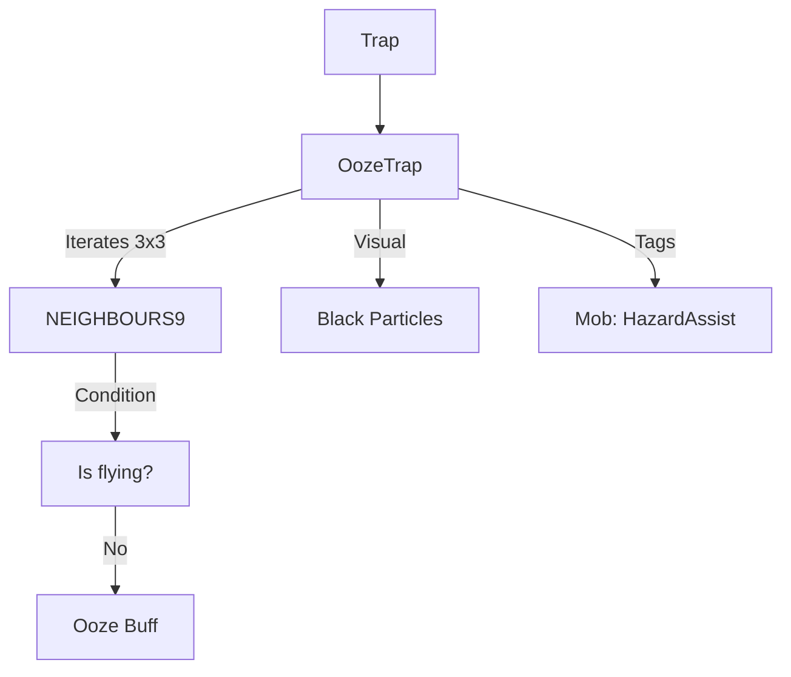

# OozeTrap (粘液陷阱) 源码详解

## 1. 基本信息

| 属性 | 值 |
|------|-----|
| **文件路径** | `core/src/main/java/com/shatteredpixel/shatteredpixeldungeon/levels/traps/OozeTrap.java` |
| **包名** | `com.shatteredpixel.shatteredpixeldungeon.levels.traps` |
| **文件类型** | class |
| **继承关系** | `extends Trap` |
| **代码行数** | 42 |
| **所属模块** | core |

## 2. 文件职责说明

### 核心职责
`OozeTrap` 负责实现“粘液陷阱”的逻辑。当它被触发时，会向周围 3x3 范围内的角色喷洒腐蚀性粘液（Ooze），使目标受到持续的腐蚀伤害，除非通过接触水面来清除。

### 系统定位
属于陷阱系统中的状态/范围分支。它是第一章（下水道）标志性的 Boss 特性在大众关卡中的陷阱化实现，强调了地形互动（找水）的重要性。

### 不负责什么
- 不负责粘液伤害的具体逐回合计算（由 `Ooze` Buff 类处理）。
- 不负责粘液在水中的清除逻辑。

## 3. 结构总览

### 主要成员概览
- **activate() 方法**: 包含九宫格范围扫描、黑色溅射特效产生、Buff 施加以及信用记录逻辑。

### 主要逻辑块概览
- **粘液扩散**: 遍历触发点及其相邻 8 格（`NEIGHBOURS9`），在非墙壁格子上模拟粘液喷溅。
- **状态应用判定**: 仅对站在地面上（非飞行）的角色施加 `Ooze` 状态。
- **视觉反馈**: 在受影响的格子上产生纯黑色像素溅射。

### 生命周期/调用时机
1. **触发**：角色踩踏。
2. **激活 (`activate`)**:
   - 产生黑色溅射。
   - 判定角色飞行状态。
   - 挂载腐蚀 Buff。

## 4. 继承与协作关系

### 父类提供的能力
继承自 `Trap`：
- 提供位置管理和触发流程。
- 定义外观为 `GREEN`（绿色）和 `DOTS`（点状）。

### 协作对象
- **Ooze (Buff)**: 核心负面效果，造成持续伤害。
- **Splash**: 产生颜色为 `0x000000`（黑色）的像素溅射效果。
- **Trap.HazardAssistTracker**: 用于怪物死亡信用追踪。
- **PathFinder.NEIGHBOURS9**: 提供九宫格范围遍历。



## 5. 字段/常量详解

### 初始属性
- **color**: GREEN（绿色，代表毒素或粘液）。
- **shape**: DOTS（点状）。

## 6. 构造与初始化机制
通过实例初始化块静态配置外观。逻辑完全封装在 `activate` 内部。

## 7. 方法详解

### activate() [九宫格喷溅逻辑]

**核心实现算法分析**：
1. **范围迭代**：
   ```java
   for( int i : PathFinder.NEIGHBOURS9) {
       if (!Dungeon.level.solid[pos + i]) {
           Splash.at( pos + i, 0x000000, 5); // 黑色溅射
           Char ch = Actor.findChar( pos + i );
           if (ch != null && !ch.flying){
               Buff.affect(ch, Ooze.class).set( Ooze.DURATION );
               // ... 信用追踪 ...
           }
       }
   }
   ```
   **分析**：
   - **视觉表现**：在受影响的每一个非墙壁格子上都会爆出 5 个黑色像素粒子，极具辨识度。
   - **核心判定**：`!ch.flying`。这意味着飞行单位（如蝙蝠、蜜蜂）或使用漂浮药水的玩家可以完全免疫粘液陷阱。
   - **Buff 强度**：直接应用 `Ooze.DURATION` 标准时长。

## 8. 对外暴露能力
主要通过 `activate()` 接口。

## 9. 运行机制与调用链
`Trap.trigger()` -> `OozeTrap.activate()` -> `Splash.at()` -> `Buff.affect(Ooze.class)` -> `Ooze.act()` (逐回合造成伤害)。

## 10. 资源、配置与国际化关联
不适用。溅射颜色硬编码为黑色。

## 11. 使用示例

### 战术反用：群体腐蚀
在没有水源的开阔地带，引诱一群近战怪物经过粘液陷阱。由于其 3x3 的覆盖面，能一次性让大量敌人处于持续掉血状态，且它们无法通过找水来解除。

## 12. 开发注意事项

### 飞行免疫
开发者需注意，粘液陷阱是极少数**非飞行角色**专属的陷阱。对于大量飞行的怪物层，此类陷阱形同虚设。

### 视觉关联
颜色虽然是 `GREEN`，但产生的溅射是黑色的（模仿古神咕噜的粘液）。这在视觉上与毒镖陷阱（绿色粒子）有明显区分。

## 13. 修改建议与扩展点

### 增加地形残留
可以增加逻辑，使受影响的地块变为“粘液覆盖”状态，路过的生物都会被减速。

## 14. 事实核查清单

- [x] 是否分析了飞行免疫逻辑：是 (!ch.flying)。
- [x] 是否解析了 3x3 的范围覆盖：是 (NEIGHBOURS9)。
- [x] 是否说明了溅射的具体颜色：是 (0x000000 黑色)。
- [x] 是否涵盖了信用记录：是。
- [x] 图像索引属性是否核对：是 (GREEN, DOTS)。
