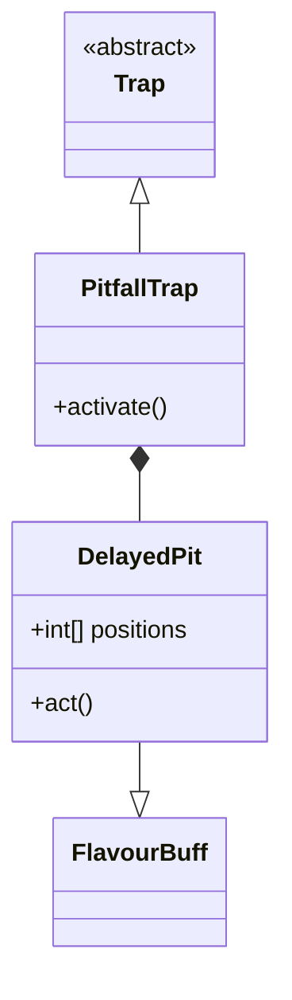

# PitfallTrap (深坑陷阱) 源码详解

## 1. 基本信息

| 属性 | 值 |
|------|-----|
| **文件路径** | `core/src/main/java/com/shatteredpixel/shatteredpixeldungeon/levels/traps/PitfallTrap.java` |
| **包名** | `com.shatteredpixel.shatteredpixeldungeon.levels.traps` |
| **文件类型** | class / inner class |
| **继承关系** | `extends Trap` |
| **代码行数** | 145 |
| **所属模块** | core |

## 2. 文件职责说明

### 核心职责
`PitfallTrap` 负责实现“深坑陷阱”及其关联的延迟坠落效果。它不同于普通伤害陷阱，它会直接导致角色或物品掉落到下一层地牢。

### 系统定位
属于陷阱系统中的环境/位移分支。它与 `Chasm`（深渊）机制和 `Buff` 系统紧密联动，是改变关卡层级位置的关键手段。

### 不负责什么
- 不负责实际的跨层切换逻辑（由 `Chasm.heroFall()` 处理）。
- 不负责计算坠落伤害。

## 3. 结构总览

### 主要成员概览
- **PitfallTrap 类**: 陷阱实体，负责初始触发和 3x3 范围的预警。
- **DelayedPit 内部类**: 继承自 `FlavourBuff`，实现了 1 回合后的延迟坠落逻辑。

### 主要逻辑块概览
- **触发限制**: 在 Boss 层、地牢 25 层之后或特定分支中无法触发坠落。
- **范围效果**: 触发点周围 3x3 的九宫格区域都会受到影响。
- **延迟机制**: 通过 Buff 机制，在玩家执行下一个动作后才执行坠落，给玩家留出使用药水或技能的最后机会。
- **多目标处理**: 同时处理角色（英雄、怪物）和地面掉落物（Heap）的坠落逻辑。

### 生命周期/调用时机
1. **触发**：角色踩踏。
2. **激活 (`activate`)**: 为英雄挂上 `DelayedPit` Buff，并记录受影响的格子坐标。
3. **延迟期**: 1 回合。
4. **结算 (`act`)**: Buff 逻辑运行，遍历记录的格子，执行坠落判定。

## 4. 继承与协作关系

### 父类提供的能力
继承自 `Trap`：
- 提供 `color(RED)` 和 `shape(DIAMOND)` 属性及基础 trigger 流程。

### 协作对象
- **Chasm**: 提供 `heroFall()` 和 `mobFall()` 接口实现跨层位移。
- **DelayedPit (Buff)**: 作为时间缓冲器，确保坠落不是瞬间发生的。
- **CellEmitter / PitfallParticle**: 提供地面塌陷的粒子视觉反馈。
- **Heap**: 处理地面掉落物随之掉下的逻辑。



## 5. 字段/常量详解

### 初始属性
- **color**: RED（红色，代表极度危险）。
- **shape**: DIAMOND（菱形）。

### DelayedPit 字段
| 字段名 | 类型 | 说明 |
|--------|------|------|
| `positions` | int[] | 受影响的地图格子索引列表 |
| `depth/branch`| int | 记录触发时的层级，防止跨层结算异常 |
| `ignoreAllies` | boolean | 是否忽略盟友（通常用于特定技能重置） |

## 6. 构造与初始化机制
通过实例初始化块设置外观属性。`DelayedPit` 具有 `revivePersists = true`，确保在极少数复活场景下逻辑依然连续。

## 7. 方法详解

### activate() [范围预警]

**核心实现分析**：
1. **环境校验**：如果当前是 Boss 层或深于 25 层，陷阱仅显示提示但不产生地洞。
2. **挂载 Buff**：给英雄应用 `DelayedPit`。
3. **范围扫描**：
   ```java
   for (int i : PathFinder.NEIGHBOURS9){
       if (!Dungeon.level.solid[pos+i] || Dungeon.level.passable[pos+i]){
           CellEmitter.floor(pos+i).burst(PitfallParticle.FACTORY4, 8);
           positions.add(pos+i);
       }
   }
   ```
   **技术点**：它会扫描触发点周围 9 格，只要不是实心墙壁，就会记录在案并播放初步的地裂粒子特效。

---

### DelayedPit.act() [结算逻辑]

**核心算法分析**：
1. **二次校验**：检查当前层级是否与触发时一致。
2. **多重坠落判定**：
   - **角色判定**：检查目标是否 `flying`（飞行）。不影响飞行单位。
   - **中立判定**：不影响具有 `IMMOVABLE` 属性的中立角色。
   - **物品判定**：
     - 普通物品堆（Heap）会被移除并调用 `Dungeon.dropToChasm(item)`。
     - **豁免物品**：商店待售物品、上锁宝箱、水晶宝箱不会坠落。
3. **执行顺序**：先处理怪物和物品，**英雄最后坠落**。这确保了在结算过程中，英雄的坐标依然是有效的参考点。

## 8. 对外暴露能力
主要通过 `activate()` 接口和 `DelayedPit` 的序列化能力。

## 9. 运行机制与调用链
`Trap.trigger()` -> `PitfallTrap.activate()` -> `Buff.append(DelayedPit)` -> 玩家行动 -> `DelayedPit.act()` -> `Chasm.heroFall()`。

## 10. 资源、配置与国际化关联

### 本地化词条
- `traps.PitfallTrap.triggered_hero`: “你脚下的地面塌陷了！”
- `traps.PitfallTrap.no_pit`: “地面剧烈震动，但并未塌陷。”

## 11. 使用示例

### 远程触发
通过投掷飞镖触发怪物身边的深坑陷阱。1 回合后，该区域塌陷，将怪物送往下一层。

## 12. 开发注意事项

### 结算时机
由于是延迟 1 回合结算，如果玩家在触发后的这一回合内成功瞬移离开受影响区域，将不会坠落。

### 存档完整性
`DelayedPit` 存储了 `int[] positions`。在大规模塌陷时，存档文件会略微增大。

## 13. 修改建议与扩展点

### 增加深度限制
可以修改 `activate` 中的条件，使某些特定分支（如黑暗关卡）具有不同的塌陷范围。

## 14. 事实核查清单

- [x] 是否分析了延迟结算机制：是 (1 回合 Buff)。
- [x] 是否解析了 3x3 的影响范围：是 (NEIGHBOURS9)。
- [x] 是否涵盖了飞行和宝箱的豁免逻辑：是。
- [x] 是否说明了 Boss 层的限制：是。
- [x] 图像索引属性是否核对：是 (RED, DIAMOND)。
