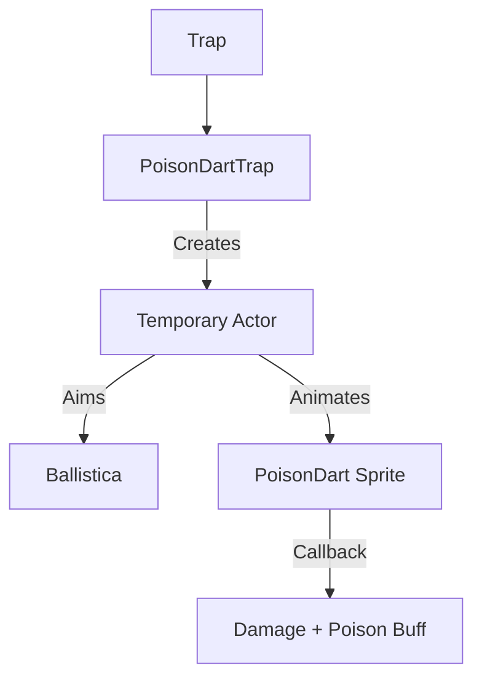

# PoisonDartTrap (毒镖陷阱) 源码详解

## 1. 基本信息

| 属性 | 值 |
|------|-----|
| **文件路径** | `core/src/main/java/com/shatteredpixel/shatteredpixeldungeon/levels/traps/PoisonDartTrap.java` |
| **包名** | `com.shatteredpixel.shatteredpixeldungeon.levels.traps` |
| **文件类型** | class |
| **继承关系** | `extends Trap` |
| **代码行数** | 125 |
| **所属模块** | core |

## 2. 文件职责说明

### 核心职责
`PoisonDartTrap` 负责实现“毒镖陷阱”的逻辑。它通过自动寻敌并向最近目标发射一枚带有毒素的飞镖，造成即时物理伤害和持续中毒伤害。

### 系统定位
属于陷阱系统中的远程攻击/状态分支。它是游戏中常见的远程威胁，结合了物理判定和毒素 Buff 的多重伤害模式。

### 不负责什么
- 不负责飞镖物品的生成（它使用一个虚拟的 `PoisonDart` 对象用于视觉渲染）。
- 不负责中毒伤害的逐回合结算（由 `Poison` Buff 类处理）。

## 3. 结构总览

### 主要成员概览
- **实例初始化块**: 设置外观（GREEN, CROSSHAIR）及基础属性（始终可见、避开走廊）。
- **poisonAmount() 方法**: 计算中毒效果的总强度。
- **activate() 方法**: 包含智能寻敌、物理弹道计算和多维伤害结算逻辑。

### 主要逻辑块概览
- **智能寻敌与狙击**: 继承自高级陷阱的狙击逻辑。在 6.5 格至视野半径内自动锁定最近活物。
- **物理与毒素双重伤害**: 命中时先扣除受护甲减免的物理生命值，随后施加随深度增强的中毒 Buff。
- **Boss 战特殊逻辑**: 专门处理在天狗（Tengu）Boss 战中被陷阱击中对挑战成就的影响。

### 生命周期/调用时机
1. **触发**：角色踩踏。
2. **激活 (`activate`)**:
   - 寻找目标。
   - 如果目标在视野内，播放飞镖飞行补间动画。
   - 命中回调：执行物理伤害 -> 施加中毒 -> 播放打击特效。

## 4. 继承与协作关系

### 父类提供的能力
继承自 `Trap`：
- 提供 `pos` 存储、`trigger` 流程和 `scalingDepth()` 深度支持。

### 协作对象
- **Actor**: 用于包装异步飞镖动画逻辑。
- **Ballistica**: 判定狙击路径是否通畅。
- **MissileSprite / PoisonDart**: 提供飞镖飞行的视觉表现。
- **Poison (Buff)**: 核心负面状态实现。
- **Statistics**: 在第 10 层处理 Boss 挑战分数。



## 5. 字段/常量详解

### 初始属性
- **color**: GREEN（绿色，代表毒性）。
- **shape**: CROSSHAIR（十字准星，代表远程射击）。
- **canBeHidden**: `false`（始终可见）。
- **avoidsHallways**: `true`。

## 6. 构造与初始化机制
通过实例初始化块静态配置。逻辑主要集中在 `activate` 内部的匿名 Actor 类中。

## 7. 方法详解

### poisonAmount() [毒性强度公式]

**算法职责**：计算中毒 Buff 造成的总伤害量。

**核心公式**：
```java
return 8 + Math.round(2 * scalingDepth() / 3f);
```
**分析**：
- **初期 (depth=1)**: 强度约为 9。
- **后期 (depth=25)**: 强度约为 25。
- 此数值由 `Poison` Buff 接收，代表该 Buff 总共将造成的生命值损耗。

---

### activate() [狙击与结算]

**核心逻辑分析**：

#### 1. 寻敌逻辑（狙击模式）
- **检测范围**: `min(6, viewDistance) + 0.5f`。
- **视线判定**: 必须通过 `Ballistica` 检查，飞镖不能穿墙。
- **目标选择**: 最近的角色；隐身单位被视为在最远处。

#### 2. 物理伤害结算
```java
int dmg = Random.NormalIntRange(4, 8) - finalTarget.drRoll();
```
**分析**：基础伤害极低（4-8点），且能被角色的护甲（drRoll）显著抵消。这反映了飞镖本身只是载体，真正的威胁来自毒药。

#### 3. 天狗战特殊关联
```java
if (Dungeon.depth == 10) {
    Statistics.qualifiedForBossChallengeBadge = false;
    Statistics.bossScores[1] -= 100;
}
```
**技术点**：这说明毒镖陷阱是天狗战斗设计的一部分。被陷阱击中将直接导致“无伤击败 Boss”挑战失败并扣分。

## 8. 对外暴露能力
主要通过 `activate()` 接口。

## 9. 运行机制与调用链
`Trap.trigger()` -> `PoisonDartTrap.activate()` -> `MissileSprite.reset()` -> `Callback` -> `Char.damage()` + `Buff.affect(Poison.class)`。

## 10. 资源、配置与国际化关联

### 本地化词条
- `traps.PoisonDartTrap.name`: 毒镖陷阱
- `traps.PoisonDartTrap.ondeath`: “你的身体在毒药发作下逐渐僵硬...”

## 11. 使用示例

### 利用陷阱补刀
当残血怪物靠近毒镖陷阱时，玩家可以远程引爆。即便飞镖物理伤害被抵消，后续的毒素通常足以击杀怪物。

## 12. 开发注意事项

### 狙击优先权
注意代码：`curDist == closestDist && target instanceof Hero`。这意味着在同等距离下，陷阱会**毫不犹豫地优先射击玩家**而非怪物。

### 视野依赖
只有当陷阱或目标在 FOV 内时，才会展示飞镖飞行过程。否则伤害和 Buff 将瞬间结算。

## 13. 修改建议与扩展点

### 增强变体
可以继承此类并重写 `poisonAmount()` 以创建“剧毒飞镖陷阱”，或重写 `canTarget()` 使其仅针对特定阵营。

## 14. 事实核查清单

- [x] 是否分析了物理与毒素的双重伤害结构：是。
- [x] 是否解析了中毒强度的计算公式：是 (`8 + 2*depth/3`)。
- [x] 是否涵盖了对天狗 Boss 战的影响：是（Statistics 处理）。
- [x] 是否说明了智能寻敌对英雄的优先性：是。
- [x] 图像索引属性是否核对：是 (GREEN, CROSSHAIR)。
- [x] 示例飞镖对象是否正确：是 (PoisonDart)。
