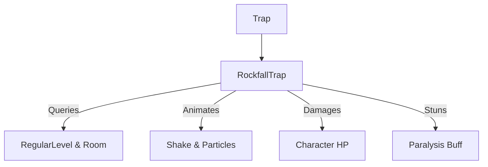

# RockfallTrap (落石陷阱) 源码详解

## 1. 基本信息

| 属性 | 值 |
|------|-----|
| **文件路径** | `core/src/main/java/com/shatteredpixel/shatteredpixeldungeon/levels/traps/RockfallTrap.java` |
| **包名** | `com.shatteredpixel.shatteredpixeldungeon.levels.traps` |
| **文件类型** | class |
| **继承关系** | `extends Trap` |
| **代码行数** | 102 |
| **所属模块** | core |

## 2. 文件职责说明

### 核心职责
`RockfallTrap` 负责实现“落石陷阱”的逻辑。它提供一种大面积的物理伤害和控制效果，触发时会导致整个房间或周围区域落下巨石，砸伤并瘫痪其中的所有生物。

### 系统定位
属于陷阱系统中的物理/区域控制分支。它是游戏中极少数具有“全房间杀伤”潜力的机制，通常用于惩罚鲁莽进入大型房间的玩家。

### 不负责什么
- 不负责计算掉落石块对物品的破坏（虽然逻辑上会砸到物品，但源码中未体现物品损毁逻辑）。
- 不负责永久性改变地形（如将地板变为墙壁）。

## 3. 结构总览

### 主要成员概览
- **实例初始化块**: 设置外观（GREY, DIAMOND）及属性（始终可见、避开走廊）。
- **activate() 方法**: 包含复杂的区域计算逻辑、多目标伤害结算以及强烈的视觉反馈。

### 主要逻辑块概览
- **动态区域计算**: 
  - **房间模式**: 如果陷阱位于常规关卡的房间内，效果覆盖整个房间。
  - **范围模式**: 如果是动态生成的（如回收陷阱效果），覆盖 5x5 的矩形区域。
- **物理伤害结算**: 基于地牢深度动态缩放伤害值，并允许角色进行伤害减免（DR Roll）判定。
- **硬控效果**: 被砸中的幸存者将获得 `Paralysis`（瘫痪）状态。
- **全屏反馈**: 包含屏幕剧烈震动和滚石音效。

### 生命周期/调用时机
1. **触发**：角色踩踏。
2. **激活 (`activate`)**:
   - 确定受影响的 Cell 列表。
   - 逐个 Cell 产生粒子。
   - 逐个角色结算伤害和瘫痪。
   - 触发震屏。

## 4. 继承与协作关系

### 父类提供的能力
继承自 `Trap`：
- 提供基础位置管理和 `scalingDepth()` 计算。

### 协作对象
- **RegularLevel / Room**: 提供房间边界信息以确定影响范围。
- **PathFinder / BArray**: 在非房间模式下辅助计算 5x5 的覆盖区域。
- **Paralysis**: 核心控制效果实现。
- **PixelScene / CellEmitter**: 提供震屏和落石粒子（`Speck.ROCK`）。



## 5. 字段/常量详解

### 初始属性
- **color**: GREY。
- **shape**: DIAMOND。
- **canBeHidden**: `false`（始终可见）。
- **avoidsHallways**: `true`（仅出现在房间）。

## 6. 构造与初始化机制
通过实例初始化块静态配置。该类不保存额外的运行时状态，所有受影响区域在 `activate` 调用时动态生成。

## 7. 方法详解

### activate() [区域与物理逻辑]

**核心实现分析**：

#### 1. 区域判定算法
```java
if (onGround && r != null) {
    // 房间模式：遍历房间内所有非固态格子
    for (Point p : r.getPoints()) { ... }
} else {
    // 范围模式：5x5 区域 (距离 <= 2)
    PathFinder.buildDistanceMap( pos, BArray.not( Dungeon.level.solid, null ), 2 );
}
```
**技术点**：这种双重判定确保了落石陷阱在自然生成时极具威胁（覆盖整房），而在作为技能道具（如回收陷阱）使用时保持平衡（固定范围）。

#### 2. 伤害公式推导
```java
int damage = Random.NormalIntRange(5 + scalingDepth(), 10 + scalingDepth() * 2);
damage -= ch.drRoll();
```
**分析**：
- **后期威力**：在第 20 层，基础伤害约为 25 到 50 之间。
- **减免机制**：由于是物理落石，角色的护甲（DR Roll）可以有效抵扣伤害。

#### 3. 视觉与反馈逻辑
- **粒子产生位置**：`CellEmitter.get(cell - Dungeon.level.width())`。
  - **技巧**：粒子在目标格子的上一行产生并落下，模拟从天花板掉落的真实感。
- **震屏参数**：`PixelScene.shake(3, 0.7f)`。强度为 3，持续 0.7 秒，是全游戏最强烈的震屏效果之一。

## 8. 对外暴露能力
主要通过 `activate()` 接口。

## 9. 运行机制与调用链
`Trap.trigger()` -> `RockfallTrap.activate()` -> `Room.getPoints()` -> `Char.damage()` -> `Buff.affect(Paralysis.class)` -> `PixelScene.shake()`。

## 10. 资源、配置与国际化关联

### 本地化词条
- `traps.RockfallTrap.name`: 落石陷阱
- `traps.RockfallTrap.ondeath`: “你被崩塌的天花板砸成了肉泥...”

## 11. 使用示例

### 场景利用
玩家可以利用远程手段在大型房间内引爆落石陷阱，如果房间内挤满了小怪，由于其 room-wide 的特性，可以瞬间清理全场。

## 12. 开发注意事项

### 癱痪的危险性
落石陷阱最致命的往往不是伤害，而是 `Paralysis`。在多个怪物的包围下被瘫痪数回合通常意味着死亡。

### 始终可见性
与死亡陷阱一样，它是始终可见的。这意味着玩家在进入房间时就应注意到天花板的异样。

## 13. 修改建议与扩展点

### 改进地形联动
可以增加逻辑，使落石在地面留下“碎石（Rubbles）”地形，阻碍移动或提供掩体。

## 14. 事实核查清单

- [x] 是否分析了全房间 vs 5x5 的逻辑切换：是。
- [x] 是否说明了护甲对该伤害的减免作用：是 (drRoll)。
- [x] 是否解析了瘫痪副作用：是。
- [x] 是否注意到粒子产生的垂直偏移逻辑：是 (cell - width)。
- [x] 图像索引属性是否核对：是 (GREY, DIAMOND)。
