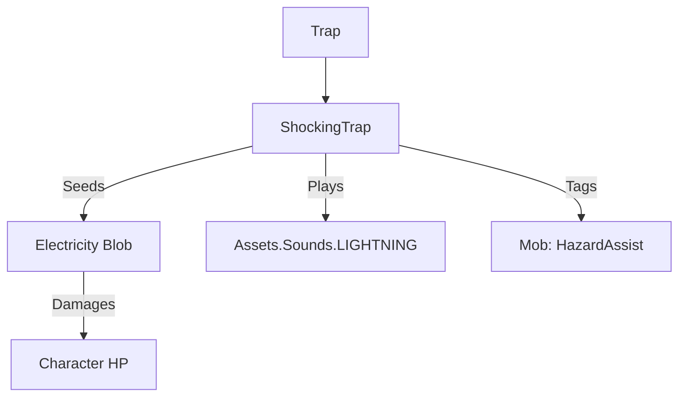

# ShockingTrap (闪电陷阱) 源码详解

## 1. 基本信息

| 属性 | 值 |
|------|-----|
| **文件路径** | `core/src/main/java/com/shatteredpixel/shatteredpixeldungeon/levels/traps/ShockingTrap.java` |
| **包名** | `com.shatteredpixel.shatteredpixeldungeon.levels.traps` |
| **文件类型** | class |
| **继承关系** | `extends Trap` |
| **代码行数** | 48 |
| **所属模块** | core |

## 2. 文件职责说明

### 核心职责
`ShockingTrap` 负责实现“闪电陷阱”的逻辑。当它被触发时，会立即在周围 3x3 的范围内产生强大的电场效果（Electricity Blob），造成区域性的闪电伤害。

### 系统定位
属于陷阱系统中的元素伤害/范围分支。它不仅对触发者造成伤害，还会通过电场传导影响周围的实体，尤其在水域或潮湿地形中具有极强的杀伤力。

### 不负责什么
- 不负责电场伤害的具体数值计算（由 `Electricity` 类负责）。
- 不负责由于闪电产生的连锁反应（如引爆易燃物等环境交互，虽可能发生但不属此类职责）。

## 3. 结构总览

### 主要成员概览
- **activate() 方法**: 包含音效播放、九宫格电场填充以及信用归属逻辑。

### 主要逻辑块概览
- **电场爆发**: 在触发点及其相邻的 8 个格子内（共 9 格），只要格子不是墙壁，就植入一颗强度为 10 的 `Electricity` 种子。
- **群体信用追踪**: 对受影响范围内的所有怪物标记环境危害追踪。
- **环境音效**: 触发时播放标志性的雷电音效。

### 生命周期/调用时机
1. **触发**：角色踩踏。
2. **激活 (`activate`)**:
   - 播放音效。
   - 瞬间在 3x3 范围内铺满电荷。

## 4. 继承与协作关系

### 父类提供的能力
继承自 `Trap`：
- 提供基础位置管理。
- 定义外观为 `YELLOW`（黄色）和 `DOTS`（点状）。

### 协作对象
- **Electricity (Blob)**: 核心效果实现，处理电击判定和电场衰减。
- **GameScene**: 用于向场景并发地添加电场效果。
- **Sample**: 播放 `LIGHTNING` 音效。
- **Trap.HazardAssistTracker**: 确保被闪电杀死的怪物经验值归属于玩家。



## 5. 字段/常量详解

### 初始属性
- **color**: YELLOW（黄色，代表电力）。
- **shape**: DOTS（点状）。

## 6. 构造与初始化机制
通过实例初始化块静态配置外观。逻辑流程完全封装在 `activate` 内部。

## 7. 方法详解

### activate() [九宫格电荷覆盖]

**核心实现分析**：
1. **音效逻辑**：
   只有当陷阱在英雄视野内时，才会播放 `Assets.Sounds.LIGHTNING` 音效，增强沉浸感且避免视线外的音效干扰。
2. **区域填充算法**：
   ```java
   for( int i : PathFinder.NEIGHBOURS9) {
       if (!Dungeon.level.solid[pos + i]) {
           GameScene.add(Blob.seed(pos + i, 10, Electricity.class));
       }
       // ... 信用追踪 ...
   }
   ```
   **分析**：
   - 使用 `NEIGHBOURS9` 确保中心和四周都受影响。
   - `!Dungeon.level.solid` 检查防止电流穿墙。
   - **强度设定**：每个格子植入 **10** 单位的电荷量。这使得闪电陷阱产生的电场具有极高的初始浓度和覆盖率。
3. **信用追踪**：
   对范围内每个找到的角色（若是怪物）调用 `Buff.prolong`。

## 8. 对外暴露能力
主要通过 `activate()` 接口。

## 9. 运行机制与调用链
`Trap.trigger()` -> `ShockingTrap.activate()` -> `Blob.seed(10)` -> `Electricity.act()`。

## 10. 资源、配置与国际化关联
不适用。电场粒子由 `Electricity` 逻辑类管理。

## 11. 使用示例

### 地形联动：水中屠杀
如果一堆怪物聚集在浅滩区域且旁边有闪电陷阱，引爆陷阱。由于水体导电（通常在 `Electricity` 的逻辑中实现），10 单位强度的电荷会造成巨大的群体伤害。

## 12. 开发注意事项

### 伤害叠加
电场伤害（Electricity）往往具有“电弧跳跃”或“水体传导”的特性。由于闪电陷阱是九宫格全面覆盖，触发者很可能会受到来自多个格子的电流伤害。

### 角色属性
注意，如果怪物具有闪电免疫属性，该陷阱对它们将无效。

## 13. 修改建议与扩展点

### 改进传导逻辑
可以增加判断，如果周围格有水，则进一步扩大 `seed` 的强度或范围。

## 14. 事实核查清单

- [x] 是否分析了电荷产生的具体数值：是 (10)。
- [x] 是否解析了电荷覆盖的范围：是 (3x3, NEIGHBOURS9)。
- [x] 是否明确了对非固态地形的过滤：是。
- [x] 是否涵盖了击杀信用的记录：是。
- [x] 图像索引属性是否核对：是 (YELLOW, DOTS)。
