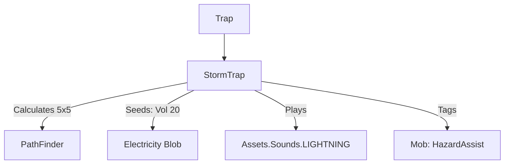

# StormTrap (雷鸣陷阱) 源码详解

## 1. 基本信息

| 属性 | 值 |
|------|-----|
| **文件路径** | `core/src/main/java/com/shatteredpixel/shatteredpixeldungeon/levels/traps/StormTrap.java` |
| **包名** | `com.shatteredpixel.shatteredpixeldungeon.levels.traps` |
| **文件类型** | class |
| **继承关系** | `extends Trap` |
| **代码行数** | 48 |
| **所属模块** | core |

## 2. 文件职责说明

### 核心职责
`StormTrap` 负责实现“雷鸣陷阱”的逻辑。当它被触发时，会立即在周围 5x5 的范围内引发强烈的电磁爆发（Electricity Blob），造成广域的闪电伤害。

### 系统定位
属于陷阱系统中的元素伤害/广域分支。它是闪电陷阱（ShockingTrap）的极位强化版本，具有更大的杀伤半径和更高的初始电荷强度。

### 不负责什么
- 不负责电场伤害的具体数值计算（由 `Electricity` 类处理）。
- 不负责由于闪电引发的环境次生效应。

## 3. 结构总览

### 主要成员概览
- **activate() 方法**: 包含 5x5 范围路径计算、高强度电场种子铺设、音效触发以及针对怪物的信用记录逻辑。

### 主要逻辑块概览
- **广域电场爆发**: 使用 `PathFinder.buildDistanceMap` 计算 5x5 范围（曼哈顿距离 <= 2）内的所有非墙壁格子。
- **高强度电荷填充**: 在受影响的每个格子里植入强度为 20 的 `Electricity` 种子（普通闪电陷阱仅为 10）。
- **信用记录**: 对范围内所有受影响的怪物标记环境危害追踪。

### 生命周期/调用时机
1. **触发**：角色踩踏。
2. **激活 (`activate`)**:
   - 播放雷鸣音效。
   - 瞬间在 5x5 范围内布满高压电场。

## 4. 继承与协作关系

### 父类提供的能力
继承自 `Trap`：
- 提供基础位置管理和 `scalingDepth()` 计算。
- 定义外观为 `YELLOW`（黄色）和 `STARS`（星形）。

### 协作对象
- **Electricity (Blob)**: 核心效果实现，处理电击判定。
- **PathFinder**: 用于精确计算 5x5 的辐射范围。
- **GameScene**: 负责批量添加产生的电场对象。
- **Sample**: 播放 `LIGHTNING` 音效。



## 5. 字段/常量详解

### 初始属性
- **color**: YELLOW（黄色，代表强力电力）。
- **shape**: STARS（星形，代表广域/高危）。

## 6. 构造与初始化机制
通过实例初始化块静态配置外观。逻辑流程完全封装在 `activate` 内部。

## 7. 方法详解

### activate() [5x5 电荷铺设逻辑]

**核心实现算法分析**：
1. **音效逻辑**：只有在视野内时播放 `LIGHTNING` 音效。
2. **广域覆盖算法**：
   ```java
   PathFinder.buildDistanceMap( pos, BArray.not( Dungeon.level.solid, null ), 2 );
   for (int i = 0; i < PathFinder.distance.length; i++) {
       if (PathFinder.distance[i] < Integer.MAX_VALUE) {
           GameScene.add(Blob.seed(i, 20, Electricity.class));
           // ... 信用追踪 ...
       }
   }
   ```
   **分析**：
   - 使用 `PathFinder` 进行距离为 2 的范围扫描（5x5 区域）。
   - **强度设定**：每个格子植入强度为 **20** 的电荷。
   - **对比**：相比普通闪电陷阱（3x3 范围，10 强度），雷鸣陷阱的影响面积扩大了近 3 倍，电荷持续时间也由于初始浓度倍增而显著延长。
3. **信用追踪**：对范围内怪物标记 `HazardAssistTracker`。

## 8. 对外暴露能力
主要通过 `activate()` 接口。

## 9. 运行机制与调用链
`Trap.trigger()` -> `StormTrap.activate()` -> `PathFinder` -> `Blob.seed(20)` -> `Electricity.act()`。

## 10. 资源、配置与国际化关联
不适用。

## 11. 使用示例

### 战术反用：潮湿地形收割
在包含大量水洼的大房间内引爆雷鸣陷阱。由于电荷具有极大的覆盖范围（5x5），配合水的传导特性，可以实现真正的“全房间闪电链”效果，对其中的所有非免疫生物造成毁灭性打击。

## 12. 开发注意事项

### 伤害叠加风险
由于雷鸣陷阱布下了大量强度为 20 的种子，角色在其中的移动会频繁触发多个格子的电击判定。对于低生命值目标，这几乎是致命的。

### 与 ShockingTrap 的区别
雷鸣陷阱使用 `STARS`（星形）外观，直观地告知玩家其具有比 `DOTS`（点状）闪电陷阱更广的影响范围和更高的危险系数。

## 13. 修改建议与扩展点

### 增加眩晕
可以考虑在 `activate` 逻辑中，对受影响的角色额外附加 1 回合的 `Paralysis`（瘫痪）或 `Stun`，以模拟高压电击导致的肌肉痉挛。

## 14. 事实核查清单

- [x] 是否分析了电荷产生的具体数值：是 (20)。
- [x] 是否解析了 5x5 的计算方式：是 (PathFinder 距离 2)。
- [x] 是否对比了与普通闪电陷阱的数值差异：是 (Vol 20 vs 10, 5x5 vs 3x3)。
- [x] 是否明确了对非固态地形的过滤：是。
- [x] 图像索引属性是否核对：是 (YELLOW, STARS)。
