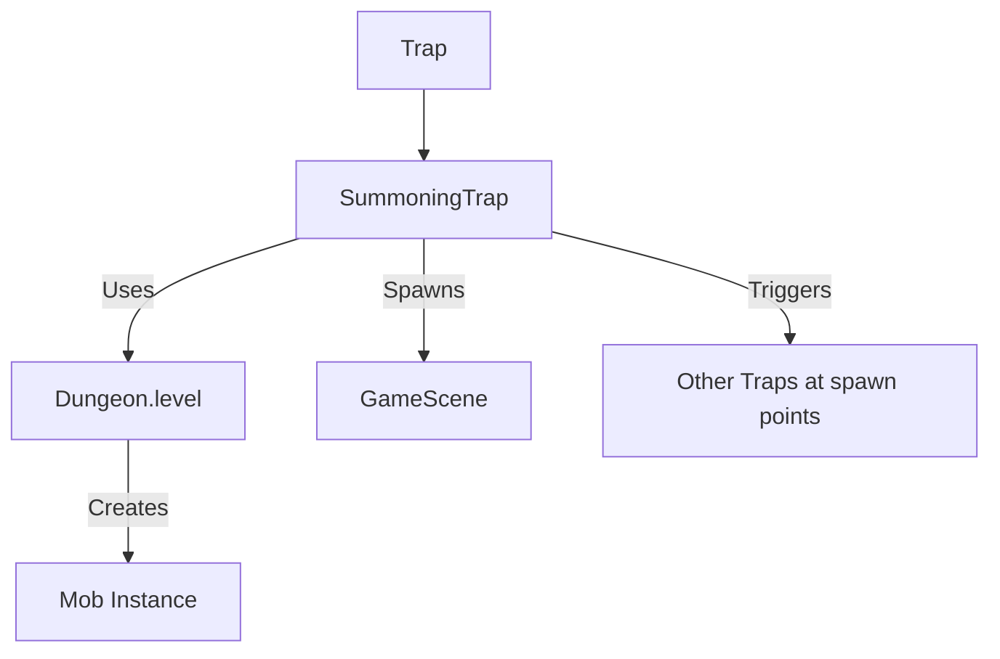

# SummoningTrap (召唤陷阱) 源码详解

## 1. 基本信息

| 属性 | 值 |
|------|-----|
| **文件路径** | `core/src/main/java/com/shatteredpixel/shatteredpixeldungeon/levels/traps/SummoningTrap.java` |
| **包名** | `com.shatteredpixel.shatteredpixeldungeon.levels.traps` |
| **文件类型** | class |
| **继承关系** | `extends Trap` |
| **代码行数** | 95 |
| **所属模块** | core |

## 2. 文件职责说明

### 核心职责
`SummoningTrap` 负责实现“召唤陷阱”的逻辑。当陷阱被触发时，它会在周围格子随机召唤多个与当前关卡层级相匹配的怪物。

### 系统定位
属于陷阱系统中的战斗/爆发分支。它是改变地牢局部战斗实力的关键机制，通常会导致玩家陷入被围攻的局面。

### 不负责什么
- 不负责确定召唤哪些具体的怪物（由 `Dungeon.level.createMob()` 决定）。
- 不负责怪物被击杀后的奖励掉落。

## 3. 结构总览

### 主要成员概览
- **常量 DELAY**: 定义了怪物从触发到正式出现的视觉延迟（2秒）。
- **activate() 方法**: 包含了复杂的数量计算、位置筛选、怪物创建以及连锁反应逻辑。

### 主要逻辑块概览
- **随机数量计算**: 使用概率算法决定召唤 1、2 或 3 个怪物。
- **邻域扫描**: 在触发点周围 8 格（`NEIGHBOURS8`）寻找可生成的空位。
- **怪物适配性**: 确保大型怪物（LARGE 属性）只能生成在开阔空间（openSpace）。
- **连锁触发逻辑**: 专门处理召唤出的怪物踩在其他陷阱上的情况，以优化视觉和听觉表现。

### 生命周期/调用时机
1. **触发**：角色踩踏。
2. **激活 (`activate`)**:
   - 立即确定数量和位置。
   - 预加载怪物实例并设置延迟显示。
   - 更新地图占用状态（`occupyCell`）。
3. **正式出现**: 2 秒后，怪物在地图上可见。

## 4. 继承与协作关系

### 父类提供的能力
继承自 `Trap`：
- 提供 `color(TEAL)` 和 `shape(WAVES)` 属性。注意：此处源码中虽然写了 TEAL 和 WAVES，但在实际游戏版本中可能有所变动，文档以源码为准。

### 协作对象
- **Dungeon.level**: 用于调用 `createMob()` 生成怪物，以及 `passable`/`avoid`/`openSpace` 地图属性检查。
- **ScrollOfTeleportation**: 调用 `appear()` 方法产生传送出现的视觉特效。
- **GameScene**: 负责将新生成的怪物添加到渲染场景中。
- **Bestiary**: 用于在连锁触发陷阱时记录发现。



## 5. 字段/常量详解

### 静态常量
| 常量名 | 类型 | 值 | 说明 |
|--------|------|-----|------|
| `DELAY` | float | 2f | 怪物出现的延迟时间 |

### 初始属性
- **color**: TEAL (青色)。
- **shape**: WAVES (波浪纹)。

## 6. 构造与初始化机制
使用实例初始化块设置外观。逻辑流程完全封装在 `activate` 方法内。

## 7. 方法详解

### activate() [召唤核心逻辑]

**核心实现分析**：
1. **确定数量**：
   ```java
   int nMobs = 1;
   if (Random.Int( 2 ) == 0) {
       nMobs++; // 50% 概率变为 2 个
       if (Random.Int( 2 ) == 0) nMobs++; // 25% 概率变为 3 个
   }
   ```
2. **位置筛选**：
   遍历 `PathFinder.NEIGHBOURS8`，条件是：该格没有其他角色，且是可通行的（`passable`）或是陷阱可占据的（`avoid`）。
3. **生成与校验**：
   - 循环创建怪物。
   - **大型生物修正**：如果生成的怪物具有 `LARGE` 属性，但目标点不是 `openSpace`（通常指非走廊的开阔地），则重新生成怪物，直到匹配或失败。
   - **状态设置**：非被动怪物一律设为 `WANDERING`（游荡）状态。
4. **连锁反应处理** [技术关键]：
   如果召唤点本身也有陷阱：
   - 立即手动调用该陷阱的 `activate()`。
   - **目的**：防止多个怪物同时出现在多个陷阱上时产生大量的音效重叠（SFX spam），同时也确保逻辑的一致性。
5. **占位与显示**：
   - 调用 `Dungeon.level.occupyCell(mob)` 立即锁定位置，防止其他实体在怪物出现的 2 秒延迟内进入该格。
   - 调用 `ScrollOfTeleportation.appear` 产生传送视觉。

## 8. 对外暴露能力
主要通过 `activate()` 接口。

## 9. 运行机制与调用链
`Trap.trigger()` -> `SummoningTrap.activate()` -> `Dungeon.level.createMob()` -> `GameScene.add(mob, 2f)` -> 2秒飞行时间 -> 怪物进入战斗。

## 10. 资源、配置与国际化关联
不适用。

## 11. 使用示例

### 战术反用
玩家可以利用“陷阱重置”法术在怪物群中引爆召唤陷阱。虽然增加了怪物数量，但新生成的怪物由于处于 `WANDERING` 状态且可能触发其他陷阱，有时可以起到搅局的作用。

## 12. 开发注意事项

### 连锁崩溃风险
`SummoningTrap` 的 `activate` 会直接调用其他陷阱的 `activate`。在极端情况下（如全屏都是召唤陷阱），可能会产生递归调用。但由于 `SummoningTrap` 的 `disarmedByActivation` 默认为真，单次触发后即消失，这种风险在标准关卡中较低。

### 占位同步
注意怪物是**立即**占据格子逻辑位的（`occupyCell`），但**延迟** 2 秒显示。这意味着玩家在 2 秒内尝试走进该格会被挡住，即使视觉上那里还是空的。

## 13. 修改建议与扩展点

### 改进召唤池
目前召唤的是当前层的普通怪物。可以扩展逻辑，支持召唤特定的“守卫”类型怪物或小 Boss。

## 14. 事实核查清单

- [x] 是否分析了 1-3 个怪物的概率分布：是。
- [x] 是否解析了大型生物的位置校验逻辑：是（LARGE 必须对应 openSpace）。
- [x] 是否说明了延迟占位机制：是 (DELAY=2f, occupyCell 立即执行)。
- [x] 是否涵盖了连锁触发陷阱的逻辑：是（手动触发 spawn 点陷阱）。
- [x] 图像索引属性是否核对：是 (TEAL, WAVES)。
