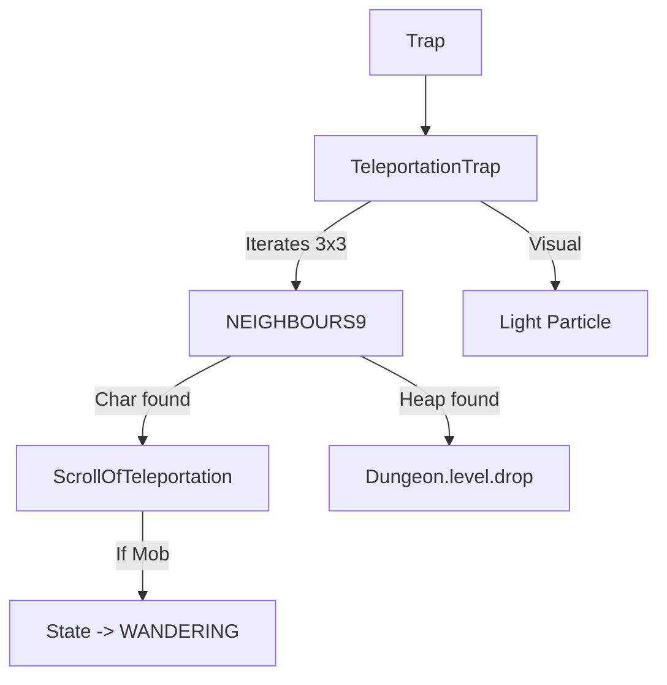

# TeleportationTrap (传送陷阱) 源码详解

## 1. 基本信息

| 属性 | 值 |
|------|-----|
| **文件路径** | `core/src/main/java/com/shatteredpixel/shatteredpixeldungeon/levels/traps/TeleportationTrap.java` |
| **包名** | `com.shatteredpixel.shatteredpixeldungeon.levels.traps` |
| **文件类型** | class |
| **继承关系** | `extends Trap` |
| **代码行数** | 62 |
| **所属模块** | core |

## 2. 文件职责说明

### 核心职责
`TeleportationTrap` 负责实现“传送陷阱”的逻辑。它的核心功能是将触发点周围 3x3 范围内的所有角色和物品随机传送到关卡的其他空闲位置。

### 系统定位
属于陷阱系统中的位移/战术分支。它不造成伤害，但通过强制改变空间布局来打乱战斗节奏或移除威胁。

### 不负责什么
- 不负责确定传送的具体算法（由 `ScrollOfTeleportation` 及其调用的 `Level.randomDestination` 负责）。
- 不负责传送不可移动的角色。

## 3. 结构总览

### 主要成员概览
- **activate() 方法**: 包含九宫格范围扫描、多目标传送逻辑以及怪物 AI 重置逻辑。

### 主要逻辑块概览
- **范围传送判定**: 遍历触发点周围 9 格（`NEIGHBOURS9`），对其中的角色和物品堆（Heap）分别处理。
- **角色处理**: 
  - 强制执行随机位移。
  - **AI 打断**: 如果被传送的是正在狩猎的怪物，其状态会被重置为游荡（WANDERING）。
- **物品处理**: 将地面掉落物重新分配到随机坐标，并支持碎蜜罐与蜜蜂的联动位移。

### 生命周期/调用时机
1. **触发**：角色踩踏。
2. **激活 (`activate`)**:
   - 逐个单元格检查实体。
   - 播放特效。
   - 瞬间执行所有传送。

## 4. 继承与协作关系

### 父类提供的能力
继承自 `Trap`：
- 提供 `pos` 存储、`trigger` 流程。
- 定义外观为 `TEAL`（青色）和 `DOTS`（点状）。

### 协作对象
- **ScrollOfTeleportation**: 复用其 `teleportChar()` 核心逻辑。
- **Heap / Item**: 处理物品的捡起与重新掉落。
- **PathFinder.NEIGHBOURS9**: 提供九宫格范围算法。
- **Speck.LIGHT**: 提供传送时的闪光粒子效果。



## 5. 字段/常量详解

### 初始属性
- **color**: TEAL（青色）。
- **shape**: DOTS（点状）。

## 6. 构造与初始化机制
通过实例初始化块静态配置外观。所有逻辑状态在 `activate` 栈内完成计算。

## 7. 方法详解

### activate() [九宫格传送核心逻辑]

**逻辑流程分析**：

#### 1. 角色传送与 AI 重置
```java
if (ScrollOfTeleportation.teleportChar(ch)) {
    if (ch instanceof Mob && ((Mob) ch).state == ((Mob) ch).HUNTING) {
        ((Mob) ch).state = ((Mob) ch).WANDERING;
        Buff.prolong(ch, Trap.HazardAssistTracker.class, HazardAssistTracker.DURATION);
    }
}
```
**技术点**：传送不仅改变物理位置，还会切断怪物的“仇恨”。被送走的怪物将不再追踪玩家，而是开始随机游荡。此外，记录 `HazardAssistTracker` 确保如果怪物传送到危险地形死亡，玩家仍能获得经验。

#### 2. 物品传送
- **过滤条件**: 仅处理 `Heap.Type.HEAP` 类型（排除宝箱和商店物品）。
- **同步位移**:
  ```java
  if (item instanceof Honeypot.ShatteredPot){
      ((Honeypot.ShatteredPot)item).movePot(pos, cell);
  }
  ```
  **分析**：这是一个细节处理。如果被传送的是碎掉的蜜罐，它关联的蜜蜂实体也会同步移动到新位置，避免逻辑断裂。

#### 3. 视觉反馈
在中心格产生 `Speck.LIGHT` 粒子并播放传送音效。

## 8. 对外暴露能力
主要通过 `activate()` 接口。

## 9. 运行机制与调用链
`Trap.trigger()` -> `TeleportationTrap.activate()` -> `PathFinder.NEIGHBOURS9` 循环 -> `ScrollOfTeleportation.teleportChar()` / `Level.drop()`。

## 10. 资源、配置与国际化关联
不适用。

## 11. 使用示例

### 战术移除
当玩家被一群小怪包围时，引爆旁边的传送陷阱可以瞬间清空周围 3x3 的区域，为逃跑或补给争取时间。

## 12. 开发注意事项

### 九宫格威力
由于该陷阱影响 3x3 区域，触发者自己几乎百分之百会被传送走。玩家在使用物品触发它时，也应远离该区域以免被波及。

### 角色属性
注意 `ScrollOfTeleportation.teleportChar()` 会检查角色的 `IMMOVABLE` 属性。Boss 通常免疫此类位移。

## 13. 修改建议与扩展点

### 改进传送模式
可以增加一种“镜像传送陷阱”，将 3x3 区域内的所有东西整体平移到另一个房间，保持相对位置不变。

## 14. 事实核查清单

- [x] 是否分析了传送的影响范围：是 (3x3, NEIGHBOURS9)。
- [x] 是否解析了对怪物 AI 的具体干扰：是 (Hunting -> Wandering)。
- [x] 是否说明了对掉落物品的处理：是（同步处理蜜罐联动）。
- [x] 是否涵盖了环境危害追踪：是。
- [x] 图像索引属性是否核对：是 (TEAL, DOTS)。
