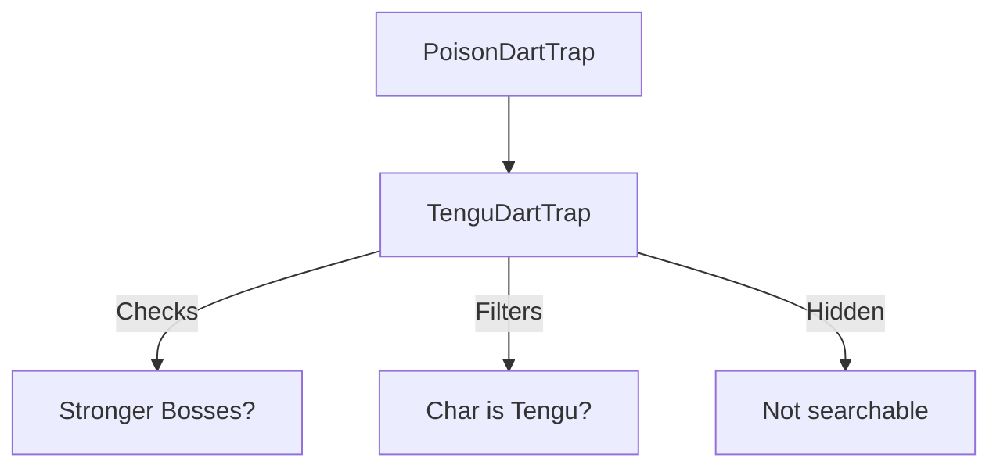

# TenguDartTrap (天狗毒镖陷阱) 源码详解

## 1. 基本信息

| 属性 | 值 |
|------|-----|
| **文件路径** | `core/src/main/java/com/shatteredpixel/shatteredpixeldungeon/levels/traps/TenguDartTrap.java` |
| **包名** | `com.shatteredpixel.shatteredpixeldungeon.levels.traps` |
| **文件类型** | class |
| **继承关系** | `extends PoisonDartTrap` |
| **代码行数** | 38 |
| **所属模块** | core |

## 2. 文件职责说明

### 核心职责
`TenguDartTrap` 是专门为第二章 Boss 天狗（Tengu）战斗设计的特殊陷阱。它继承了毒镖陷阱的所有行为，但在可见性、目标选择和中毒强度上进行了针对 Boss 战平衡性的调整。

### 系统定位
属于陷阱系统中的 Boss 战专属分支。它作为天狗技能组的一部分，用于在战斗的第一阶段通过密集的远程火力压制玩家。

### 不负责什么
- 不负责飞镖的轨迹逻辑（由父类 `PoisonDartTrap` 负责）。
- 不负责天狗 Boss 本身的 AI 逻辑。

## 3. 结构总览

### 主要成员概览
- **实例初始化块**: 定义了陷阱的隐蔽性属性（默认隐藏且不可通过搜索发现）。
- **poisonAmount() 方法**: 覆写父类逻辑，根据当前挑战状态动态计算中毒强度。
- **canTarget() 方法**: 定义了陷阱的目标豁免逻辑。

### 主要逻辑块概览
- **强制隐蔽性**: 该陷阱被设定为 `canBeHidden = true` 且 `canBeSearched = false`。这意味着在天狗战斗中，这些陷阱对玩家是完全不可见的，只能通过记忆或特定技能（如扫描）来感知位置。
- **动态中毒平衡**: 根据是否开启了“强力 Boss”挑战，大幅调整中毒的总伤害量。
- **身份识别豁免**: 陷阱会智能识别 Boss 身份，确保天狗自己不会被自己的陷阱误伤。

### 生命周期/调用时机
1. **产生**：天狗 Boss 战第一阶段开始时由 `Tengu` 类生成。
2. **触发**：玩家踩踏。
3. **激活 (`activate`)**: 调用父类狙击逻辑。

## 4. 继承与协作关系

### 父类提供的能力
继承自 `PoisonDartTrap`：
- 提供自动寻敌、飞镖飞行补间动画和物理伤害计算逻辑。

### 覆写的方法
- `poisonAmount()`: 引入了挑战系统依赖。
- `canTarget()`: 引入了实体类型过滤。

### 协作对象
- **Challenges**: 检查是否开启了 `STRONGER_BOSSES`（强力 Boss）。
- **Tengu**: 被豁免的目标类型。



## 5. 字段/常量详解

### 初始属性
- **canBeHidden**: `true`（默认隐藏）。
- **canBeSearched**: `false`（**无法通过普通搜索发现**）。
  - **技术分析**：这在天狗战斗的第一阶段增加了极大的随机性和难度，迫使玩家不断移动。

## 6. 构造与初始化机制
通过实例初始化块静态配置。其基础颜色和形状继承自父类（GREEN, CROSSHAIR）。

## 7. 方法详解

### poisonAmount() [挑战敏感的中毒强度]

**核心实现算法分析**：
```java
if (Dungeon.isChallenged(Challenges.STRONGER_BOSSES)){
    return 15; // 对应 50 点总伤害
} else {
    return 8; // 对应 17 点总伤害
}
```
**设计意图**：
- 在普通模式下，中毒强度为 8，属于中等威胁。
- 在“强力 Boss”挑战下，强度飙升至 15（50 点总伤），这几乎相当于第 10 层自然生成的最高级毒镖陷阱威力，对该阶段的英雄具有毁灭性。

---

### canTarget(Char ch) [身份豁免]

**核心实现分析**：
```java
@Override
protected boolean canTarget(Char ch) {
    return !(ch instanceof Tengu);
}
```
**分析**：这是为了防止天狗在瞬移或移动时触发自己布下的飞镖。

## 8. 对外暴露能力
主要通过 `poisonAmount` 和 `canTarget` 的内部覆写来改变父类 `activate` 的具体执行结果。

## 9. 运行机制与调用链
`Trap.trigger()` -> `PoisonDartTrap.activate()` -> `TenguDartTrap.canTarget()` (过滤天狗) -> `TenguDartTrap.poisonAmount()` (计算强度) -> 结算。

## 10. 资源、配置与国际化关联
不适用。

## 11. 使用示例

### 场景特定
该陷阱通常不会在自然关卡中生成，仅出现在 `Tengu` 战斗的专属地图中。

## 12. 开发注意事项

### 搜索机制失效
由于 `canBeSearched` 被设为 `false`，传统的“搜索”按钮对该陷阱无效。开发者在调试时需通过控制台命令或直接查看地图数据来确认其分布。

### 挑战一致性
该类的设计体现了游戏对“挑战”模式的深度支持，确保了 Boss 战在不同难度下的差异化体验。

## 13. 修改建议与扩展点

### 增加多种弹药
可以考虑让天狗在战斗中切换陷阱类型，例如除了毒镖外，偶尔喷射麻痹镖。

## 14. 事实核查清单

- [x] 是否分析了挑战对中毒强度的具体影响：是 (8 vs 15)。
- [x] 是否说明了无法搜索的特性：是 (canBeSearched = false)。
- [x] 是否明确了对天狗的免疫逻辑：是 (instanceof Tengu 过滤)。
- [x] 是否指出其作为 Boss 战组件的特殊性：是。
- [x] 是否确认了其继承自 PoisonDartTrap：是。
