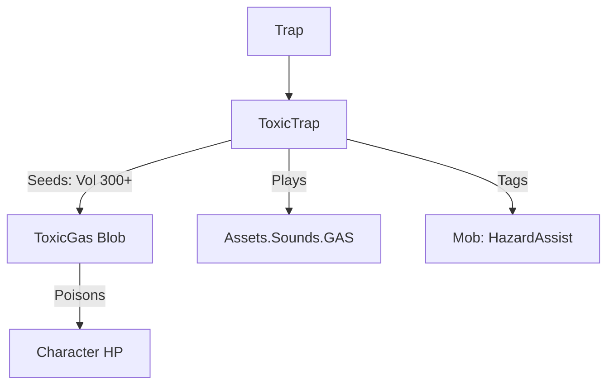

# ToxicTrap (剧毒陷阱) 源码详解

## 1. 基本信息

| 属性 | 值 |
|------|-----|
| **文件路径** | `core/src/main/java/com/shatteredpixel/shatteredpixeldungeon/levels/traps/ToxicTrap.java` |
| **包名** | `com.shatteredpixel.shatteredpixeldungeon.levels.traps` |
| **文件类型** | class |
| **继承关系** | `extends Trap` |
| **代码行数** | 43 |
| **所属模块** | core |

## 2. 文件职责说明

### 核心职责
`ToxicTrap` 负责实现“剧毒陷阱”的逻辑。当它被触发时，会瞬间释放巨量的毒气（Toxic Gas），对广域范围内的所有非免疫角色造成持续的中毒伤害。

### 系统定位
属于陷阱系统中的状态/范围分支。它产生的毒气规模极巨，足以在短时间内填满数个房间，是地牢中最具压迫感的环境陷阱之一。

### 不负责什么
- 不负责毒气伤害的具体计算逻辑（由 `ToxicGas` 类负责）。
- 不负责对角色的毒性抗性检查。

## 3. 结构总览

### 主要成员概览
- **activate() 方法**: 包含超大规模毒气的生成逻辑、音效触发和怪物信用标记。

### 主要逻辑块概览
- **超大规模规模计算**: 产生的毒气体积公式为 `300 + 20 * depth`。这与混乱陷阱同级，属于游戏内最顶级的气体爆发规模。
- **环境污染**: 旨在制造持续时间极长的剧毒地带，阻断区域通行。
- **信用记录**: 对周围 9 格内的怪物进行环境危害标记。

### 生命周期/调用时机
1. **触发**：角色踩踏。
2. **激活 (`activate`)**:
   - 释放高压毒气。
   - 毒气开始快速向四周扩散。

## 4. 继承与协作关系

### 父类提供的能力
继承自 `Trap`：
- 提供基础属性管理和深度计算支持。
- 定义外观为 `GREEN`（绿色）和 `GRILL`（格栅）。

### 协作对象
- **ToxicGas (Blob)**: 核心效果实现，处理中毒状态的应用和伤害。
- **GameScene**: 负责将巨量毒气加入渲染和逻辑更新列表。
- **Sample**: 播放 `GAS` 音效。
- **PathFinder.NEIGHBOURS9**: 用于确定信用标记的 3x3 范围。



## 5. 字段/常量详解

### 初始属性
- **color**: GREEN（绿色，代表毒性）。
- **shape**: GRILL（格栅）。

## 6. 构造与初始化机制
通过实例初始化块静态配置外观。逻辑流程完全封装在 `activate` 内部。

## 7. 方法详解

### activate() [剧毒爆发逻辑]

**核心实现算法分析**：
1. **巨量种子铺设**：
   ```java
   GameScene.add( Blob.seed( pos, 300 + 20 * scalingDepth(), ToxicGas.class ) );
   ```
   **分析**：
   - **基础体积 300**：确保了即使在第一层，其爆发力也极强。
   - **成长性**：随深度每层增加 20。在深层地牢，一个剧毒陷阱释放的毒气可能持续数十回合甚至覆盖半个层级。
2. **范围信用追踪**：
   遍历 `NEIGHBOURS9`，若发现怪物则标记 `HazardAssistTracker`。
3. **音效播放**：播放标准的气体喷射音效。

## 8. 对外暴露能力
主要通过 `activate()` 接口。

## 9. 运行机制与调用链
`Trap.trigger()` -> `ToxicTrap.activate()` -> `Blob.seed(300+)` -> `ToxicGas.act()` -> 角色中毒。

## 10. 资源、配置与国际化关联
不适用。毒气粒子由 `ToxicGas` 类管理。

## 11. 使用示例

### 远程封锁
在必经之路上远程引爆剧毒陷阱。产生的巨量绿雾会在该区域盘旋很久，如果玩家拥有防毒面具或相关 Buff，可以利用此毒雾安全地处理非免疫怪物。

## 12. 开发注意事项

### 扩散规模
开发者在布置关卡时需谨慎放置剧毒陷阱。由于其 `300+` 的体积，在密闭的小房间内触发几乎会导致所有非免疫角色（包括玩家）无法及时撤离。

### 与 CorrosionTrap 的区别
剧毒陷阱使用的是 `GREEN` 颜色，且产生的是普通的 `ToxicGas`。虽然体积更大，但单回合伤害通常低于腐蚀陷阱的酸液。

## 13. 修改建议与扩展点

### 增加易燃性
可以考虑根据游戏设定，让剧毒气体在接触火源时产生特定的化学反应（如剧烈爆炸或变为可呼吸的净化气体）。

## 14. 事实核查清单

- [x] 是否分析了超大毒气体积公式：是 (`300 + 20*depth`)。
- [x] 是否解析了外观属性：是 (GREEN, GRILL)。
- [x] 是否说明了信用追踪：是 (3x3 范围)。
- [x] 是否指出了其在同类陷阱中的规模地位：是（顶级规模）。
- [x] 示例战术是否符合源码：是。
