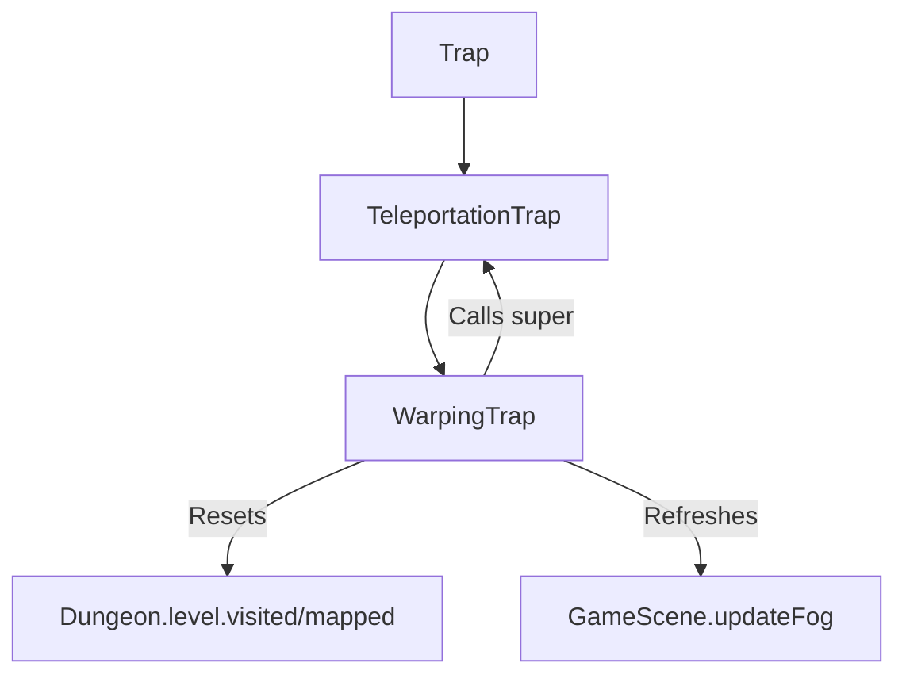

# WarpingTrap (扭曲传送陷阱) 源码详解

## 1. 基本信息

| 属性 | 值 |
|------|-----|
| **文件路径** | `core/src/main/java/com/shatteredpixel/shatteredpixeldungeon/levels/traps/WarpingTrap.java` |
| **包名** | `com.shatteredpixel.shatteredpixeldungeon.levels.traps` |
| **文件类型** | class |
| **继承关系** | `extends TeleportationTrap` |
| **代码行数** | 38 |
| **所属模块** | core |

## 2. 文件职责说明

### 核心职责
`WarpingTrap` 负责实现“扭曲传送陷阱”的逻辑。它是传送陷阱（TeleportationTrap）的强化变体，不仅会将目标传送走，还具有抹除玩家当前层级地图探索进度的能力。

### 系统定位
属于陷阱系统中的干扰/时空分支。它通过破坏玩家获取的地图信息（即“忘却”效果），极大增加了探索的混乱度和重复度。

### 不负责什么
- 不负责传送的具体实现（由父类 `TeleportationTrap` 负责）。
- 不负责恢复已抹除的地图信息。

## 3. 结构总览

### 主要成员概览
- **activate() 方法**: 覆写父类方法，增加了地图重置逻辑。

### 主要逻辑块概览
- **全层忘却 (Map Reset)**: 如果玩家在陷阱周围 1 格以内（包括踩踏或相邻触发），强制将整个关卡的 `visited`（已访问）和 `mapped`（已映射）标记重置为 `false`。
- **级联传送**: 调用父类 `activate()` 完成物理位移。
- **视野重算**: 强制触发 `Dungeon.observe()` 确保在地图重置后重新计算玩家当前位置的可见区域。

### 生命周期/调用时机
1. **触发**：角色踩踏。
2. **激活 (`activate`)**:
   - 检查玩家距离。
   - 抹除全图探索状态。
   - 执行传送。
   - 刷新玩家视野。

## 4. 继承与协作关系

### 父类提供的能力
继承自 `TeleportationTrap`：
- 提供 3x3 范围的群体传送逻辑。
- 继承了 `color(TEAL)` 属性（但在子类中重新定义了形状）。

### 覆写的方法
- `activate()`: 在执行父类传送逻辑前插入了致命的“全图重置”操作。

### 协作对象
- **Dungeon.level**: 核心操作对象，包含 `visited` 和 `mapped` 地图数组。
- **BArray**: 用于快速重置布尔数组。
- **GameScene / Dungeon**: 处理视野（Fog）的强制更新。



## 5. 字段/常量详解

### 初始属性
- **color**: TEAL（青色，延续传送陷阱的色调）。
- **shape**: STARS（星形，代表其具有比普通传送陷阱更广或更深的影响）。

## 6. 构造与初始化机制
通过实例初始化块静态配置外观。由于逻辑完全依赖父类和地图全局数组，该类本身不维护实例状态。

## 7. 方法详解

### activate() [地图抹除逻辑]

**核心实现分析**：
1. **范围判定**：
   ```java
   if (Dungeon.level.distance(Dungeon.hero.pos, pos) <= 1)
   ```
   **设计意图**：只有当玩家亲自踩到或位于陷阱旁边（如投掷物品触发）时，才会触发“忘却”效果。如果玩家在远距离通过技能触发它，则只会产生普通传送。
2. **忘却操作**：
   ```java
   BArray.setFalse(Dungeon.level.visited);
   BArray.setFalse(Dungeon.level.mapped);
   ```
   **技术影响**：这会使玩家的小地图彻底变黑，且所有的房间、走廊、已发现的陷阱和门都会从屏幕上消失，迫使玩家重新探索。
3. **级联执行**：执行 `super.activate()`，将玩家及周边实体送往随机位置。
4. **状态同步**：调用 `Dungeon.observe()`。在地图抹除后，必须立即重新计算当前格的视野，否则玩家会处于一种“即使在原地也是全黑”的逻辑异常状态。

## 8. 对外暴露能力
主要通过 `activate()` 接口。

## 9. 运行机制与调用链
`Trap.trigger()` -> `WarpingTrap.activate()` -> `BArray.setFalse()` -> `TeleportationTrap.activate()` -> `Dungeon.observe()`。

## 10. 资源、配置与国际化关联
不适用。

## 11. 使用示例

### 惩罚机制
扭曲传送陷阱通常出现在中后期关卡或特定的惩罚房间。它不致命，但极其恶心，特别是在大型迷宫层中，抹除地图可能导致玩家由于消耗掉过多粮食而最终饿死。

## 12. 开发注意事项

### 继承优势
由于其直接继承自 `TeleportationTrap`，它天然具备传送陷阱的所有特性（如 3x3 范围、物品位移、蜜罐联动等）。

### 性能影响
`BArray.setFalse` 操作的是全层（通常 32x32 = 1024 个点）的两个数组。虽然在现代硬件上很快，但应避免在同一帧内连续触发数十个此类陷阱。

## 13. 修改建议与扩展点

### 改进忘却效果
目前的忘却过于彻底。可以考虑修改逻辑，使其仅抹除 `visited` 数组（保留已知地形但变为黑色），或仅抹除一部分特定的房间。

## 14. 事实核查清单

- [x] 是否分析了地图重置的触发条件：是 (玩家距离 <= 1)。
- [x] 是否解析了 `visited` 和 `mapped` 数组的意义：是（已访问与已映射）。
- [x] 是否说明了对父类逻辑的级联调用：是 (super.activate())。
- [x] 是否涵盖了视野重算的必要性：是 (Dungeon.observe())。
- [x] 图像索引属性是否核对：是 (TEAL, STARS)。
