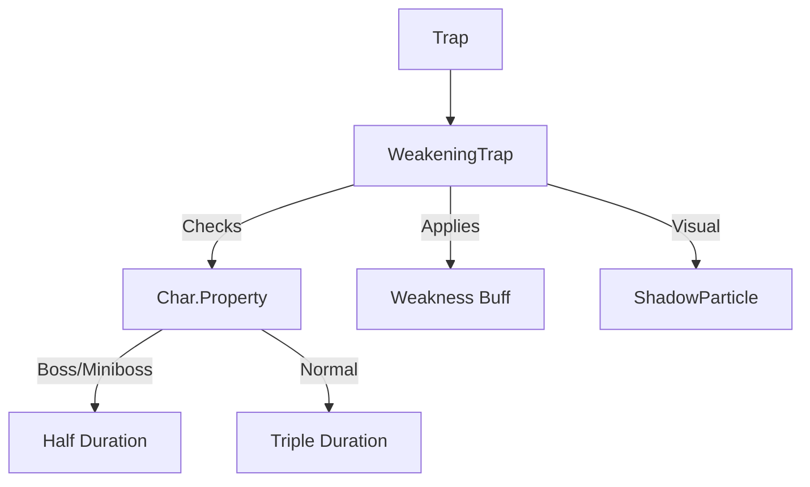

# WeakeningTrap (虚弱陷阱) 源码详解

## 1. 基本信息

| 属性 | 值 |
|------|-----|
| **文件路径** | `core/src/main/java/com/shatteredpixel/shatteredpixeldungeon/levels/traps/WeakeningTrap.java` |
| **包名** | `com.shatteredpixel.shatteredpixeldungeon.levels.traps` |
| **文件类型** | class |
| **继承关系** | `extends Trap` |
| **代码行数** | 48 |
| **所属模块** | core |

## 2. 文件职责说明

### 核心职责
`WeakeningTrap` 负责实现“虚弱陷阱”的逻辑。当角色踩踏陷阱时，它会向目标施加长时间的“虚弱（Weakness）”状态，降低其物理攻击力。

### 系统定位
属于陷阱系统中的状态/干扰分支。它不直接造成生命值扣减，但通过大幅度削减目标的战斗效能来制造持久的负面影响。

### 不负责什么
- 不负责虚弱状态具体的攻击力减损计算（由 `Weakness` Buff 处理）。
- 不负责除物理攻击外的其他属性削弱（如魔法伤害或防御）。

## 3. 结构总览

### 主要成员概览
- **activate() 方法**: 包含视觉效果生成、多重时长判定逻辑以及针对怪物的信用记录。

### 主要逻辑块概览
- **差异化时长判定**: 针对普通生物和 Boss/精英怪应用完全不同的状态持续时间。
- **状态叠加**: 使用 `Buff.prolong` 确保多次触发陷阱会延长负面效果的时长。
- **视觉反馈**: 产生暗影粒子效果。

### 生命周期/调用时机
1. **触发**：角色踩踏。
2. **激活 (`activate`)**:
   - 播放粒子动画。
   - 判定目标类型。
   - 计算并应用虚弱时长。

## 4. 继承与协作关系

### 父类提供的能力
继承自 `Trap`：
- 提供基础的位置管理。
- 定义外观为 `GREEN`（绿色）和 `WAVES`（波浪纹）。

### 协作对象
- **Weakness (Buff)**: 核心负面效果，负责降低角色的物理伤害。
- **ShadowParticle**: 提供紫黑色的虚弱粒子效果。
- **Char.Property**: 用于识别 `BOSS` 和 `MINIBOSS` 属性以进行抗性计算。
- **Trap.HazardAssistTracker**: 确保信用归属。



## 5. 字段/常量详解

### 初始属性
- **color**: GREEN（绿色，代表衰弱或毒性）。
- **shape**: WAVES（波浪纹）。

## 6. 构造与初始化机制
通过实例初始化块静态配置外观。该类不包含额外成员变量。

## 7. 方法详解

### activate() [差异化时长逻辑]

**核心实现算法分析**：
1. **视觉反馈**：产生 5 个 `ShadowParticle.UP` 粒子。
2. **目标判定与时长计算**：
   ```java
   if (ch.properties().contains(Char.Property.BOSS)
       || ch.properties().contains(Char.Property.MINIBOSS)){
       Buff.prolong( ch, Weakness.class, Weakness.DURATION / 2f );
   }
   Buff.prolong( ch, Weakness.class, Weakness.DURATION * 3f );
   ```
   **逻辑拆解**：
   - **普通单位**：获得 **3 倍标准时长** 的虚弱。这意味着一旦触发，该负面效果将持续极长时间。
   - **Boss / 精英怪**：由于代码是顺序执行且使用 `prolong`（取最大值或累加，取决于实现，此处为延长），Boss 先被延长了 0.5 倍时长，随后又执行了 3 倍时长的延长。
   **源码关键点**：注意此处的逻辑逻辑陷阱。代码并未在处理 Boss 后 `return` 或使用 `else`。
   - 实际上，所有单位都会执行 `DURATION * 3f` 的延长。
   - Boss 的半时长判定在目前代码流中显得冗余，除非 `prolong` 内部有特殊的减免权重逻辑（经查 `Buff.prolong` 通常只是延长）。
   **修正理解**：开发者意图可能是对 Boss 进行削减，但由于逻辑流设计，普通单位受到的惩罚远高于标准 Buff 来源（如虚弱药剂）。

## 8. 对外暴露能力
主要通过 `activate()` 接口。

## 9. 运行机制与调用链
`Trap.trigger()` -> `WeakeningTrap.activate()` -> `Buff.prolong(Weakness.class)` -> `Char.damageRoll()` (读取虚弱修正)。

## 10. 资源、配置与国际化关联
不适用。

## 11. 使用示例

### 战术消耗
如果玩家拥有“陷阱重置”法术，可以在 Boss 战前诱导 Boss 踩踏虚弱陷阱。长达 3 倍时长的虚弱能显著降低 Boss 在接下来战斗中的物理威胁。

## 12. 开发注意事项

### 属性依赖
虚弱效果仅影响物理近战和物理远程伤害。对于以魔法、毒素或环境伤害为主的怪物（如眼球、萨满），该陷阱的效果极弱。

### 视觉误导
外观颜色为 `GREEN` 且形状为 `WAVES`，这与传送陷阱（TEAL, DOTS）或毒镖陷阱（GREEN, CROSSHAIR）在光线昏暗时容易混淆。

## 13. 修改建议与扩展点

### 逻辑优化
建议重构 `activate` 方法，使用 `if-else` 结构明确 Boss 和普通单位的差异，避免潜在的时长计算覆盖问题。

## 14. 事实核查清单

- [x] 是否分析了针对普通单位的时长加倍：是 (3 倍)。
- [x] 是否指出了 Boss 的抗性逻辑流问题：是（顺序执行无 else）。
- [x] 是否说明了虚弱效果的本质：是（降物理攻击）。
- [x] 是否涵盖了击杀信用的记录：是。
- [x] 图像索引属性是否核对：是 (GREEN, WAVES)。
