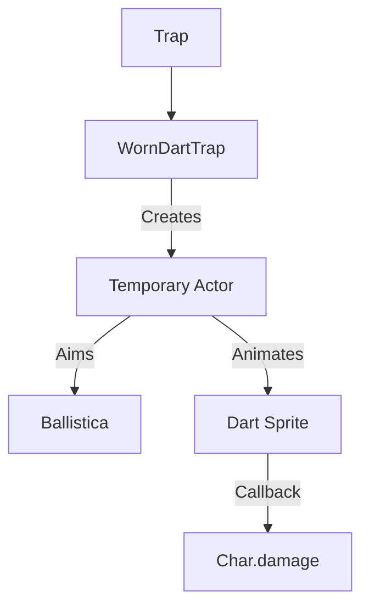

# WornDartTrap (磨损飞镖陷阱) 源码详解

## 1. 基本信息

| 属性 | 值 |
|------|-----|
| **文件路径** | `core/src/main/java/com/shatteredpixel/shatteredpixeldungeon/levels/traps/WornDartTrap.java` |
| **包名** | `com.shatteredpixel.shatteredpixeldungeon.levels.traps` |
| **文件类型** | class |
| **继承关系** | `extends Trap` |
| **代码行数** | 102 |
| **所属模块** | core |

## 2. 文件职责说明

### 核心职责
`WornDartTrap` 负责实现“磨损飞镖陷阱”的逻辑。它通过自动寻敌并向最近目标发射一枚物理飞镖，造成较低数值的物理伤害。

### 系统定位
属于陷阱系统中的基础远程攻击分支。它是游戏中最常见的远程陷阱，通常用于在早期关卡给予玩家轻微的惩罚或在后期作为触发其他机制的垫脚石。

### 不负责什么
- 不负责中毒或其他状态效果（由其子类 `PoisonDartTrap` 负责）。
- 不负责飞镖物品的实体生成（仅使用 `Dart` 对象作为视觉素材）。

## 3. 结构总览

### 主要成员概览
- **实例初始化块**: 设置外观（GREY, CROSSHAIR）及基础属性（始终可见、避开走廊）。
- **activate() 方法**: 核心逻辑入口，包含智能寻敌、弹道判定和物理伤害计算。

### 主要逻辑块概览
- **智能狙击逻辑**: 继承自高级陷阱的狙击算法。在 6.5 格至视野半径内自动锁定最近活物。
- **物理判定**: 使用 `Ballistica` 确保飞镖路径未被墙壁阻挡。
- **低额物理伤害**: 造成受护甲减免的基础物理扣减。

### 生命周期/调用时机
1. **触发**：角色踩踏。
2. **激活 (`activate`)**:
   - 确定目标。
   - 播放飞行补间动画。
   - 命中回调：执行伤害结算并播放打击特效。

## 4. 继承与协作关系

### 父类提供的能力
继承自 `Trap`：
- 提供基础位置存储和触发流程。

### 协作对象
- **Actor**: 包装异步动画。
- **Ballistica**: 路径遮挡判定。
- **MissileSprite / Dart**: 提供视觉层面的飞镖飞行表现。
- **Sample**: 播放 `HIT` 打击音效。



## 5. 字段/常量详解

### 初始属性
- **color**: GREY（灰色，代表普通/锈蚀）。
- **shape**: CROSSHAIR（十字准星，代表远程射击）。
- **canBeHidden**: `false`（始终可见）。
- **avoidsHallways**: `true`。

## 6. 构造与初始化机制
通过实例初始化块静态配置。该类不包含额外的实例变量。

## 7. 方法详解

### activate() [狙击与物理结算]

**核心实现分析**：

#### 1. 寻敌算法
- **范围**: 最小 6格，最大由 `viewDistance` 决定。
- **碰撞判定**: 调用 `new Ballistica(pos, ch.pos, Ballistica.PROJECTILE)`。只有当 `bolt.collisionPos == ch.pos`（即终点就是角色且中途无障碍）时，目标才有效。
- **优先级**: 优先瞄准玩家。

#### 2. 伤害结算
```java
int dmg = Random.NormalIntRange(4, 8) - finalTarget.drRoll();
finalTarget.damage(dmg, WornDartTrap.this);
```
**分析**：
- 伤害量为 4-8 点的正态分布。
- 由于是纯物理伤害，角色的护甲（`drRoll`）可以非常容易地将其抵消为 0。
- **风险**：在玩家残血且无护甲的情况下，依然具有威胁。

#### 3. 视觉反馈
- 使用 `MissileSprite` 渲染。
- 命中时调用 `finalTarget.sprite.bloodBurstA`（血液溅射）和 `flash()`（闪白）。

## 8. 对外暴露能力
主要通过 `activate()` 接口。

## 9. 运行机制与调用链
`Trap.trigger()` -> `WornDartTrap.activate()` -> `MissileSprite.reset()` -> `Callback` -> `Char.damage()`。

## 10. 资源、配置与国际化关联

### 本地化词条
- `traps.WornDartTrap.name`: 磨损飞镖陷阱
- `traps.WornDartTrap.ondeath`: “一枚生锈的飞镖终结了你的冒险...”

## 11. 使用示例

### 测试护甲
玩家可以主动触发已知的磨损飞镖陷阱来观察伤害数字，从而评估当前护甲的防御水平。

## 12. 开发注意事项

### 始终可见性
代码中设置 `canBeHidden = false`。这通常意味着这种陷阱的设计初衷是作为一种“路障”或“地形机制”，玩家在规划移动路线时必须考虑它的存在。

### 英雄优先
注意同距离下的目标选择逻辑：`curDist == closestDist && target instanceof Hero`。陷阱总是倾向于射击玩家。

## 13. 修改建议与扩展点

### 增加数量
可以修改 `activate`，使其一次性射出三枚飞镖（散弹效果）。

## 14. 事实核查清单

- [x] 是否分析了物理伤害公式：是 (4-8 - drRoll)。
- [x] 是否说明了智能寻敌对英雄的优先性：是。
- [x] 是否解析了弹道判定：是 (Ballistica.PROJECTILE)。
- [x] 是否涵盖了血液溅射视觉效果：是。
- [x] 图像索引属性是否核对：是 (GREY, CROSSHAIR)。
- [x] 示例飞镖对象是否正确：是 (Dart)。
