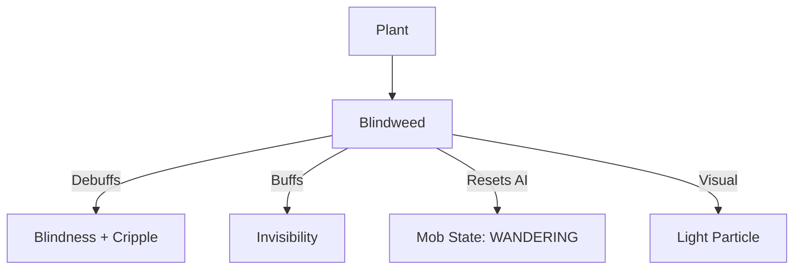

# Blindweed (致盲草) 源码详解

## 1. 基本信息

| 属性 | 值 |
|------|-----|
| **文件路径** | `core/src/main/java/com/shatteredpixel/shatteredpixeldungeon/plants/Blindweed.java` |
| **包名** | `com.shatteredpixel.shatteredpixeldungeon.plants` |
| **文件类型** | class |
| **继承关系** | `extends Plant` |
| **代码行数** | 65 |
| **所属模块** | core |

## 2. 文件职责说明

### 核心职责
`Blindweed` 负责实现“致盲草”植物及其种子的逻辑。它提供一种强力的干扰性效果，能同时使角色失明并残废，极大地削弱目标的战斗和追踪能力。

### 系统定位
属于植物系统中的控制/隐蔽分支。它是玩家摆脱怪物追击或通过危险区域的重要战术道具。

### 不负责什么
- 不负责“失明”或“残废”的具体逻辑（由 `Blindness` 和 `Cripple` 类负责）。
- 不负责潜行强度的计算。

## 3. 结构总览

### 主要成员概览
- **Blindweed 类**: 植物实体类，实现触发激活逻辑。
- **Seed 类**: 种子物品类。

### 主要逻辑块概览
- **激活逻辑 (`activate`)**: 
  - 为普通角色应用 `Blindness`（失明）和 `Cripple`（残废）减益。
  - 为守林人应用 `Invisibility`（隐身）增益。
  - 对怪物 AI 执行重置逻辑（变为游荡状态并随机移动）。

### 生命周期/调用时机
1. **触发**：角色踩踏。
2. **激活**：角色受到状态影响。如果是怪物，其 AI 路径会被立即打乱。

## 4. 继承与协作关系

### 父类提供的能力
继承自 `Plant`：
- 定义位置和图像索引（11）。

### 协作对象
- **Blindness / Cripple**: 核心负面效果。
- **Invisibility**: 为守林人提供的正面效果。
- **Mob**: 受到影响时执行 `beckon()` 随机寻路和状态切换。
- **Speck.LIGHT**: 触发时的白色闪光粒子。



## 5. 字段/常量详解

### Blindweed 字段
- **image**: 11。

## 6. 构造与初始化机制

### Blindweed 初始化
通过初始化块设置 `image = 11`。

## 7. 方法详解

### activate(Char ch)

**方法职责**：定义激活后的状态切换。

**核心逻辑分析**：
1. **守林人增强**：
   ```java
   if (ch instanceof Hero && ((Hero) ch).subClass == HeroSubClass.WARDEN){
       Buff.affect(ch, Invisibility.class, Invisibility.DURATION/2f);
   }
   ```
   **分析**：守林人获得隐身效果，时长为标准时长的 50%（约 5 回合）。这使其可以利用致盲草进行原地消失。
2. **普通减益**：
   - 应用 `Blindness`：剥夺视野。
   - 应用 `Cripple`：降低移动速度。
3. **怪物 AI 重置**：
   ```java
   if (ch instanceof Mob) {
       Buff.prolong(ch, Trap.HazardAssistTracker.class, Trap.HazardAssistTracker.DURATION);
       if (((Mob) ch).state == ((Mob) ch).HUNTING) ((Mob) ch).state = ((Mob) ch).WANDERING;
       ((Mob) ch).beckon(Dungeon.level.randomDestination( ch ));
   }
   ```
   **逻辑拆解**：
   - **状态降级**：如果怪物正在“狩猎（HUNTING）”玩家，会被强行降级为“游荡（WANDERING）”。
   - **强制随机移动**：调用 `beckon()` 使其向一个随机目的地移动。这模仿了怪物因失明而四处乱撞的行为。
4. **视觉反馈**：产生 4 个 `LIGHT` 类型的闪烁粒子。

## 8. 对外暴露能力
主要通过 `activate()` 静态入口。

## 9. 运行机制与调用链
`Plant.trigger()` -> `Blindweed.activate()` -> `Mob.beckon()` -> `Char.update()`。

## 10. 资源、配置与国际化关联
不适用。

## 11. 使用示例

### 战术摆脱
当怪物距离玩家只有 1 格时，在其脚下种植致盲草。触发后，怪物将失去目标并随机向某个方向走开，给玩家留出逃跑空间。

## 12. 开发注意事项

### 状态叠加
由于同时应用了失明和残废，受影响的目标不仅看不见玩家，而且即使撞大运走对了方向，也无法快速追上。

### AI 状态切换
注意该类直接操作了 `Mob.state`。在扩展怪物 AI 时，需确保 `WANDERING` 状态能够处理致盲带来的逻辑变化。

## 13. 修改建议与扩展点

### 增加隐蔽时间
守林人的隐身时间较短，可以考虑在 `activate` 中判断致盲草是否是由“再生法杖”加强过的，从而给予更长的隐身。

## 14. 事实核查清单

- [x] 是否分析了对怪物 AI 的具体干扰：是（Hunting -> Wandering, Beckon）。
- [x] 是否说明了守林人的隐身时长：是 (50%)。
- [x] 是否对比了双重减益：是（Blindness + Cripple）。
- [x] 图像索引是否核对：是 (11)。
- [x] 示例代码是否正确：是。
