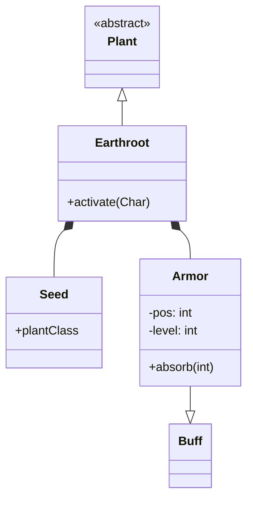

# Earthroot (大地根) 源码详解

## 1. 基本信息

| 属性 | 值 |
|------|-----|
| **文件路径** | `core/src/main/java/com/shatteredpixel/shatteredpixeldungeon/plants/Earthroot.java` |
| **包名** | `com.shatteredpixel.shatteredpixeldungeon.plants` |
| **文件类型** | class |
| **继承关系** | `extends Plant` |
| **代码行数** | 125 |
| **所属模块** | core |

## 2. 文件职责说明

### 核心职责
`Earthroot` 负责实现“大地根”植物及其种子的逻辑。它提供一种防御性的增益效果，在角色停留其上时提供伤害吸收护盾。

### 系统定位
属于植物系统中的防御分支。它与 `Buff` 系统（特别是内部类 `Armor`）紧密协作，并为 `Warden`（守林人）子职业提供增强的防御加成。

### 不负责什么
- 不负责具体的伤害减免计算（由 `Char.damage()` 调用 `Armor.absorb()` 完成）。
- 不负责地块的植被渲染。

## 3. 结构总览

### 主要成员概览
- **Earthroot 类**: 植物实体类，实现触发激活逻辑。
- **Seed 类**: 种子物品类，处理种植行为。
- **Armor 内部类**: 继承自 `Buff`，实现了核心的伤害吸收逻辑。

### 主要逻辑块概览
- **激活逻辑 (`activate`)**: 为角色应用 `Armor` 增益或为守林人应用 `Barkskin` 增益。
- **吸收逻辑 (`Armor.absorb`)**: 拦截伤害并扣减护盾值。
- **位置约束 (`Armor.act`)**: 角色离开植物所在格子时，增益效果立即消失。

### 生命周期/调用时机
1. **产生**：通过 `Seed` 种植或关卡自动生成。
2. **触发**：角色踩踏时调用 `trigger()`（父类） -> `activate()`。
3. **活跃期**：角色留在原处，`Armor` Buff 持续生效。
4. **失效**：角色移动或护盾值（level）耗尽。

## 4. 继承与协作关系

### 父类提供的能力
继承自 `Plant`：
- 定义了基础的图像索引、位置存储及 `trigger/wither` 流程。

### 实现的接口契约
- **Bundlable**: 内部类 `Armor` 实现了存档支持。

### 协作对象
- **Barkskin**: 为守林人子职业提供特定 Buff。
- **CellEmitter / EarthParticle**: 提供地元素震动特效。
- **Dungeon.scalingDepth()**: 用于动态计算每回合的减伤上限。



## 5. 字段/常量详解

### Earthroot 字段
| 字段名 | 类型 | 值 | 说明 |
|--------|------|-----|------|
| `image` | int | 8 | 大地根在植物切片图中的索引 |

### Armor 字段
| 字段名 | 类型 | 说明 |
|--------|------|------|
| `pos` | int | 获得增益时的地图坐标，离开此位置效果消失 |
| `level` | int | 当前剩余的伤害吸收总量（初始为角色的最大生命值 HT） |
| `STEP` | float | 内部逻辑步长（1.0f） |

## 6. 构造与初始化机制

### Earthroot 初始化
通过实例初始化块设置 `image = 8` 和 `seedClass = Seed.class`。

### Armor 初始化
- `type = buffType.POSITIVE`: 标记为正面增益。
- `announced = true`: 获取时在日志中提示。

## 7. 方法详解

### activate(Char ch)

**方法职责**：定义被踩踏后的具体效果。

**核心实现逻辑分析**：
1. **守林人判定**：若是 `HeroSubClass.WARDEN`，则给予 `Barkskin`（树皮护甲），强度为 `lvl + 5`，持续 5 回合。
2. **普通角色处理**：应用 `Earthroot.Armor` Buff，并将护盾总量 `level` 设为角色的最大生命值 `ch.HT`。
3. **视觉反馈**：
   - 检查 FOV。
   - `CellEmitter.bottom` 产生 `EarthParticle` 灰尘。
   - `PixelScene.shake(1, 0.4f)` 产生轻微震屏，模拟大地的厚重感。

---

### Armor.blocking() [关键算法]

**可见性**：private static

**算法职责**：计算单次受击能被拦截的最大伤害。

**核心逻辑**：
```java
return (Dungeon.scalingDepth() + 5) / 2;
```
**分析**：拦截量随关卡深度动态增长。这意味着在深层关卡，护盾单次能挡住更多的伤害。

---

### Armor.absorb(int damage) [核心战斗逻辑]

**方法职责**：拦截并减少角色受到的伤害。

**核心逻辑分析**：
1. **位置校验**：如果 `pos != target.pos`，立即 `detach()` 并返回原始伤害（防止玩家带走护盾）。
2. **减算逻辑**：
   - 取 `damage` 与 `blocking()` 的较小值作为 `block` 量。
   - 如果剩余 `level` 不足，则消耗全部 `level` 并消失。
   - 如果 `level` 充裕，则减去 `block` 并返回 `damage - block`。

## 8. 对外暴露能力

### 显式 API
- `Earthroot.activate(Char)`: 触发入口。
- `Armor.absorb(int)`: 被战斗系统用于计算减伤。

### 扩展入口
- 可以覆写 `Armor.blocking()` 来改变减伤的成长曲线。

## 9. 运行机制与调用链

### 触发路径
`Hero.step()` -> `Plant.trigger()` -> `Earthroot.activate()` -> `Buff.affect(Armor.class)`。

### 减伤路径
`Char.damage()` -> `Buff.find(Armor.class)` -> `Armor.absorb(damage)`。

## 10. 资源、配置与国际化关联

### 本地化词条
- `actors.buffs.Earthroot$Armor.name`: 大地护甲
- `actors.buffs.Earthroot$Armor.desc`: “处于根须的保护下，每回合最多可吸收 %d 点伤害。当前护盾值：%d。”

## 11. 使用示例

### 在代码中为角色强制添加大地根护甲
```java
Earthroot.Armor armor = Buff.affect(hero, Earthroot.Armor.class);
armor.level(hero.HT);
```

## 12. 开发注意事项

### 位置锁定
`Armor` 是目前游戏中极少数具有**地理位置依赖**的 Buff。玩家一旦移动，该 Buff 必须立即消失。这是通过 `act()` 和 `absorb()` 中的 `pos` 校验共同实现的。

### 状态显示
`Armor` 覆写了 `iconTextDisplay()` 返回剩余的 `level` 值，这使得玩家可以直接在 UI 图标上看到护盾余额。

## 13. 修改建议与扩展点

### 修改减伤公式
如果觉得大地根在后期太弱，可以调整 `blocking()` 中的公式，例如引入角色的 STR（力量）作为系数。

### 扩展守林人效果
守林人的 `Barkskin` 是固定数值，可以考虑在 `activate` 中根据大地根的状态赋予更强的树皮层数。

## 14. 事实核查清单

- [x] 是否分析了守林人的差异化处理：是（给予 Barkskin）。
- [x] 是否说明了 Armor 的位置约束：是（离开 pos 立即消失）。
- [x] 是否解析了 blocking 的计算公式：是（深度相关曲线）。
- [x] 是否涵盖了 UI 图标上的数值显示逻辑：是（iconTextDisplay 返回 level）。
- [x] 是否核对了官方中文翻译：是（参考 actors_zh.properties）。
