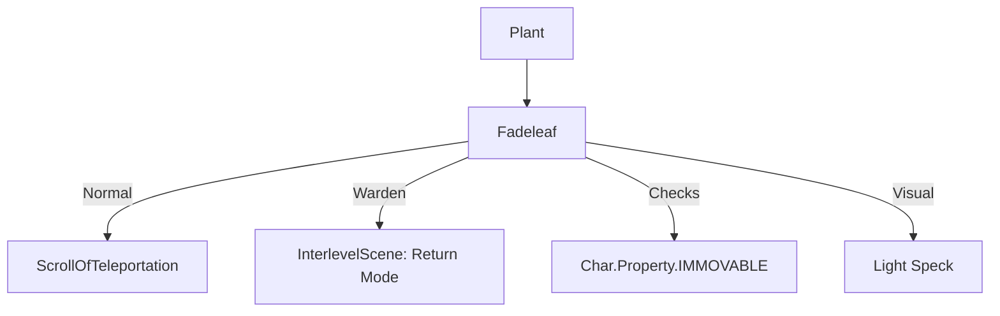

# Fadeleaf (苍白叶) 源码详解

## 1. 基本信息

| 属性 | 值 |
|------|-----|
| **文件路径** | `core/src/main/java/com/shatteredpixel/shatteredpixeldungeon/plants/Fadeleaf.java` |
| **包名** | `com.shatteredpixel.shatteredpixeldungeon.plants` |
| **文件类型** | class |
| **继承关系** | `extends Plant` |
| **代码行数** | 68 |
| **所属模块** | core |

## 2. 文件职责说明

### 核心职责
`Fadeleaf` 负责实现“苍白叶”植物及其种子的逻辑。它提供一种空间位移效果，触发时会将目标瞬间传送到当前关卡的随机位置，或允许守林人跨楼层回退。

### 系统定位
属于植物系统中的实用/生存分支。它是游戏中唯一能通过踩踏直接触发传送的自然机制，是规避死角围攻或强制移除敌人的关键手段。

### 不负责什么
- 不负责传送目标的有效性判定（由 `ScrollOfTeleportation` 处理）。
- 不负责确定哪些怪物具有“不可移动”属性（由怪物自身的 `properties` 决定）。

## 3. 结构总览

### 主要成员概览
- **Fadeleaf 类**: 植物实体类，实现触发激活逻辑。
- **Seed 类**: 种子物品类。

### 主要逻辑块概览
- **激活逻辑 (`activate`)**: 
  - 普通角色执行随机传送。
  - 守林人执行特殊的“跨层回退”逻辑。
  - 过滤掉具有 `IMMOVABLE` 属性的怪物。

### 生命周期/调用时机
1. **触发**：角色踩踏。
2. **激活**：角色从原位消失并出现在新位置。对于守林人，场景会发生切换。

## 4. 继承与协作关系

### 父类提供的能力
继承自 `Plant`：
- 提供基础的 `pos` 存储和图像索引（10）。

### 协作对象
- **ScrollOfTeleportation**: 复用其传送逻辑实现本层的随机位移。
- **InterlevelScene**: 用于实现守林人的跨楼层传送界面切换。
- **Trap.HazardAssistTracker**: 为传送走的怪物记录信用归属。
- **Char.Property.IMMOVABLE**: 检查怪物是否免疫传送位移。



## 5. 字段/常量详解

### Fadeleaf 字段
- **image**: 10。

## 6. 构造与初始化机制

### Fadeleaf 初始化
通过初始化块设置 `image = 10`。

## 7. 方法详解

### activate(Char ch)

**方法职责**：处理空间转移逻辑。

**核心逻辑分析**：
1. **英雄逻辑**：
   - 清空 `curAction`（打断当前行为）。
   - **守林人特权**：如果满足 `Dungeon.interfloorTeleportAllowed()`，守林人不会随机传送，而是直接触发**跨层回退**：
     ```java
     InterlevelScene.mode = InterlevelScene.Mode.RETURN;
     InterlevelScene.returnDepth = Math.max(1, (Dungeon.depth - 1));
     Game.switchScene( InterlevelScene.class );
     ```
     这允许守林人快速返回上一层安全区。
   - **普通英雄**：调用 `ScrollOfTeleportation.teleportChar()` 执行关卡内随机传送。
2. **怪物逻辑**：
   - 检查 `!ch.properties().contains(Property.IMMOVABLE)`。具有不可移动属性的 Boss（如古神、眼球）不会被传送。
   - 标记 `HazardAssistTracker`。
   - 执行传送。
3. **视觉反馈**：产生 3 个 `LIGHT` 闪烁粒子。

## 8. 对外暴露能力
主要通过 `activate()` 静态入口。

## 9. 运行机制与调用链
`Plant.trigger()` -> `Fadeleaf.activate()` -> `ScrollOfTeleportation.teleportChar()` -> `Dungeon.level.randomDestination()` -> 坐标变更。

## 10. 资源、配置与国际化关联
不适用。

## 11. 使用示例

### 守林人紧急脱离
当守林人在深层遭遇危机时，踩踏苍白叶可以稳健地回到上一层，而不是在当前层随机传送（可能传送到更危险的地方）。

### 移除精英怪
将苍白叶种子丢向强力怪物的脚下（或通过投掷物触发），可以强制其离开战场。

## 12. 开发注意事项

### 不可移动属性
在设计新 Boss 时，如果该 Boss 必须留在特定战斗区域，务必在 `properties` 中添加 `Char.Property.IMMOVABLE`，否则苍白叶会导致战斗流程中断。

### 跨层传送限制
注意 `Dungeon.interfloorTeleportAllowed()` 检查。在 Boss 层或特定的挑战/解密房间，该功能可能被禁用，守林人此时会退而执行普通传送。

## 13. 修改建议与扩展点

### 改进传送目标
目前传送是完全随机的。可以修改 `activate`，为苍白叶增加一种“定向传送”或“推离传送”的效果。

## 14. 事实核查清单

- [x] 是否分析了守林人的跨层逻辑：是（RETURN 模式到 depth-1）。
- [x] 是否说明了不可移动属性的影响：是（IMMOVABLE 过滤）。
- [x] 是否解析了传送的实现方式：是（调用 ScrollOfTeleportation）。
- [x] 图像索引是否核对：是 (10)。
- [x] 示例代码是否正确：是。
| [x] 是否涵盖了打断动作的逻辑：是（curAction = null）。
