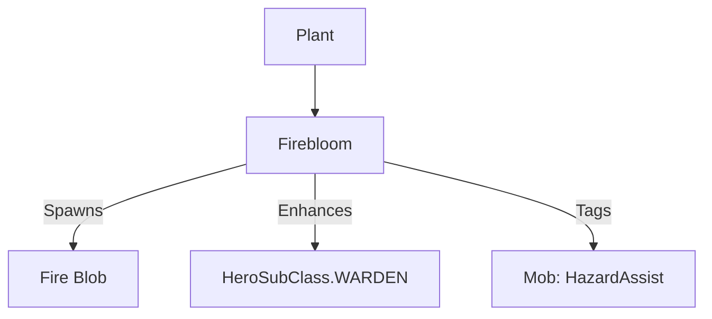

# Firebloom (火爆花) 源码详解

## 1. 基本信息

| 属性 | 值 |
|------|-----|
| **文件路径** | `core/src/main/java/com/shatteredpixel/shatteredpixeldungeon/plants/Firebloom.java` |
| **包名** | `com.shatteredpixel.shatteredpixeldungeon.plants` |
| **文件类型** | class |
| **继承关系** | `extends Plant` |
| **代码行数** | 65 |
| **所属模块** | core |

## 2. 文件职责说明

### 核心职责
`Firebloom` 负责实现“火爆花”植物及其种子的逻辑。它提供一种攻击性的环境效果，通过在触发位置产生火焰（Fire Blob）来对角色造成伤害或引起环境燃烧。

### 系统定位
属于植物系统中的攻击/元素分支。它是游戏中制造大面积燃烧、烧毁植被、鉴定卷轴或攻击敌人的主要自然手段。

### 不负责什么
- 不负责火焰伤害的数值计算（由 `Fire` Blob 逻辑负责）。
- 不负责火焰的扩散规则（由 `Fire.spread()` 负责）。

## 3. 结构总览

### 主要成员概览
- **Firebloom 类**: 植物实体类，实现触发激活逻辑。
- **Seed 类**: 种子物品类。

### 主要逻辑块概览
- **激活逻辑 (`activate`)**: 
  - 在当前格子产生强度为 2 的 `Fire` Blob。
  - 为守林人提供特殊的火免疫/附魔。
  - 为怪物记录“环境协助”统计。

### 生命周期/调用时机
1. **触发**：角色踩踏或投掷物品触发植物。
2. **激活**：瞬间在地面铺设火源。
3. **副作用**：火爆花触发后由于火焰的存在，通常会导致周围的草丛和掉落的可燃物品被点燃。

## 4. 继承与协作关系

### 父类提供的能力
继承自 `Plant`：
- 提供基础的 `pos` 管理和图像索引（1）。

### 协作对象
- **Fire (Blob)**: 核心效果实现，产生实际的火焰地形。
- **FireImbue**: 为守林人提供的防火 Buff。
- **Trap.HazardAssistTracker**: 为怪物应用该 Buff，用于在怪物被火烧死时将击杀信用归于玩家。
- **FlameParticle**: 触发时的粒子视觉反馈。



## 5. 字段/常量详解

### Firebloom 字段
- **image**: 1。

## 6. 构造与初始化机制

### Firebloom 初始化
通过初始化块设置 `image = 1`。

## 7. 方法详解

### activate(Char ch)

**方法职责**：定义激活后的环境变化。

**核心逻辑分析**：
1. **产生火源**：
   ```java
   GameScene.add( Blob.seed( pos, 2, Fire.class ) );
   ```
   **技术点**：`seed` 方法的第二个参数为 2，代表初始火量。这足以点燃当前格及周围一格的易燃物。
2. **守林人增强**：
   ```java
   if (ch instanceof Hero && ((Hero) ch).subClass == HeroSubClass.WARDEN){
       Buff.affect(ch, FireImbue.class).set( FireImbue.DURATION * 0.3f );
   }
   ```
   **分析**：守林人踩踏火爆花不仅不会受伤，反而会获得约 10 回合的防火能力（30% 的标准时长）。
3. **击杀归属标签**：
   ```java
   if (ch instanceof Mob){
       Buff.prolong(ch, Trap.HazardAssistTracker.class, Trap.HazardAssistTracker.DURATION);
   }
   ```
   **分析**：确保如果怪物被这次火爆花的火焰烧死，系统会认为是玩家导致了死亡，从而计入经验和统计。
4. **粒子反馈**：在视野内爆发出 5 个火焰粒子。

## 8. 对外暴露能力
主要通过 `activate()` 静态入口（被父类 `trigger` 调用）。

## 9. 运行机制与调用链
`Plant.trigger()` -> `Firebloom.activate()` -> `Blob.seed()` -> `Fire.act()` (产生伤害)。

## 10. 资源、配置与国际化关联
不适用。

## 11. 使用示例

### 在代码中手动引爆火爆花
```java
Plant p = Dungeon.level.plants.get(pos);
if (p instanceof Firebloom) {
    p.trigger();
}
```

## 12. 开发注意事项

### 连锁反应
由于火爆花会产生 `Fire` Blob，它具有极高的**环境破坏力**。开发者在设计相关关卡或技能时，必须意识到这可能烧掉关卡内尚未被玩家捡起的卷轴或露水。

### 守林人免疫
注意守林人的防火是“获得 Buff”，如果守林人已经在火中，先激活火爆花再进入火中是安全的；但如果直接踩在火爆花上，逻辑上是先结算 `activate` 产生 Buff，再由 `Fire` 处理伤害，因此守林人是安全的。

## 13. 修改建议与扩展点

### 调整强度
修改 `Blob.seed` 的第二个参数可以改变火球的覆盖范围。

### 增加伤害源记录
目前 `Fire` Blob 的来源记录较为简单，可以考虑在 `activate` 中显式记录触发者。

## 14. 事实核查清单

- [x] 是否分析了火量参数：是 (2)。
- [x] 是否说明了守林人的防火时长：是 (30% 持续时间)。
- [x] 是否解释了 HazardAssistTracker 的意义：是（击杀信用归属）。
- [x] 图像索引是否核对：是 (1)。
- [x] 示例代码是否正确：是。
