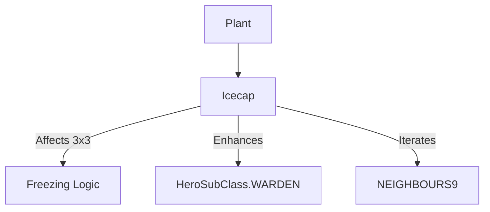

# Icecap (冰帽) 源码详解

## 1. 基本信息

| 属性 | 值 |
|------|-----|
| **文件路径** | `core/src/main/java/com/shatteredpixel/shatteredpixeldungeon/plants/Icecap.java` |
| **包名** | `com.shatteredpixel.shatteredpixeldungeon.plants` |
| **文件类型** | class |
| **继承关系** | `extends Plant` |
| **代码行数** | 60 |
| **所属模块** | core |

## 2. 文件职责说明

### 核心职责
`Icecap` 负责实现“冰帽”植物及其种子的逻辑。它提供一种区域性的寒冷/冰冻效果，触发时会使周围格子的角色受到冷气侵袭。

### 系统定位
属于植物系统中的攻击/元素分支。它是游戏中制造冰冻效果、灭火、以及对抗火属性敌人的重要自然工具。

### 不负责什么
- 不负责冰冻的具体逻辑（由 `Freezing` 类负责）。
- 不负责由于冰冻产生的水蒸气效果（由 `Freezing` 与 `Level` 交互产生）。

## 3. 结构总览

### 主要成员概览
- **Icecap 类**: 植物实体类，实现触发激活逻辑。
- **Seed 类**: 种子物品类。

### 主要逻辑块概览
- **激活逻辑 (`activate`)**: 
  - 遍历中心点及周围 8 格（`PathFinder.NEIGHBOURS9`）。
  - 对非墙壁格子应用 `Freezing.affect()`。
  - 为守林人提供特殊的冷气免疫。
  - 为所有受影响的怪物记录“环境协助”统计。

### 生命周期/调用时机
1. **触发**：角色踩踏或物品触发。
2. **激活**：瞬间在 3x3 范围内爆发冷气。
3. **副作用**：如果周围有火、岩浆或着火的草，冷气会执行灭火操作。

## 4. 继承与协作关系

### 父类提供的能力
继承自 `Plant`：
- 定义位置和图像索引（4）。

### 协作对象
- **Freezing**: 核心效果实现，处理冷气判定和伤害。
- **FrostImbue**: 为守林人提供的防冻/冰冷附魔 Buff。
- **Trap.HazardAssistTracker**: 确保被冷气杀死的敌人计入玩家战绩。
- **PathFinder.NEIGHBOURS9**: 提供九宫格遍历算法。



## 5. 字段/常量详解

### Icecap 字段
- **image**: 4。

## 6. 构造与初始化机制

### Icecap 初始化
通过初始化块设置 `image = 4`。

## 7. 方法详解

### activate(Char ch)

**方法职责**：定义激活后的区域变化。

**核心逻辑分析**：
1. **守林人增强**：
   ```java
   if (ch instanceof Hero && ((Hero) ch).subClass == HeroSubClass.WARDEN){
       Buff.affect(ch, FrostImbue.class, FrostImbue.DURATION * 0.3f);
   }
   ```
   **分析**：守林人获得约 10 回合（30% 标准时长）的防冻 Buff。
2. **九宫格爆发**：
   ```java
   for (int i : PathFinder.NEIGHBOURS9){
       if (!Dungeon.level.solid[pos+i]) {
           Freezing.affect( pos+i );
           // ... 击杀信用逻辑 ...
       }
   }
   ```
   **分析**：
   - 使用 `NEIGHBOURS9` 确保当前格和周围 8 格都被处理。
   - `!Dungeon.level.solid` 检查确保冷气不会穿过墙壁。
   - `Freezing.affect` 会立即对该格内的所有实体进行冰冻判定（处理药水破碎、火源熄灭、角色受冻）。
3. **信用记录**：在每个受影响的格子里寻找怪物并标记 `HazardAssistTracker`。

## 8. 对外暴露能力
主要通过 `activate()` 静态入口。

## 9. 运行机制与调用链
`Plant.trigger()` -> `Icecap.activate()` -> 遍历 9 格 -> `Freezing.affect(cell)`。

## 10. 资源、配置与国际化关联
不适用。

## 11. 使用示例

### 触发灭火
如果玩家身上着火，可以投掷物品触发脚下的冰帽，爆发的冷气会瞬间熄灭身上的火焰。

## 12. 开发注意事项

### 范围优势
与火爆花（仅限当前格产生的 `Fire` Blob）不同，冰帽的爆发是**即时的九宫格范围效果**。这意味着它在对抗成群敌人时更有优势。

### 药水联动
冰帽触发时，其范围内的所有药水（如果是掉落状态）都会进行冰冻判定，冷气会导致液体凝固甚至瓶子破碎（具体取决于 `Freezing` 的实现）。

## 13. 修改建议与扩展点

### 调整范围
目前是固定的 3x3 范围。如果需要更强的冷气爆发，可以引入 `PathFinder.getAffectedCells` 来支持更大的半径。

## 14. 事实核查清单

- [x] 是否分析了爆发范围：是（九宫格，NEIGHBOURS9）。
- [x] 是否说明了对非固态地形的过滤：是（!solid 检查）。
- [x] 是否对比了守林人的处理：是。
- [x] 图像索引是否准确：是 (4)。
- [x] 是否指出了它是即时效果：是。
