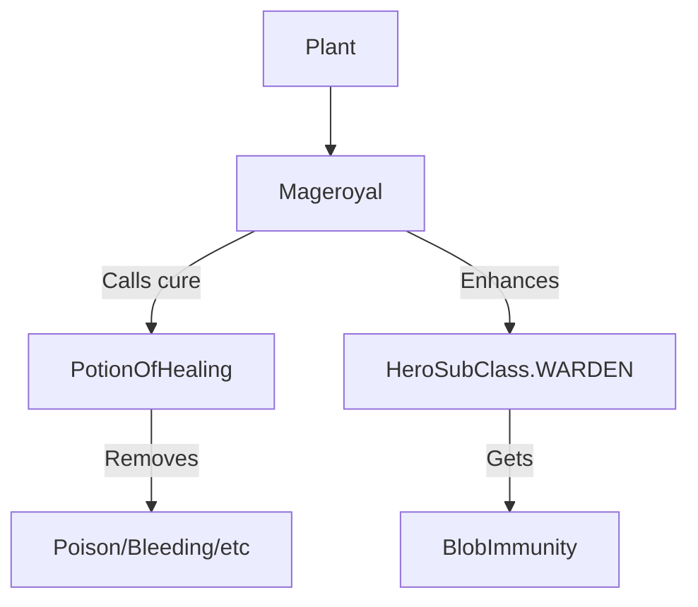

# Mageroyal (梦叶草) 源码详解

## 1. 基本信息

| 属性 | 值 |
|------|-----|
| **文件路径** | `core/src/main/java/com/shatteredpixel/shatteredpixeldungeon/plants/Mageroyal.java` |
| **包名** | `com.shatteredpixel.shatteredpixeldungeon.plants` |
| **文件类型** | class |
| **继承关系** | `extends Plant` |
| **代码行数** | 52 |
| **所属模块** | core |

## 2. 文件职责说明

### 核心职责
`Mageroyal` 负责实现“梦叶草”植物及其种子的逻辑。它提供一种净化性的实用效果，能够清除角色身上的多种负面状态（Debuff）。

### 系统定位
属于植物系统中的医疗/辅助分支。它是除了治疗药水和净化药水外，游戏中最重要的自然净化手段。

### 不负责什么
- 不负责恢复生命值（虽然它调用了治疗药水的净化逻辑，但不包含回血逻辑）。
- 不负责具体的净化列表管理（由 `PotionOfHealing.cure()` 定义）。

## 3. 结构总览

### 主要成员概览
- **Mageroyal 类**: 植物实体类，实现触发激活逻辑。
- **Seed 类**: 种子物品类。

### 主要逻辑块概览
- **激活逻辑 (`activate`)**: 
  - 调用 `PotionOfHealing.cure()` 清除角色的中毒、流血、削弱等状态。
  - 为守林人应用 `BlobImmunity`（环境效果免疫）。
  - 在日志中显示“精神一振”的消息。

### 生命周期/调用时机
1. **触发**：角色踩踏。
2. **激活**：角色身上的减益状态瞬间消失。

## 4. 继承与协作关系

### 父类提供的能力
继承自 `Plant`：
- 定义位置和图像索引（7）。

### 协作对象
- **PotionOfHealing.cure()**: 核心逻辑实现，执行具体的状态清除。
- **BlobImmunity**: 为守林人提供的正面效果，使其短时间内免疫毒气、火焰等区域效果。
- **GLog / Messages**: 处理本地化日志输出。



## 5. 字段/常量详解

### Mageroyal 字段
- **image**: 7。

## 6. 构造与初始化机制

### Mageroyal 初始化
通过初始化块设置 `image = 7`。

## 7. 方法详解

### activate(Char ch)

**方法职责**：定义净化逻辑。

**核心逻辑分析**：
1. **净化核心**：
   ```java
   PotionOfHealing.cure(ch);
   ```
   **分析**：复用了治疗药水的净化代码。它会移除目标身上几乎所有的非永久性负面 Buff（如中毒、流血、致盲、残废等）。
2. **英雄反馈**：
   ```java
   if (ch instanceof Hero) {
       GLog.i( Messages.get(this, "refreshed") ); // “你感到精神一振。”
       // ...
   }
   ```
3. **守林人增强**：
   ```java
   if (((Hero) ch).subClass == HeroSubClass.WARDEN){
       Buff.affect(ch, BlobImmunity.class, BlobImmunity.DURATION/2f);
   }
   ```
   **分析**：守林人获得约 10 回合的环境免疫。这意味着踩踏梦叶草后的守林人可以在短时间内无视毒气或火焰进行战斗。

## 8. 对外暴露能力
主要通过 `activate()` 静态入口。

## 9. 运行机制与调用链
`Plant.trigger()` -> `Mageroyal.activate()` -> `PotionOfHealing.cure()` -> `Buff.detach()`。

## 10. 资源、配置与国际化关联

### 本地化词条
- `Mageroyal.name`: 梦叶草
- `Mageroyal.refreshed`: “你感到精神一振。”

## 11. 使用示例

### 战术清除中毒
当玩家受到强力毒素影响且没有治疗药水时，可以立即种植并踩踏梦叶草，中毒状态将立即消失，从而保住生命值。

## 12. 开发注意事项

### 净化与治疗的区别
开发者需明确，梦叶草**不回血**。如果玩家在低血量且处于流血状态时踩踏梦叶草，流血虽然会停止，但血量依然危险。

### 对怪物的净化
注意 `cure` 方法同样作用于怪物。虽然罕见，但如果怪物踩到梦叶草，它身上的负面状态（如玩家施加的中毒）也会被清除。

## 13. 修改建议与扩展点

### 增加魔法恢复
由于其名称包含 "Mage"，可以考虑在 `activate` 中为法师职业增加少量的法杖充能或法力回复。

## 14. 事实核查清单

- [x] 是否分析了净化的具体实现：是（调用 PotionOfHealing.cure）。
- [x] 是否说明了守林人的特殊免疫：是 (BlobImmunity)。
- [x] 是否涵盖了日志反馈逻辑：是。
- [x] 图像索引是否核对：是 (7)。
- [x] 示例代码是否正确：是。
