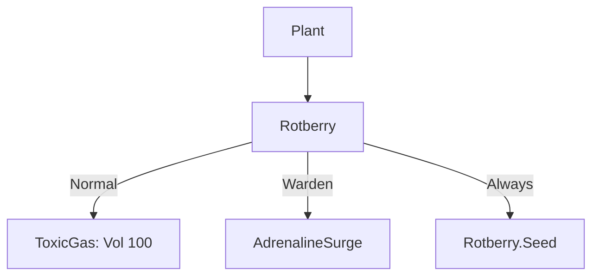

# Rotberry (腐烂莓) 源码详解

## 1. 基本信息

| 属性 | 值 |
|------|-----|
| **文件路径** | `core/src/main/java/com/shatteredpixel/shatteredpixeldungeon/plants/Rotberry.java` |
| **包名** | `com.shatteredpixel.shatteredpixeldungeon.plants` |
| **文件类型** | class |
| **继承关系** | `extends Plant` |
| **代码行数** | 68 |
| **所属模块** | core |

## 2. 文件职责说明

### 核心职责
`Rotberry` 负责实现“腐烂莓”植物及其种子的逻辑。它是一种任务相关的特殊植物，具有极高的毒性和独有的种子回收机制。

### 系统定位
属于植物系统中的特殊/任务分支。它是游戏中唯一一个在枯萎后**必然**掉回种子的植物，主要用于炼金或作为任务道具（如老法师的任务）。

### 不负责什么
- 不负责毒气伤害的具体计算（由 `ToxicGas` 类负责）。
- 不负责老法师任务的进度追踪。

## 3. 结构总览

### 主要成员概览
- **Rotberry 类**: 植物实体类，覆写了 `activate` 和 `wither`。
- **Seed 类**: 种子物品类，标记为 `unique`（唯一）。

### 主要逻辑块概览
- **激活逻辑 (`activate`)**: 
  - 为普通角色产生巨量毒气。
  - 为守林人应用 `AdrenalineSurge`（肾上腺素冲动）增益。
- **枯萎逻辑 (`wither`)**: 覆写父类逻辑，实现 100% 的种子掉落率。

### 生命周期/调用时机
1. **触发**：角色踩踏。
2. **激活**：释放毒气或给予增益。
3. **循环**：由于种子必然掉落，玩家可以无限次地重新种植腐烂莓。

## 4. 继承与协作关系

### 父类提供的能力
继承自 `Plant`：
- 提供基础的 `pos` 存储和图像索引（0）。

### 覆写的方法
- `activate(Char)`: 实现了巨量毒气产生逻辑。
- `wither()`: 改变了种子掉落规则。

### 协作对象
- **ToxicGas**: 核心负面效果，产生大范围毒云。
- **AdrenalineSurge**: 为守林人提供的正面效果，增加力量和血量上限。
- **GameScene**: 用于向场景添加 `Blob`。



## 5. 字段/常量详解

### Rotberry 字段
- **image**: 0。

### Seed 属性 (Override)
- **unique**: `true`（该种子在逻辑上被视为唯一物品，虽然可以堆叠）。
- **value**: 30 金币。
- **energyVal**: 3 点。

## 6. 构造与初始化机制

### Rotberry 初始化
通过初始化块设置 `image = 0`。

## 7. 方法详解

### activate(Char ch)

**方法职责**：定义剧毒爆发逻辑。

**核心逻辑分析**：
1. **普通爆发**：
   ```java
   GameScene.add( Blob.seed( pos, 100, ToxicGas.class ) );
   ```
   **技术点**：初始体积设为 **100**。这是全游戏单次产生毒气量的最高值，会导致整个房间迅速充满高浓度毒气。
2. **守林人增强**：
   ```java
   if (ch instanceof Hero && ((Hero) ch).subClass == HeroSubClass.WARDEN){
       Buff.affect(ch, AdrenalineSurge.class).reset(1, AdrenalineSurge.DURATION);
   }
   ```
   **分析**：守林人踩踏腐烂莓会获得肾上腺素效果（临时提升 1 点力量），使其在毒云中反而变得更强。

---

### wither() [核心差异化逻辑]

**方法职责**：控制植物移除后的产物。

**代码逻辑**：
```java
@Override
public void wither() {
    Dungeon.level.uproot( pos );
    // ... 粒子特效 ...
    // 不受 Lotus 随机概率影响，直接生成新种子并掉落
    Dungeon.level.drop( new Seed(), pos ).sprite.drop();
}
```
**设计意义**：这确保了腐烂莓作为一个“资源”是永不枯竭的。玩家可以反复利用它来清除怪物或为守林人加 Buff。

## 8. 对外暴露能力
主要通过 `activate()` 接口。

## 9. 运行机制与调用链
`Plant.trigger()` -> `Rotberry.activate()` -> `Blob.seed(100)` -> `ToxicGas` 扩散。

## 10. 资源、配置与国际化关联
不适用。

## 11. 使用示例

### 守林人常驻力量增益
守林人可以随身携带腐烂莓种子，在战斗前种下并踩踏，获得临时的力量加成，由于种子必然回收，该操作几乎零成本。

### 清房神技
在紧闭的房间门口投入腐烂莓种子并触发，100 体积的毒气足以杀伤室内所有非免疫怪物。

## 12. 开发注意事项

### 毒气规模
体积 100 的毒气非常危险。如果不具备毒素免疫，即使是玩家在开阔地带触发，也极易被大面积扩散的毒气困住。

### 种子属性
注意 `Seed` 内部类标记了 `unique = true`。

## 13. 修改建议与扩展点

### 改进任务关联
如果需要配合任务系统，可以在 `wither` 中添加事件发布逻辑，通知任务系统玩家已成功“收割”一次腐烂莓。

## 14. 事实核查清单

- [x] 是否分析了 100% 掉率的实现：是（覆写 wither）。
- [x] 是否解析了毒气体积参数：是 (100)。
- [x] 是否说明了守林人的力量加成：是 (AdrenalineSurge)。
- [x] 图像索引是否核对：是 (0)。
- [x] 示例代码是否正确：是。
