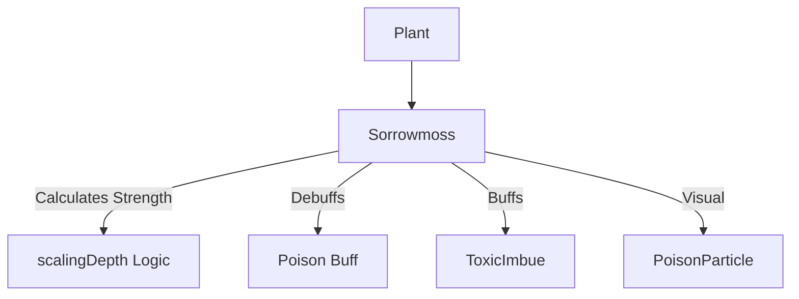

# Sorrowmoss (悲伤苔藓) 源码详解

## 1. 基本信息

| 属性 | 值 |
|------|-----|
| **文件路径** | `core/src/main/java/com/shatteredpixel/shatteredpixeldungeon/plants/Sorrowmoss.java` |
| **包名** | `com.shatteredpixel.shatteredpixeldungeon.plants` |
| **文件类型** | class |
| **继承关系** | `extends Plant` |
| **代码行数** | 63 |
| **所属模块** | core |

## 2. 文件职责说明

### 核心职责
`Sorrowmoss` 负责实现“悲伤苔藓”植物及其种子的逻辑。它提供一种中毒性的攻击效果，能够使触发者受到持续的毒素伤害。

### 系统定位
属于植物系统中的攻击/状态分支。它是玩家在前期利用自然地形制造持续伤害、鉴定中毒相关抗性的重要手段。

### 不负责什么
- 不负责中毒伤害的逐回合跳字逻辑（由 `Poison` Buff 负责）。
- 不负责毒气的产生（它直接作用于角色 Buff，不产生毒气 Blob）。

## 3. 结构总览

### 主要成员概览
- **Sorrowmoss 类**: 植物实体类，实现触发激活逻辑。
- **Seed 类**: 种子物品类。

### 主要逻辑块概览
- **激活逻辑 (`activate`)**: 
  - 为触发角色施加 `Poison`（中毒）减益。
  - 为守林人应用 `ToxicImbue`（毒素附魔/免疫）。
  - 为怪物记录环境危害追踪。
  - 根据地牢深度动态计算中毒强度。

### 生命周期/调用时机
1. **触发**：角色踩踏。
2. **激活**：角色获得中毒状态。

## 4. 继承与协作关系

### 父类提供的能力
继承自 `Plant`：
- 定义位置和图像索引（6）。

### 协作对象
- **Poison**: 核心负面效果，负责持续扣减生命值。
- **ToxicImbue**: 为守林人提供的防毒 Buff。
- **Trap.HazardAssistTracker**: 用于信用归属。
- **PoisonParticle.SPLASH**: 触发时的绿色毒素溅射效果。



## 5. 字段/常量详解

### Sorrowmoss 字段
- **image**: 6。

## 6. 构造与初始化机制

### Sorrowmoss 初始化
通过初始化块设置 `image = 6`。

## 7. 方法详解

### activate(Char ch)

**方法职责**：定义中毒效果的应用及其强度。

**核心逻辑分析**：
1. **守林人增强**：
   ```java
   if (ch instanceof Hero && ((Hero) ch).subClass == HeroSubClass.WARDEN){
       Buff.affect(ch, ToxicImbue.class).set(ToxicImbue.DURATION * 0.3f);
   }
   ```
   **分析**：守林人踩踏后不仅不中毒，还会获得约 10 回合（30% 标准时长）的防毒能力。
2. **动态中毒强度计算**：
   ```java
   Buff.affect( ch, Poison.class ).set( 5 + Math.round(2 * Dungeon.scalingDepth() / 3f) );
   ```
   **强度公式推导**：
   - **地牢 1 层** (depth=1): 强度约为 5 + 1 = 6 点总伤害。
   - **地牢 25 层** (depth=25): 强度约为 5 + 17 = 22 点总伤害。
   **设计意图**：确保中毒效果在后期依然对怪物（及玩家）具有威胁性。
3. **视觉反馈**：
   在格子中心产生 3 个 `PoisonParticle.SPLASH` 粒子。

## 8. 对外暴露能力
主要通过 `activate()` 静态入口。

## 9. 运行机制与调用链
`Plant.trigger()` -> `Sorrowmoss.activate()` -> `Buff.affect(Poison.class)` -> `Poison.act()` (逐回合造成伤害)。

## 10. 资源、配置与国际化关联
不适用。

## 11. 使用示例

### 利用苔藓风筝怪物
将悲伤苔藓种在怪物必经之路上。怪物踩踏后获得的中毒状态会持续多个回合，玩家可以趁机拉开距离并观察其生命值不断下降。

## 12. 开发注意事项

### 伤害累加
`Poison` Buff 通常具有累加性（取决于具体的 Buff 实现），连续触发多株苔藓会导致中毒总伤害显著提升。

### 守林人优势
守林人利用此植物获得的 `ToxicImbue` 可以在接下来的战斗中免疫各种毒气 Blob，是战术上的重大优势。

## 13. 修改建议与扩展点

### 改进中毒效果
目前的强度是线性的。可以考虑在 `activate` 中判断目标的等级，如果是 Boss，则给予特定比例的最大生命值伤害。

## 14. 事实核查清单

- [x] 是否分析了中毒强度的动态公式：是 (`5 + 2*depth/3`)。
- [x] 是否对比了守林人的处理：是。
- [x] 是否说明了击杀信用的记录：是。
- [x] 图像索引是否核对：是 (6)。
- [x] 示例代码是否正确：是。
