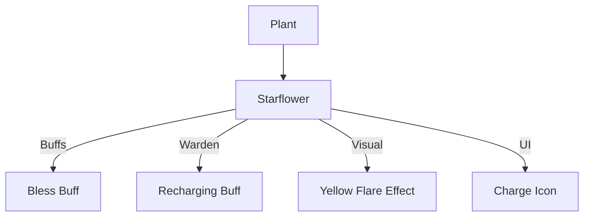

# Starflower (星辰花) 源码详解

## 1. 基本信息

| 属性 | 值 |
|------|-----|
| **文件路径** | `core/src/main/java/com/shatteredpixel/shatteredpixeldungeon/plants/Starflower.java` |
| **包名** | `com.shatteredpixel.shatteredpixeldungeon.plants` |
| **文件类型** | class |
| **继承关系** | `extends Plant` |
| **代码行数** | 62 |
| **所属模块** | core |

## 2. 文件职责说明

### 核心职责
`Starflower` 负责实现“星辰花”植物及其种子的逻辑。它提供一种祝福性的增强效果，显著提升角色的战斗属性（命中与闪避），并为特定职业提供法力补给。

### 系统定位
属于植物系统中的高级辅助/祝福分支。它是游戏中唯一能通过踩踏直接获得“祝福”状态的自然机制，具有较高的稀有度和经济价值。

### 不负责什么
- 不负责“祝福”状态的具体属性加成（由 `Bless` Buff 负责）。
- 不负责经验值的直接获取（在旧版本中可能有关联，但当前源码中未体现）。

## 3. 结构总览

### 主要成员概览
- **Starflower 类**: 植物实体类，实现触发激活。
- **Seed 类**: 种子物品类，具有特殊的售价和能量值。

### 主要逻辑块概览
- **激活逻辑 (`activate`)**: 
  - 为触发角色应用 `Bless`（祝福）增益。
  - 为守林人额外应用 `Recharging`（充能）增益。
  - 播放华丽的视觉反馈效果。

### 生命周期/调用时机
1. **触发**：角色踩踏。
2. **激活**：角色全身闪烁金光，获得战斗加成。

## 4. 继承与协作关系

### 父类提供的能力
继承自 `Plant`：
- 提供基础的 `pos` 存储和图像索引（9）。

### 协作对象
- **Bless**: 核心效果实现，提供命中和闪避加成。
- **Recharging**: 为守林人提供的额外 Buff，加速法杖和神器充能。
- **Flare**: 产生 6 射线、黄色、持续 2 秒的旋转光芒特效。
- **SpellSprite.CHARGE**: 守林人触发时的 UI 图标反馈。



## 5. 字段/常量详解

### Starflower 字段
- **image**: 9。

### Seed 经济属性 (Override)
| 属性 | 值 | 说明 |
|------|-----|------|
| `value` | 30 * quantity | 基础售价为 30 金币（普通种子为 10） |
| `energyVal` | 3 * quantity | 炼金能量为 3 点（普通种子为 2） |

## 6. 构造与初始化机制

### Starflower 初始化
通过初始化块设置 `image = 9`。

## 7. 方法详解

### activate(Char ch)

**方法职责**：定义神圣祝福逻辑。

**核心逻辑分析**：
1. **全职业祝福**：
   ```java
   Buff.prolong(ch, Bless.class, Bless.DURATION);
   ```
   **分析**：任何踩踏星辰花的实体（包括怪物）都会获得祝福，提升战斗表现。
2. **华丽特效**：
   ```java
   if (Dungeon.level.heroFOV[ch.pos]){
       new Flare(6, 32).color(0xFFFF00, true).show(ch.sprite, 2f);
   }
   ```
   **分析**：产生一个由 6 条旋转射线组成的亮黄色发光圆盘，持续 2 秒。这是全游戏植物中最华丽的触发特效。
3. **守林人增强**：
   ```java
   if (ch instanceof Hero && ((Hero) ch).subClass == HeroSubClass.WARDEN){
       Buff.prolong(ch, Recharging.class, Recharging.DURATION);
       SpellSprite.show( ch, SpellSprite.CHARGE );
   }
   ```
   **分析**：守林人除了获得祝福，还能获得充能效果（通常用于加速法杖恢复）。

## 8. 对外暴露能力
主要通过 `activate()` 静态入口。

## 9. 运行机制与调用链
`Plant.trigger()` -> `Starflower.activate()` -> `Buff.prolong(Bless.class)` -> `Char.attack()` (读取祝福修正)。

## 10. 资源、配置与国际化关联
不适用。

## 11. 使用示例

### 战前增益
在面对 Boss 前，如果有星辰花种子，可以提前种植并踩踏，带着祝福状态进入战斗以提高胜率。

## 12. 开发注意事项

### 经济价值
由于其 `value` 和 `energyVal` 均高于普通种子，在设计掉落概率时应将其视为稀有资源。

### 视觉优先级
`Flare` 特效持续时间较长（2s），在大规模混战中可能会遮挡部分底层视觉细节。

## 13. 修改建议与扩展点

### 增加经验加成
在早期版本中，星辰花可能与经验值挂钩。如果需要重现此功能，可以在 `activate` 中判断角色是否为英雄，并调用 `hero.addExperience()`。

## 14. 事实核查清单

- [x] 是否分析了守林人的双重增益：是（Bless + Recharging）。
- [x] 是否对比了种子的特殊价值：是（30金币 / 3能量）。
- [x] 是否涵盖了华丽的 Flare 特效参数：是（6射线, 32半径, 2s时长）。
- [x] 图像索引是否核对：是 (9)。
- [x] 示例代码是否正确：是。
