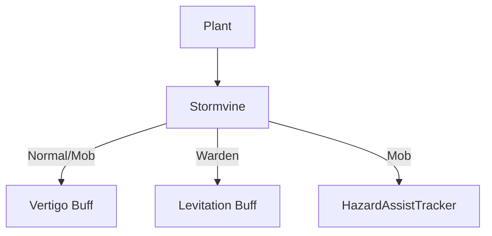

# Stormvine (雷暴藤) 源码详解

## 1. 基本信息

| 属性 | 值 |
|------|-----|
| **文件路径** | `core/src/main/java/com/shatteredpixel/shatteredpixeldungeon/plants/Stormvine.java` |
| **包名** | `com.shatteredpixel.shatteredpixeldungeon.plants` |
| **文件类型** | class |
| **继承关系** | `extends Plant` |
| **代码行数** | 52 |
| **所属模块** | core |

## 2. 文件职责说明

### 核心职责
`Stormvine` 负责实现“雷暴藤”植物及其种子的逻辑。它提供一种具有干扰性或机动性的空中效果，能够使目标感到眩晕（失去方向感）或允许特定职业在空中滑行。

### 系统定位
属于植物系统中的控制/实用分支。它在对抗位于深渊边缘的敌人时极具杀伤力，也是守林人跨越陷阱或障碍的重要手段。

### 不负责什么
- 不负责“眩晕”的具体随机移动逻辑（由 `Vertigo` 类负责）。
- 不负责坠落深渊的即死判定（由 `Char.move()` 触发 `Level.pit` 判定）。

## 3. 结构总览

### 主要成员概览
- **Stormvine 类**: 植物实体类，处理触发逻辑。
- **Seed 类**: 种子物品类。

### 主要逻辑块概览
- **激活逻辑 (`activate`)**: 
  - 为普通角色和怪物应用 `Vertigo`（眩晕）减益。
  - 为守林人应用 `Levitation`（漂浮）增益。
  - 对怪物应用环境危害追踪。

### 生命周期/调用时机
1. **触发**：角色踩踏。
2. **激活**：角色状态改变。如果处于眩晕状态，接下来的移动方向将不再受玩家或 AI 直接控制。

## 4. 继承与协作关系

### 父类提供的能力
继承自 `Plant`：
- 定义位置和图像索引（5）。

### 协作对象
- **Vertigo**: 核心负面效果，使角色移动方向随机化。
- **Levitation**: 为守林人提供的正面效果，允许越过障碍和深渊。
- **Trap.HazardAssistTracker**: 确保怪物因眩晕跌入深渊而死时玩家能获得经验。



## 5. 字段/常量详解

### Stormvine 字段
- **image**: 5。

## 6. 构造与初始化机制

### Stormvine 初始化
通过初始化块设置 `image = 5`。

## 7. 方法详解

### activate(Char ch)

**方法职责**：定义激活后的状态分支。

**核心逻辑分析**：
1. **守林人分支**：
   ```java
   if (ch instanceof Hero && ((Hero) ch).subClass == HeroSubClass.WARDEN){
       Buff.affect(ch, Levitation.class, Levitation.DURATION/2f);
   }
   ```
   **分析**：守林人获得漂浮效果，持续时间为标准时长的 50%（约 10 回合）。这使得守林人可以利用雷暴藤在紧急情况下飞越深渊。
2. **普通/怪物分支**：
   - 如果是怪物，先标记 `HazardAssistTracker`。
   - 应用 `Vertigo`：目标将失去对移动方向的控制。
   **战术价值**：将雷暴藤种在深渊边缘，怪物踩踏后极大概率会失足坠落。

## 8. 对外暴露能力
主要通过 `activate()` 静态入口。

## 9. 运行机制与调用链
`Plant.trigger()` -> `Stormvine.activate()` -> `Buff.affect(Vertigo.class)` -> `Char.update()` (处理随机位移)。

## 10. 资源、配置与国际化关联
不适用。

## 11. 使用示例

### 地形杀
在连接房间的狭窄悬崖通道处种植雷暴藤。当强力怪物（如魔像）踩踏后，其随机移动的逻辑往往会导致其掉下悬崖，实现“秒杀”。

## 12. 开发注意事项

### 坠落信用
标记 `HazardAssistTracker` 非常重要。因为眩晕导致的随机位移在逻辑上不属于玩家的直接攻击，如果没有这个标签，怪物坠亡将不会产生经验值奖励。

### 守林人优势
守林人不仅免疫眩晕，还获得了机动性。这种“环境转化”的设计思路贯穿了所有的植物子类。

## 13. 修改建议与扩展点

### 改进视觉
雷暴藤目前没有专门的触发粒子效果。可以在 `activate` 中添加一些表示旋转或风力的粒子。

## 14. 事实核查清单

- [x] 是否分析了守林人的特殊漂浮效果：是 (50% DURATION)。
- [x] 是否解析了眩晕的战术用途：是（地形杀/深渊边缘）。
- [x] 是否提到了击杀信用的处理：是。
- [x] 图像索引是否核对：是 (5)。
- [x] 示例代码是否正确：是。
