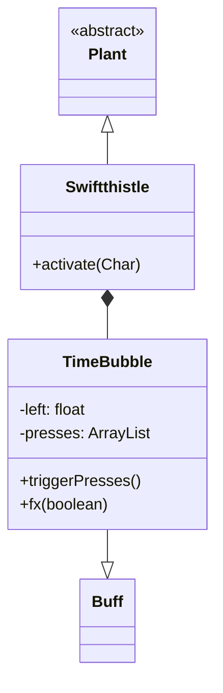

# Swiftthistle (迅捷蓟) 源码详解

## 1. 基本信息

| 属性 | 值 |
|------|-----|
| **文件路径** | `core/src/main/java/com/shatteredpixel/shatteredpixeldungeon/plants/Swiftthistle.java` |
| **包名** | `com.shatteredpixel.shatteredpixeldungeon.plants` |
| **文件类型** | class |
| **继承关系** | `extends Plant` |
| **代码行数** | 185 |
| **所属模块** | core |

## 2. 文件职责说明

### 核心职责
`Swiftthistle` 负责实现“迅捷蓟”植物及其种子的逻辑。它提供一种极强的战术性增益效果：时间停止（Time Freeze），允许角色在不受外界干扰的情况下连续行动多个回合。

### 系统定位
属于植物系统中的速度/时空分支。它通过内部类 `TimeBubble` 操纵游戏的回合制逻辑，是逃生、调整站位或预设战术的核心道具。

### 不负责什么
- 不负责永久性的速度提升（由 `Haste` 药水负责）。
- 不负责对敌人造成直接伤害。

## 3. 结构总览

### 主要成员概览
- **Swiftthistle 类**: 植物实体类，处理基础触发。
- **Seed 类**: 种子物品类。
- **TimeBubble 内部类**: 核心 Buff 类，实现了复杂的时间停止逻辑和动作延迟触发机制。

### 主要逻辑块概览
- **激活逻辑 (`activate`)**: 为角色开启 `TimeBubble`。
- **时间停止逻辑 (`TimeBubble.fx`)**: 冻结粒子发射器，并给所有怪物施加视觉上的瘫痪状态。
- **动作队列 (`presses`)**: 记录在时间停止期间角色踩到的植物或陷阱，待时间恢复后统一触发。

### 生命周期/调用时机
1. **产生**：种植或关卡生成。
2. **触发**：角色踩踏。
3. **活跃期**：角色获得 6 个回合的停止时间。此期间世界处于静止状态。
4. **失效**：6 回合耗尽或手动取消。失效时触发所有积压的物理反馈（陷阱、植物触发）。

## 4. 继承与协作关系

### 父类提供的能力
继承自 `Plant`：
- 定义位置和图像索引（2）。

### 协作对象
- **Haste**: 守林人触发时额外获得 1 回合加速。
- **Emitter**: 通过 `freezeEmitters` 静态变量暂停全游戏的粒子运动。
- **Mob**: 时间停止期间，所有怪物的精灵会被添加 `PARALYSED` 状态。
- **Trap / Plant**: 记录并在时间恢复后触发它们的 `trigger()`。



## 5. 字段/常量详解

### Swiftthistle 字段
- **image**: 2。

### TimeBubble 字段
| 字段名 | 类型 | 说明 |
|--------|------|------|
| `left` | float | 剩余的时间停止回合数（初始为 7，其中 1 回合用于补偿当前的激活动作） |
| `presses` | ArrayList | 记录期间踩到的 Cell 索引，用于延迟触发 |

## 6. 构造与初始化机制

### Swiftthistle 初始化
初始化块设置 `image = 2`。

### TimeBubble 初始化
- `type = POSITIVE`
- `announced = true`
- `reset()`: 默认给予 6 回合时间。

## 7. 方法详解

### activate(Char ch)

**核心实现分析**：
1. **开启气泡**：`Buff.affect(ch, TimeBubble.class).reset()`。
2. **守林人增强**：如果是守林人，额外应用 1 回合 `Haste`（加速），使其在时间停止结束后依然保持爆发速度。

---

### TimeBubble.fx(boolean on) [关键视觉逻辑]

**方法职责**：控制世界的静止视觉。

**代码逻辑**：
1. **粒子冻结**：`Emitter.freezeEmitters = on;` 全局暂停所有火花、烟雾等粒子的 update。
2. **怪物瘫痪**：
   ```java
   for (Mob mob : Dungeon.level.mobs) {
       if (on) mob.sprite.add(State.PARALYSED);
       else mob.sprite.remove(State.PARALYSED);
   }
   ```
   这仅是视觉效果，逻辑上的行动阻塞由 `Actor` 系统的调度器配合 `TimeBubble` 共同完成（由于 `TimeBubble` 存在期间只有玩家能 `act`）。

---

### TimeBubble.setDelayedPress(int cell) [战术逻辑]

**方法职责**：拦截并积压触发事件。

**设计意图**：在时间停止期间，如果玩家踩到一个陷阱或另一株植物，它们不应该立即爆炸或生效（因为时间是静止的）。系统会将这些格子的索引存入 `presses`。

---

### TimeBubble.triggerPresses() [延迟触发逻辑]

**核心实现分析**：
当 Buff 消失时，创建一个优先级为 `VFX_PRIO` 的临时 `Actor`。该 Actor 会遍历 `presses` 列表，依次调用该位置的 `Plant.trigger()` 和 `Trap.trigger()`。
**技术意义**：这实现了“在静止的时间里走过陷阱阵，等时间恢复后身后爆炸四起”的电影化效果。

## 8. 对外暴露能力

### 显式 API
- `TimeBubble.reset(int turns)`: 手动设置停止时长。
- `TimeBubble.disarmPresses()`: 撤销所有积压的触发（用于特定的高级技能或重置逻辑）。

## 9. 运行机制与调用链
`Hero.step()` -> `Plant.trigger()` -> `Swiftthistle.activate()` -> `TimeBubble` 生效 -> 玩家行动 6 回合 -> `TimeBubble.detach()` -> `triggerPresses()`。

## 10. 资源、配置与国际化关联

### 本地化
- `actors.buffs.Swiftthistle$TimeBubble.name`: 时间气泡
- `actors.buffs.Swiftthistle$TimeBubble.desc`: “由于你行动得太快，世界在你眼中似乎静止了。剩余回合：%s。”

## 11. 使用示例

### 在代码中手动停止时间
```java
Swiftthistle.TimeBubble bubble = Buff.affect(hero, Swiftthistle.TimeBubble.class);
bubble.reset(10); // 停止 10 回合
```

## 12. 开发注意事项

### 浮点数精度
`processTime` 中使用 `if (left < -0.001f)` 检查剩余时间，这是为了防止浮点数在多次扣减 1.0f 后的累计误差导致 Buff 无法正常结束。

### 守林人联动
守林人的加速虽然只有 1 回合，但由于是在时间停止中获得的，实际上是在时间恢复后的第一个动作生效。

## 13. 修改建议与扩展点

### 改进 disarmPresses
目前的 `disarmPresses` 会直接 `uproot` 植物（除了腐烂莓）。如果想要更温和的处理，可以改为仅清空队列而不移除物体。

### 增加范围效果
可以修改 `activate`，使范围内的所有盟友都进入时间气泡（需要处理 `Actor` 调度的并发问题）。

## 14. 事实核查清单

- [x] 是否分析了时间停止的视觉实现：是（Emitter 冻结 + 怪物癱痪）。
- [x] 是否解析了延迟触发机制：是（triggerPresses 异步 Actor）。
- [x] 回合数是否核对：是（6 回合）。
- [x] 是否涵盖了守林人的 Haste：是。
- [x] 图像索引是否准确：是 (2)。
