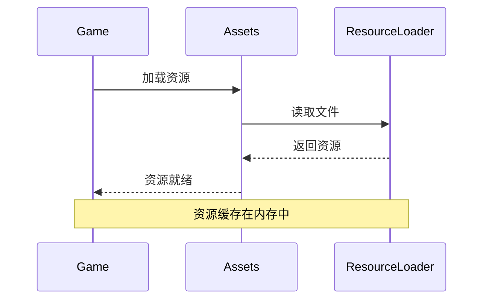

# 资源管线指南

## 概述
本指南介绍 Shattered Pixel Dungeon 的资源文件管理，包括图像、音频、字体等资源的使用和组织方式。

## 资源类型

| 类型 | 格式 | 位置 |
|------|------|------|
| 精灵图 | PNG | `core/assets/sprites/` |
| 图标 | PNG | `core/assets/icons/` |
| 音效 | OGG/WAV | `core/assets/sounds/` |
| 音乐 | OGG | `core/assets/music/` |
| 字体 | FNT/PNG | `core/assets/fonts/` |
| 消息 | PROPERTIES | `core/assets/messages/` |

---

## Assets 类

所有资源路径在 `Assets.java` 中定义：

```java
public class Assets {
    
    // 精灵图
    public static class Sprites {
        public static final String HERO = "sprites/hero.png";
        public static final String ITEMS = "sprites/items.png";
        // ...
    }
    
    // 音效
    public static class Sounds {
        public static final String HIT = "sounds/hit.ogg";
        public static final String MISS = "sounds/miss.ogg";
        // ...
    }
    
    // 音乐
    public static class Music {
        public static final String SEWERS = "music/sewers.ogg";
        // ...
    }
}
```

---

## 图像资源

### 精灵表格式

标准精灵表使用 16x16 像素网格：

```
+----+----+----+----+
| 0  | 1  | 2  | 3  |  第0行
+----+----+----+----+
| 4  | 5  | 6  | 7  |  第1行
+----+----+----+----+
```

### 加载精灵图

```java
// 方式1：直接使用纹理
Image img = new Image(Assets.Sprites.ITEMS);

// 方式2：使用 TextureFilm 分割
TextureFilm film = new TextureFilm(Assets.Sprites.ITEMS, 16, 16);
Image img = new Image(film.get(frameIndex));

// 方式3：使用 ItemSpriteSheet
ItemSprite sprite = new ItemSprite(ItemSpriteSheet.SOMETHING);
```

### ItemSpriteSheet

物品精灵图定义在 `ItemSpriteSheet.java`：

```java
public class ItemSpriteSheet {
    // 单格物品
    public static final int SOMETHING = 1;
    
    // 多格物品（大图标）
    public static final int BIG_ITEM = SHEET_SIZE + 1;
    
    // 分配精灵区域
    private static final Rect SOMETHING = new Rect(0, 0, 16, 16);
    
    static {
        // 分配矩形区域
        assignItemRect(SOMETHING, 16, 16);
    }
}
```

---

## 音频资源

### 播放音效

```java
import com.watabou.noosa.audio.Sample;

// 播放一次
Sample.INSTANCE.play(Assets.Sounds.HIT);

// 播放并调整音调
Sample.INSTANCE.play(Assets.Sounds.HIT, 1, 1.5f);

// 播放并调整音量
Sample.INSTANCE.play(Assets.Sounds.HIT, 0.5f, 1);
```

### 播放音乐

```java
import com.watabou.noosa.audio.Music;

// 播放背景音乐
Music.INSTANCE.play(Assets.Music.SEWERS, true);  // true = 循环

// 停止音乐
Music.INSTANCE.stop();
```

---

## 添加新资源

### 步骤 1：放置资源文件

将资源文件放入对应目录：
```
core/assets/
├── sprites/new_sprite.png
├── sounds/new_sound.ogg
└── music/new_music.ogg
```

### 步骤 2：定义资源路径

在 `Assets.java` 中添加常量：

```java
public static class Sprites {
    // 现有定义...
    public static final String NEW_SPRITE = "sprites/new_sprite.png";
}

public static class Sounds {
    // 现有定义...
    public static final String NEW_SOUND = "sounds/new_sound.ogg";
}
```

### 步骤 3：使用资源

```java
// 加载图像
Image img = new Image(Assets.Sprites.NEW_SPRITE);

// 播放音效
Sample.INSTANCE.play(Assets.Sounds.NEW_SOUND);
```

---

## 资源优化

### 精灵表合并

将多个小图像合并到一个大精灵表中以提高性能：

```java
// 使用 ItemSpriteSheet 的 assignItemRect 方法
ItemSpriteSheet.assignItemRect(NEW_ITEM, 16, 16);
```

### 音频格式选择

| 格式 | 优点 | 适用场景 |
|------|------|---------|
| OGG | 文件小、质量好 | 音乐、长音效 |
| WAV | 无压缩、加载快 | 短音效 |

---

## 资源加载流程



---

## 调试技巧

### 检查资源是否存在

```java
// 检查纹理是否加载
Texture texture = TextureCache.get(Assets.Sprites.NEW_SPRITE);
if (texture == null) {
    GLog.w("Resource not found: " + Assets.Sprites.NEW_SPRITE);
}
```

### 清除资源缓存

```java
// 清除纹理缓存
TextureCache.clear();

// 重新加载资源
GameScene.reload();
```

---

## 相关资源

- [添加精灵图教程](../tutorials/assets/adding-sprites.md)
- [本地化指南](localization-guide.md)
- [注册指南](registration-guide.md)