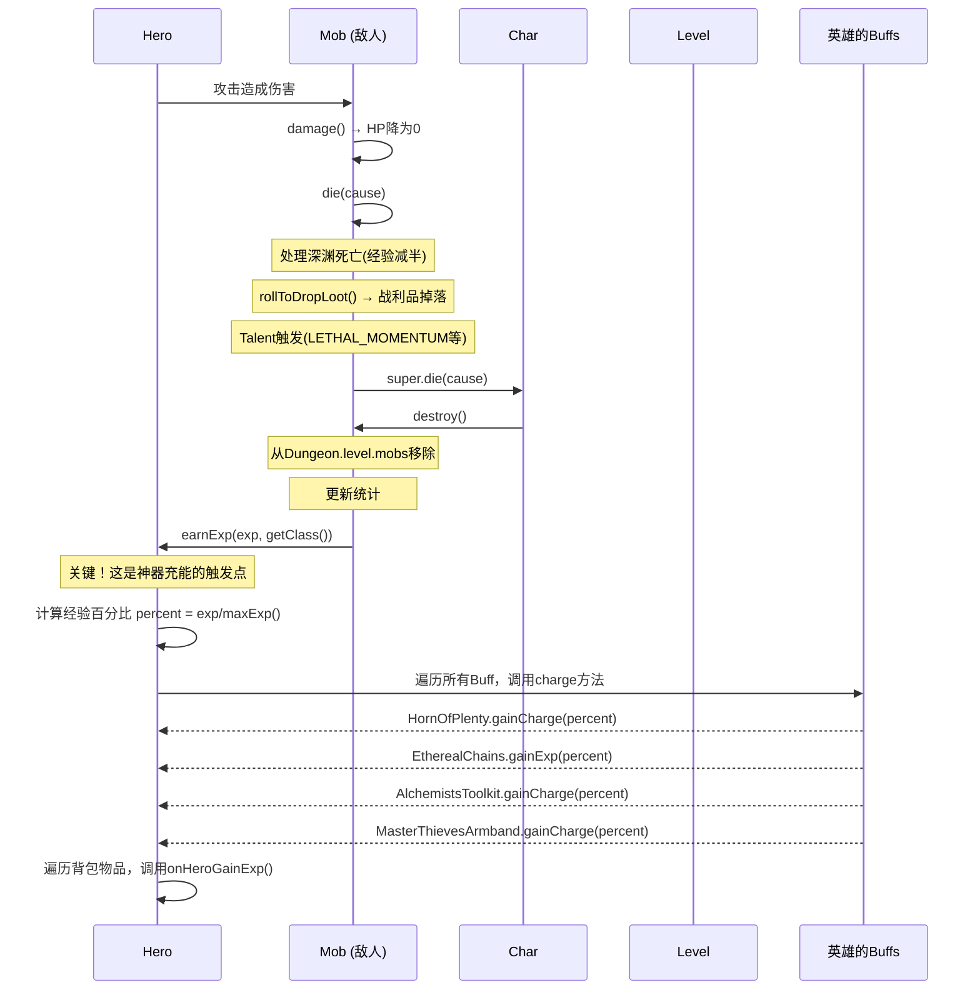
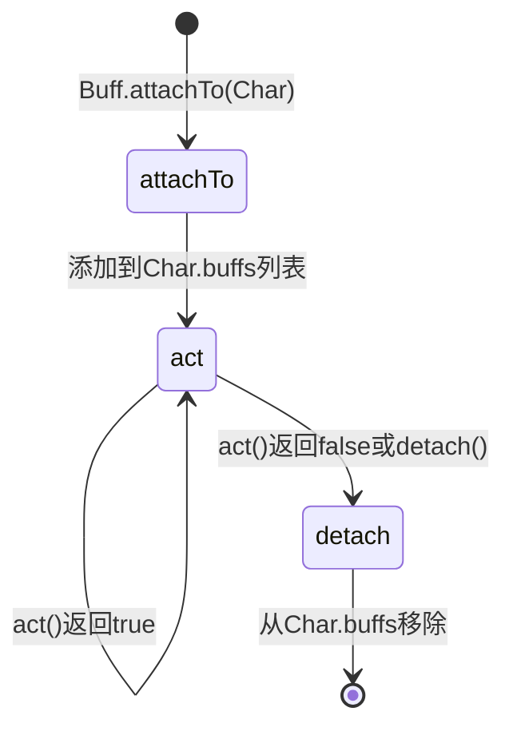
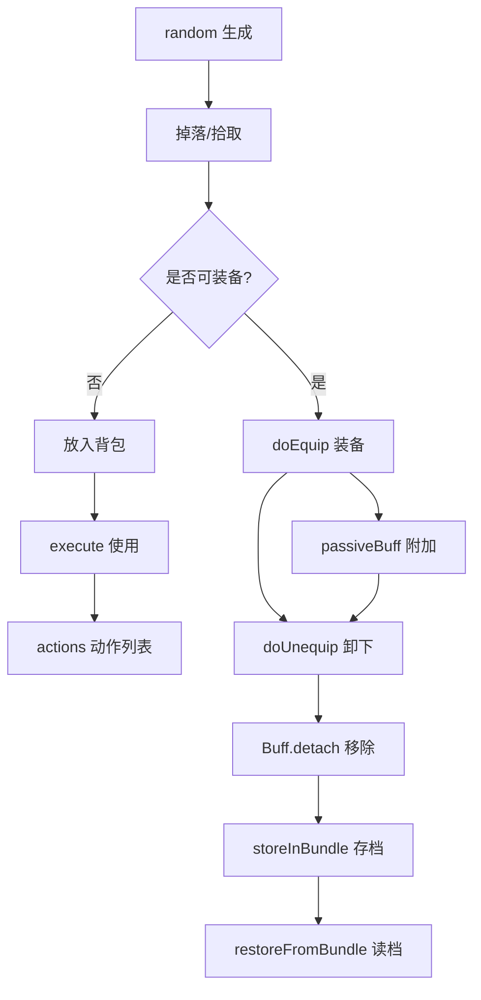

# 游戏生命周期与集成指南

## 概述
Shattered Pixel Dungeon 不使用传统的事件系统，而是通过**方法调用链**和**Buff系统**实现各系统集成。理解这些调用链是开发自定义内容的关键。

---

## 核心调用链

### 敌人死亡流程



### 源码分析

**Mob.java 第866行 - destroy() 方法中调用 earnExp():**
```java
// 在 Mob.destroy() 方法中
if (alignment == Alignment.ENEMY) {
    int exp = Dungeon.hero.lvl <= maxLvl ? EXP : 0;
    // ... 经验计算逻辑
    Dungeon.hero.earnExp(exp, getClass());
}
```

**Hero.java 第1967-2012行 - earnExp() 方法实现:**
```java
public void earnExp( int exp, Class source ) {
    this.exp += exp;
    float percent = exp/(float)maxExp();  // 计算经验百分比

    // 关键！直接查找特定类型的Buff并调用其方法
    EtherealChains.chainsRecharge chains = buff(EtherealChains.chainsRecharge.class);
    if (chains != null) chains.gainExp(percent);

    HornOfPlenty.hornRecharge horn = buff(HornOfPlenty.hornRecharge.class);
    if (horn != null) horn.gainCharge(percent);
    
    AlchemistsToolkit.kitEnergy kit = buff(AlchemistsToolkit.kitEnergy.class);
    if (kit != null) kit.gainCharge(percent);

    MasterThievesArmband.Thievery armband = buff(MasterThievesArmband.Thievery.class);
    if (armband != null) armband.gainCharge(percent);

    Berserk berserk = buff(Berserk.class);
    if (berserk != null) berserk.recover(percent);
    
    // 遍历所有物品，调用onHeroGainExp
    if (source != PotionOfExperience.class) {
        for (Item i : belongings) {
            i.onHeroGainExp(percent, this);
        }
    }
    // ... 升级逻辑
}
```

---

## 关键结论：如何让神器在敌人死亡时充能

### ❌ 错误方式（教程中的代码不会工作）

```java
public void onEnemyDefeated() {
    // 这个方法永远不会被调用！
    // 游戏没有任何地方会调用这个方法
    charge(Dungeon.hero, 1f);
}
```

### ✅ 正确方式一：通过经验获取充能（推荐）

```java
public class MyArtifact extends Artifact {
    
    @Override
    protected ArtifactBuff passiveBuff() {
        return new MyArtifactBuff();
    }
    
    public class MyArtifactBuff extends ArtifactBuff {
        
        // 重写 charge 方法 - 这个方法会在 Hero.earnExp() 中被自动调用
        @Override
        public void charge(Hero target, float amount) {
            if (charge < chargeCap && !cursed) {
                partialCharge += amount * 0.5f;  // 每2%经验获得1点部分充能
                while (partialCharge >= 1 && charge < chargeCap) {
                    partialCharge--;
                    charge++;
                    updateQuickslot();
                }
            }
        }
    }
}
```

**为什么这样能工作？**

1. 当神器装备时，`passiveBuff()` 返回的 `ArtifactBuff` 会附加到英雄身上
2. 在 `Hero.earnExp()` 方法中，游戏会检查特定的 Buff 类型
3. 如果发现你的 Buff 类型，会调用其 `charge()` 方法

### ✅ 正确方式二：通过 Item.onHeroGainExp() 接口

```java
public class MyArtifact extends Artifact {
    
    @Override
    public void onHeroGainExp(float levelPercent, Hero hero) {
        if (isEquipped(hero) && !cursed) {
            partialCharge += levelPercent;
            while (partialCharge >= 1 && charge < chargeCap) {
                partialCharge--;
                charge++;
            }
            updateQuickslot();
        }
    }
}
```

### ✅ 正确方式三：通过 ArtifactRecharge Buff

某些效果（如天赋、药剂）会触发 `ArtifactRecharge` Buff：

```java
// 在某个效果中触发
Buff.affect(hero, ArtifactRecharge.class).set(10f);

// ArtifactRecharge 会每回合调用所有 ArtifactBuff.charge()
```

### ✅ 正确方式四：基于受到伤害充能

```java
public class DamageChargeArtifact extends Artifact {
    
    @Override
    protected ArtifactBuff passiveBuff() {
        return new damageChargeBuff();
    }
    
    public class damageChargeBuff extends ArtifactBuff {
        
        // 重写防御回调 - 当英雄受到伤害时触发
        @Override
        public int defenseProc(Char enemy, int damage) {
            if (!isCursed() && charge < chargeCap) {
                partialCharge += damage * 0.1f;
                while (partialCharge >= 1 && charge < chargeCap) {
                    partialCharge--;
                    charge++;
                }
                updateQuickslot();
            }
            return damage;
        }
    }
}
```

---

## Buff 系统集成

### Buff 如何工作



### ArtifactBuff 的 charge 方法调用时机

| 调用来源 | 触发条件 | 调用方法 |
|---------|---------|---------|
| `Hero.earnExp()` | 英雄获得经验 | `ArtifactBuff.charge(hero, percent)` |
| `ArtifactRecharge.act()` | Buff激活时每回合 | `ArtifactBuff.charge(hero, amount)` |
| `Talent.onFoodEaten()` | 进食时（特定天赋） | `ArtifactBuff.charge(hero, amount)` |
| `RingOfEnergy` | 特定条件 | `ArtifactBuff.charge(hero, amount)` |

---

## 英雄行为钩子

### Hero 类中的关键钩子方法

| 方法 | 触发时机 | 用途 |
|------|---------|------|
| `doAttack()` | 执行攻击时 | 修改攻击行为 |
| `onAttackComplete()` | 攻击完成时 | 触发攻击后效果 |
| `attackProc()` | 攻击命中时 | 添加攻击附加效果 |
| `defenseProc()` | 被攻击时 | 添加防御附加效果 |
| `damage()` | 受到伤害时 | 处理伤害逻辑 |
| `die()` | 死亡时 | 死亡处理 |
| `earnExp()` | 获得经验时 | 充能、升级触发 |
| `onHeroGainExp()` (Item) | 获得经验时 | 物品响应经验 |

### 添加新钩子的步骤

1. **确定触发点**（哪个类的哪个方法）
2. **在该方法中添加接口调用**
3. **创建接口或使用现有回调**
4. **在文档中记录新的钩子**

---

## 物品生命周期钩子

### Item 类的关键生命周期方法

| 方法 | 触发时机 | 说明 |
|------|---------|------|
| `random()` | 物品生成时 | 随机化属性 |
| `doPickUp(Hero)` | 拾取时 | 处理拾取逻辑 |
| `collect(Bag)` | 放入背包时 | 处理背包逻辑 |
| `execute(Hero, String)` | 使用物品时 | 执行物品动作 |
| `actions(Hero)` | 返回可用动作 | 定义物品可执行的操作 |
| `doEquip(Hero)` | 装备时（EquipableItem） | 处理装备逻辑 |
| `doUnequip(Hero, boolean, boolean)` | 卸下时 | 处理卸下逻辑 |
| `onThrow(int)` | 投掷时 | 处理投掷落地 |
| `onHeroGainExp(float, Hero)` | 获得经验时 | 物品响应经验 |
| `storeInBundle(Bundle)` | 存档时 | 保存物品状态 |
| `restoreFromBundle(Bundle)` | 读档时 | 恢复物品状态 |

### 生命周期流程图



---

## 完整集成示例

### 示例：创建"击杀充能神器"

```java
package com.dustedpixel.dustedpixeldungeon.items.artifacts;

import com.dustedpixel.dustedpixeldungeon.actors.Char;
import com.dustedpixel.dustedpixeldungeon.actors.buffs.Buff;
import com.dustedpixel.dustedpixeldungeon.actors.buffs.MagicImmune;
import com.dustedpixel.dustedpixeldungeon.actors.hero.Hero;
import com.dustedpixel.dustedpixeldungeon.items.Item;
import com.dustedpixel.dustedpixeldungeon.sprites.ItemSpriteSheet;
import com.dustedpixel.dustedpixeldungeon.utils.GLog;
import com.watabou.utils.Bundle;

public class KillChargeArtifact extends Artifact {

    {
        image = ItemSpriteSheet.ARTIFACT_HOURGLASS;
        chargeCap = 10;
        levelCap = 5;
    }

    @Override
    protected ArtifactBuff passiveBuff() {
        return new killChargeBuff();
    }

    public class killChargeBuff extends ArtifactBuff {

        // 方式1：通过经验获取充能（推荐）
        // 这个方法会在 Hero.earnExp() 中被自动调用
        @Override
        public void charge(Hero target, float amount) {
            if (charge < chargeCap && !isCursed()) {
                partialCharge += amount * 0.5f;  // 每2%经验获得1点充能
                while (partialCharge >= 1 && charge < chargeCap) {
                    partialCharge--;
                    charge++;
                    updateQuickslot();
                }
            }
        }

        // 方式2：通过防御回调（基于受到伤害充能）
        @Override
        public int defenseProc(Char enemy, int damage) {
            if (!isCursed() && charge < chargeCap && damage > 0) {
                partialCharge += 0.5f;  // 每次受击获得0.5部分充能
                while (partialCharge >= 1 && charge < chargeCap) {
                    partialCharge--;
                    charge++;
                    GLog.p("神器充能 +1");
                }
                updateQuickslot();
            }
            return damage;
        }

        @Override
        public boolean act() {
            spend(TICK);
            return true;
        }
    }

    // 也可以在物品级别实现 onHeroGainExp
    @Override
    public void onHeroGainExp(float levelPercent, Hero hero) {
        // 这是另一种实现方式
        // 会自动被 Hero.earnExp() 调用
    }

    @Override
    public void storeInBundle(Bundle bundle) {
        super.storeInBundle(bundle);
        bundle.put("customCharge", charge);
    }

    @Override
    public void restoreFromBundle(Bundle bundle) {
        super.restoreFromBundle(bundle);
        charge = bundle.getInt("customCharge");
    }
}
```

---

## 调试技巧

### 验证集成是否工作

#### 1. 添加日志

```java
@Override
public void charge(Hero target, float amount) {
    GLog.i("Charge called with amount: " + amount);
    // ...
}
```

#### 2. 使用断点调试

- 在 `Hero.earnExp()` 设置断点
- 观察 `buff(HornOfPlenty.hornRecharge.class)` 是否返回非null
- 确认 `gainCharge()` 被调用

#### 3. 检查 Buff 状态

```java
// 在游戏运行时检查
for (Buff b : hero.buffs()) {
    if (b instanceof Artifact.ArtifactBuff) {
        GLog.i("ArtifactBuff found: " + b.getClass().getSimpleName());
    }
}
```

#### 4. 验证方法调用链

```java
// 在 Mob.destroy() 中添加日志（仅调试用）
@Override
public void destroy() {
    GLog.i("Mob.destroy() called, exp=" + EXP);
    super.destroy();
}
```

---

## 常见集成错误

| 错误 | 原因 | 解决方案 |
|------|------|---------|
| 神器充能不增长 | `charge()` 方法没有被调用 | 检查是否正确继承了 `ArtifactBuff`，确保 `passiveBuff()` 返回正确的实例 |
| Buff不生效 | Buff没有正确附加 | 检查 `passiveBuff()` 是否返回非null，确保 `attachTo()` 返回true |
| 事件不触发 | 钩子点不正确 | 使用日志验证方法是否被调用，检查调用链 |
| 存档丢失数据 | 没有正确序列化 | 实现 `storeInBundle()` 和 `restoreFromBundle()` |
| 编译错误 | 类型不匹配 | 检查内部类的访问修饰符，确保正确引用外部类成员 |

---

## 相关资源

- [Artifact API 参考](../reference/items/artifact-api.md)
- [Buff API 参考](../reference/actors/buff-api.md)
- [创建神器教程](../tutorials/items/creating-artifact.md)
- [调试工作流程](debugging-workflow.md)