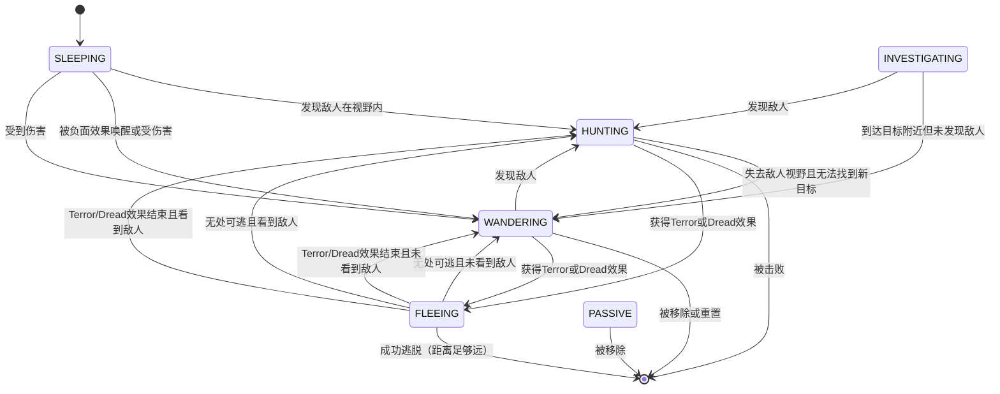

# Mob API 参考

## 类声明
```java
public abstract class Mob extends Char
```

**继承自:** Char → Actor

**所在包:** `com.shatteredpixel.shatteredpixeldungeon.actors.mobs`

## 类职责
Mob 是游戏中所有 AI 控制角色的抽象基类。它实现了完整的状态机 AI 系统，包含六种核心状态：睡眠（SLEEPING）、游荡（WANDERING）、调查（INVESTIGATING）、狩猎（HUNTING）、逃跑（FLEEING）、被动（PASSIVE）。Mob 处理敌人的选择逻辑、战斗行为、战利品掉落以及与英雄的交互。

## 关键字段

| 字段名 | 类型 | 访问级别 | 默认值 | 说明 |
|-------|------|---------|-------|------|
| `SLEEPING` | `AiState` | public | - | 睡眠状态实例 |
| `HUNTING` | `AiState` | public | - | 狩猎状态实例 |
| `INVESTIGATING` | `AiState` | public | - | 调查状态实例 |
| `WANDERING` | `AiState` | public | - | 游荡状态实例 |
| `FLEEING` | `AiState` | public | - | 逃跑状态实例 |
| `PASSIVE` | `AiState` | public | - | 被动状态实例 |
| `state` | `AiState` | public | SLEEPING | 当前 AI 状态 |
| `spriteClass` | `Class<? extends CharSprite>` | public | null | 精灵类，用于渲染 |
| `target` | `int` | protected | -1 | 移动目标位置 |
| `defenseSkill` | `int` | public | 0 | 防御技能值，影响闪避率 |
| `EXP` | `int` | public | 1 | 击杀后给予英雄的经验值 |
| `maxLvl` | `int` | public | Hero.MAX_LEVEL-1 | 能获得经验的最大英雄等级 |
| `enemy` | `Char` | protected | null | 当前敌对目标 |
| `enemyID` | `int` | protected | -1 | 敌人 ID，用于存档/恢复 |
| `enemySeen` | `boolean` | protected | false | 是否能看到敌人 |
| `alerted` | `boolean` | protected | false | 是否刚被警醒 |
| `intelligentAlly` | `boolean` | protected | false | 是否为智能盟友（更智能的目标选择） |
| `loot` | `Object` | protected | null | 掉落物品（可为 Category、Class 或 Item） |
| `lootChance` | `float` | protected | 0 | 基础掉落概率 |
| `firstAdded` | `boolean` | protected | true | 是否首次添加到游戏中 |
| `recentlyAttackedBy` | `ArrayList<Char>` | protected | - | 最近攻击者列表 |

## 常量

| 常量名 | 值 | 说明 |
|-------|-----|------|
| `TIME_TO_WAKE_UP` | 1f | 唤醒所需时间 |

## AI 状态接口

```java
public interface AiState {
    boolean act(boolean enemyInFOV, boolean justAlerted);
}
```

## AI状态图


**参数说明:**
- `enemyInFOV`: 敌人是否在视野内
- `justAlerted`: 是否刚被警醒

**返回值:** `true` 表示行动完成

## 可重写方法

| 方法签名 | 返回值 | 必须重写？ | 说明 |
|---------|-------|----------|------|
| `damageRoll()` | `int` | **是** | 计算攻击伤害值 |
| `attackSkill(Char target)` | `int` | **是** | 返回对目标的攻击技能值 |
| `drRoll()` | `int` | 可选 | 伤害减免骰子，默认返回 0 |
| `attackProc(Char enemy, int damage)` | `int` | 可选 | 攻击时触发，返回实际伤害 |
| `defenseProc(Char enemy, int damage)` | `int` | 可选 | 被攻击时触发，返回实际伤害 |
| `canAttack(Char enemy)` | `boolean` | 可选 | 判断是否可攻击敌人，默认检查相邻 |
| `getCloser(int target)` | `boolean` | 可选 | 向目标移动一格 |
| `getFurther(int target)` | `boolean` | 可选 | 远离目标移动一格 |
| `attackDelay()` | `float` | 可选 | 攻击延迟，默认 1f |
| `doAttack(Char enemy)` | `boolean` | 可选 | 执行攻击逻辑 |
| `speed()` | `float` | 可选 | 移动速度，默认调用父类 |
| `defenseSkill(Char enemy)` | `int` | 可选 | 对特定敌人的防御值 |
| `surprisedBy(Char enemy)` | `boolean` | 可选 | 是否被偷袭 |
| `spawningWeight()` | `float` | 可选 | 生成权重，默认 1 |
| `reset()` | `boolean` | 可选 | 层级重置时调用，默认 false |
| `beckon(int cell)` | `void` | 可选 | 被召唤时调用 |
| `notice()` | `void` | 可选 | 注意到某事时调用 |
| `yell(String str)` | `void` | 可选 | 喊话 |
| `description()` | `String` | 可选 | 返回描述文本 |
| `info()` | `String` | 可选 | 返回完整信息（含 Champion 信息） |
| `landmark()` | `Notes.Landmark` | 可选 | 关联的地标，默认 null |
| `heroShouldInteract()` | `boolean` | 可选 | 英雄是否应交互而非攻击 |
| `lootChance()` | `float` | 可选 | 计算最终掉落概率 |
| `createLoot()` | `Item` | 可选 | 创建掉落物品 |
| `rollToDropLoot()` | `void` | 可选 | 执行掉落逻辑 |
| `chooseEnemy()` | `Char` | 可选 | 选择目标敌人 |
| `aggro(Char ch)` | `void` | 可选 | 激怒并锁定目标 |
| `clearEnemy()` | `void` | 可选 | 清除当前敌人 |
| `isTargeting(Char ch)` | `boolean` | 可选 | 是否正在追踪某角色 |
| `onAdd()` | `void` | 可选 | 添加到游戏时调用 |

## 公开方法

### 状态管理

| 方法签名 | 说明 |
|---------|------|
| `void aggro(Char ch)` | 激怒并锁定目标敌人，切换到 HUNTING 状态 |
| `void clearEnemy()` | 清除当前敌人和视野状态，HUNTING 转为 WANDERING |
| `boolean isTargeting(Char ch)` | 检查是否正在追踪指定角色 |
| `void beckon(int cell)` | 被召唤到指定位置 |

### 战斗相关

| 方法签名 | 说明 |
|---------|------|
| `boolean surprisedBy(Char enemy)` | 检查是否被偷袭（简化版） |
| `boolean surprisedBy(Char enemy, boolean attacking)` | 检查是否被偷袭（完整版） |
| `boolean heroShouldInteract()` | 判断英雄应交互（true）还是攻击（false） |

### 存档/恢复

| 方法签名 | 说明 |
|---------|------|
| `void storeInBundle(Bundle bundle)` | 保存状态到 Bundle |
| `void restoreFromBundle(Bundle bundle)` | 从 Bundle 恢复状态 |
| `void restoreEnemy()` | 恢复敌人引用（所有 Actor 添加后调用） |

### 精灵与渲染

| 方法签名 | 说明 |
|---------|------|
| `CharSprite sprite()` | 创建并返回精灵实例 |
| `void updateSpriteState()` | 更新精灵状态（处理时间冻结效果） |

### 信息获取

| 方法签名 | 说明 |
|---------|------|
| `String description()` | 获取基础描述 |
| `String info()` | 获取完整信息（含 Champion 增强） |
| `Notes.Landmark landmark()` | 获取关联地标 |

### 生成与战利品

| 方法签名 | 说明 |
|---------|------|
| `float spawningWeight()` | 返回生成权重 |
| `boolean reset()` | 层级重置时是否应移除 |
| `float lootChance()` | 计算最终掉落概率 |
| `Item createLoot()` | 创建并返回掉落物品 |
| `void rollToDropLoot()` | 执行掉落判定 |

### 静态方法（盟友管理）

| 方法签名 | 说明 |
|---------|------|
| `static void holdAllies(Level level)` | 保存层级切换时应保留的盟友 |
| `static void holdAllies(Level level, int holdFromPos)` | 从指定位置保存盟友 |
| `static void restoreAllies(Level level, int pos)` | 恢复保存的盟友 |
| `static void restoreAllies(Level level, int pos, int gravitatePos)` | 恢复盟友并设置优先位置 |
| `static void clearHeldAllies()` | 清除保存的盟友列表 |

## AI 状态机详解

### SLEEPING（睡眠）
**标签:** `SLEEPING`

**行为:**
- 等待被唤醒
- 检测负面效果会唤醒
- 检测敌人基于 `1 / (distance + stealth)` 概率
- 飞行角色距离 >= 2 时更难被发现
- 盗贼的 Silent Steps 天才会影响检测

**唤醒条件:**
- 敌人在视野内：切换到 HUNTING
- 敌人不在视野内：切换到 WANDERING

**相关方法:**
- `detectionChance(Char enemy)`: 计算检测概率
- `awaken(boolean enemyInFOV)`: 执行唤醒

---

### WANDERING（游荡）
**标签:** `WANDERING`

**行为:**
- 随机移动，寻找目的地
- 检测敌人基于 `1 / (distance/2 + stealth)` 概率
- 发现敌人时切换到 HUNTING

**相关方法:**
- `detectionChance(Char enemy)`: 计算检测概率
- `noticeEnemy()`: 发现敌人并进入狩猎
- `continueWandering()`: 继续游荡
- `randomDestination()`: 获取随机目的地

---

### INVESTIGATING（调查）
**标签:** `INVESTIGATING`

**继承自:** Wandering

**行为:**
- 向目标位置移动（比游荡更积极）
- 到达目标附近时显示 "lost" 并切换到 WANDERING
- 适合用于追踪敌人最后已知位置

---

### HUNTING（狩猎）
**标签:** `HUNTING`

**行为:**
- 积极追踪并攻击敌人
- 如果能攻击则执行攻击
- 如果不能攻击但最近被其他角色攻击，可能切换目标
- 目标不可达时尝试寻找新目标
- 失去目标时显示 "lost" 并切换到 WANDERING

**相关方法:**
- `handleRecentAttackers()`: 处理最近攻击者
- `handleUnreachableTarget()`: 处理不可达目标

---

### FLEEING（逃跑）
**标签:** `FLEEING`

**行为:**
- 远离敌人移动
- 敌人不在视野且距离足够远时可能"逃脱"
- 无路可逃时转为 HUNTING 或 WANDERING

**逃脱条件:**
- 敌人为 null 或 `1 + Random.Int(distance) >= 6`

**相关方法:**
- `escaped()`: 逃脱时调用（默认空实现）
- `nowhereToRun()`: 无路可逃时调用

---

### PASSIVE（被动）
**标签:** `PASSIVE`

**行为:**
- 不采取任何行动
- 仅消耗时间（TICK）
- 适用于不应主动行为的角色

---

## 生命周期

### 1. 创建阶段
```java
Mob mob = new MyMob();
mob.pos = spawnPosition;
```

### 2. 添加阶段
```
Actor.add() → onAdd()
```
- `firstAdded` 为 true 时调整生命值（飞升挑战）
- 设置 `firstAdded = false`

### 3. 行动阶段
```
act() 循环执行:
  1. 检查麻痹状态
  2. 处理 Terror/Dread（切换到 FLEEING）
  3. chooseEnemy() 选择目标
  4. 计算 enemyInFOV
  5. 调用 state.act()
```

### 4. 受伤阶段
```
damage() → 
  - 如果 SLEEPING，切换到 WANDERING
  - 如果非 FLEEING 且非 Corruption，设置 alerted
  - 如果来源是 Wand/ClericSpell/ArmorAbility，锁定英雄
```

### 5. 死亡阶段
```
die() →
  1. 如果死因是深渊，EXP 减半
  2. 如果是敌人阵营，执行战利品掉落
  3. 触发天赋效果（Lethal Momentum, Lethal Haste）
  4. 调用 super.die()
  5. 如果有 SoulMark 且有天赋，可能生成腐化幽灵
```

### 6. 销毁阶段
```
destroy() →
  1. 从 Dungeon.level.mobs 移除
  2. 更新 MindVision 视野
  3. 如果是敌人阵营：
     - 更新 Statistics
     - 记录 Bestiary
     - 处理飞升挑战
     - 给予英雄经验
     - 处理武僧能量
```

### 7. 存档/恢复
```
storeInBundle() → 保存 state, enemySeen, target, maxLvl, enemyID
restoreFromBundle() → 恢复所有状态
restoreEnemy() → 通过 enemyID 恢复敌人引用
```

## 使用示例

### 基础怪物
```java
public class MyMob extends Mob {
    {
        spriteClass = MyMobSprite.class;
        HP = HT = 20;
        defenseSkill = 10;
        EXP = 5;
        maxLvl = 15;
        
        // 可选：设置掉落
        loot = Generator.Category.POTION;
        lootChance = 0.1f;
    }
    
    @Override
    public int damageRoll() {
        return Random.NormalIntRange(5, 10);
    }
    
    @Override
    public int attackSkill(Char target) {
        return 15;
    }
    
    @Override
    public int drRoll() {
        return Random.NormalIntRange(0, 2);
    }
}
```

### 远程攻击怪物
```java
public class RangedMob extends Mob {
    @Override
    protected boolean canAttack(Char enemy) {
        // 可以攻击 2 格内的敌人
        return Dungeon.level.distance(pos, enemy.pos) <= 2;
    }
    
    @Override
    protected boolean doAttack(Char enemy) {
        // 自定义远程攻击逻辑
        // ...
        return super.doAttack(enemy);
    }
}
```

### 智能 NPC
```java
public class MyNPC extends Mob {
    {
        alignment = Alignment.NEUTRAL;
        state = PASSIVE; // 默认被动
    }
    
    @Override
    public boolean reset() {
        return true; // 层级重置时消失
    }
    
    @Override
    public boolean heroShouldInteract() {
        return true; // 英雄应交互而非攻击
    }
}
```

### 自定义 AI 状态
```java
public class MyMob extends Mob {
    public AiState CUSTOM_STATE = new CustomState();
    
    private class CustomState implements AiState {
        @Override
        public boolean act(boolean enemyInFOV, boolean justAlerted) {
            // 自定义行为逻辑
            spend(TICK);
            return true;
        }
    }
}
```

### Boss 怪物
```java
public class MyBoss extends Mob {
    {
        HP = HT = 500;
        defenseSkill = 20;
        EXP = 100;
        
        properties.add(Property.BOSS); // Boss 属性
        properties.add(Property.LARGE); // 大型怪物
        
        loot = new Gold().quantity(1000);
        lootChance = 1f; // 100% 掉落
    }
    
    @Override
    public int damageRoll() {
        return Random.NormalIntRange(20, 40);
    }
    
    @Override
    public float spawningWeight() {
        return 5; // 生成时相当于 5 个普通怪物
    }
}
```

## 重要机制

### 敌人选择逻辑（chooseEnemy）
1. **Dread/Terror 优先**: 返回恐惧来源
2. **侵略石效果**: 攻击带有 Aggression buff 的角色
3. **阵营判断**:
   - 敌人阵营: 攻击盟友和英雄
   - 盟友阵营: 攻击敌人阵营（非被动、非睡眠/游荡）
   - Amok 状态: 优先攻击敌人阵营，其次盟友，最后英雄
4. **距离优先**: 选择最近的可攻击目标
5. **幻影优先**: 如果目标是英雄但有幻影存在，切换到幻影

### 偷袭机制（surprisedBy）
当以下条件全部满足时视为偷袭：
- 攻击者是英雄
- 英雄处于隐身 或 怪物未看到敌人 或 英雄不在怪物视野内
- 英雄可以进行偷袭攻击

偷袭效果：
- 防御值降为 0
- 播放强击音效
- 显示 Surprise 或 Wound 特效
- 记录 Statistics.sneakAttacks

### 战利品掉落逻辑
1. 英雄等级超过 `maxLvl + 2` 时不掉落
2. 检查 `MasterThievesArmband.StolenTracker`
3. 基础掉落概率受以下影响：
   - `RingOfWealth.dropChanceMultiplier()`
   - `Talent.BOUNTY_HUNTER` 天赋
   - `ShardOfOblivion.lootChanceMultiplier()`
4. 财富之戒额外掉落（Boss 15 次，Miniboss 5 次）
5. 幸运附魔额外掉落
6. 灵魂标记 + 灵魂吞噬天赋触发食物效果

## 相关类

### 直接子类
- `Mob` 有大量直接子类，包括所有标准怪物、Boss、NPC

### 重要相关类
- `Char`: 父类，提供基础角色功能
- `Actor`: 祖先类，提供行动调度
- `CharSprite`: 精灵渲染
- `ChampionEnemy`: Champion 敌人增强
- `Wraith`: 特殊怪物，可从有灵魂标记的尸体生成

## 注意事项

1. **抽象方法必须实现**: `damageRoll()` 和 `attackSkill()` 必须在子类中实现
2. **初始化块**: 使用实例初始化块 `{ ... }` 设置基础属性
3. **状态切换**: 直接修改 `state` 字段即可切换状态
4. **存档兼容**: 添加新字段时注意 `storeInBundle`/`restoreFromBundle` 的兼容性
5. **性能考虑**: `chooseEnemy()` 会遍历所有角色，大型关卡需注意性能