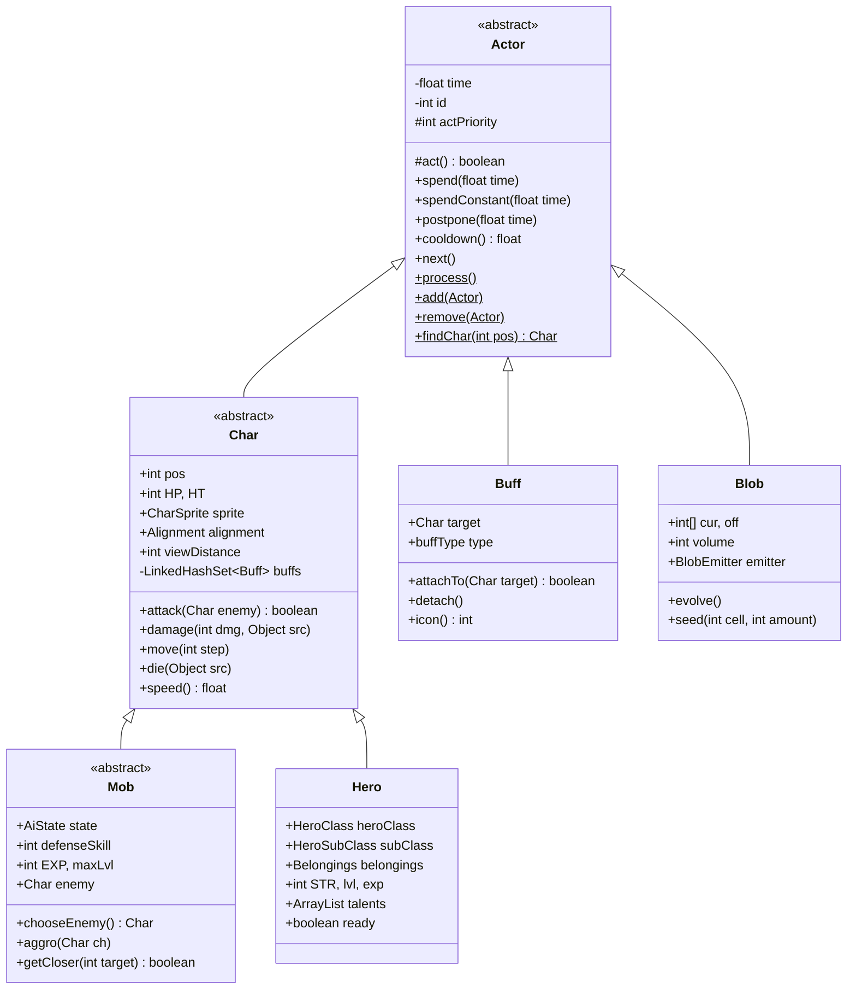
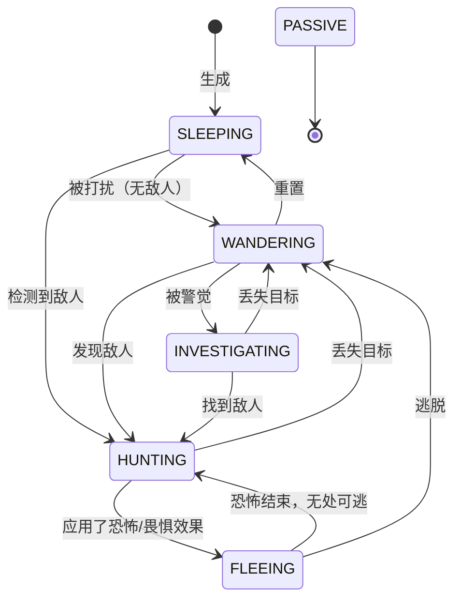
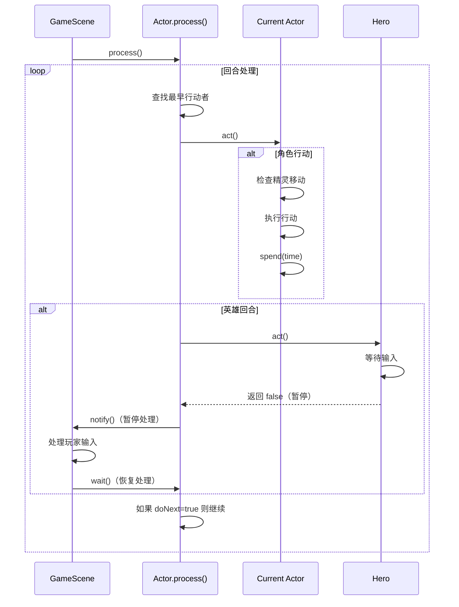

# 行动者系统文档

## 概述

行动者（Actor）系统是 Shattered Pixel Dungeon 的核心回合制游戏循环。所有参与游戏回合制逻辑的实体——角色、状态效果、区域效果和视觉效果——都是行动者。该系统通过统一的基于时钟的调度器来管理所有游戏操作的时间、优先级和执行。

---

## 类层次结构



---

## 优先级系统

行动者优先级系统决定了当多个行动者具有相同时间值时的执行顺序。优先级值越高，越先执行。

### 优先级常量

| Priority | Value | 描述 | 典型行动者 |
|----------|-------|-------------|----------------|
| `VFX_PRIO` | 100 | 视觉效果 | VFX 行动者、粒子 |
| `HERO_PRIO` | 0 | 玩家角色 | Hero |
| `BLOB_PRIO` | -10 | 区域效果 | 气体、火焰、电击 |
| `MOB_PRIO` | -20 | 敌人和盟友 | 所有 Mob 子类 |
| `BUFF_PRIO` | -30 | 状态效果 | Buff 子类 |
| `DEFAULT` | -100 | 回退选项 | 未指定的行动者 |

### 优先级解析逻辑

当多个行动者具有相同的时间值时，系统使用 `actPriority` 来确定执行顺序：

```java
if (actor.time < earliest ||
    actor.time == earliest && actor.actPriority > current.actPriority) {
    earliest = actor.time;
    current = actor;
}
```

### 微调优先级

某些行动者使用偏移优先级来实现特定行为：

```java
// 示例：一个在普通增益/减益状态之前执行的增益/减益状态
actPriority = BUFF_PRIO + 1;

// 示例：一个在其他怪物之前执行的特殊怪物
actPriority = MOB_PRIO + 5;
```

---

## 行动者基类

### 核心字段

| 字段 | 类型 | 描述 |
|-------|------|-------------|
| `time` | float | 内部时钟；决定行动者下次行动的时间 |
| `id` | int | 行动者的唯一标识符 |
| `actPriority` | int | 时间相等时的执行顺序 |

### 核心方法

#### `act()` - 抽象行动方法
```java
protected abstract boolean act();
```
- **返回值**: `true` 继续处理，`false` 暂停游戏循环
- **用途**: 重写以定义行动者行为
- **注意**: 必须调用 `spend()` 或 `next()` 来推进时间

#### 时间管理方法

```java
// 花费时间（受速度修正影响）
protected void spend(float time) {
    spendConstant(time);
}

// 花费确切时间（忽略修正）
protected void spendConstant(float time) {
    this.time += time;
}

// 确保最小延迟
protected void postpone(float time) {
    if (this.time < now + time) {
        this.time = now + time;
    }
}

// 获取到下次行动的剩余时间
public float cooldown() {
    return time - now;
}
```

### 静态管理方法

```java
// 为关卡初始化行动者系统
public static void init() {
    add(Dungeon.hero);
    for (Mob mob : Dungeon.level.mobs) add(mob);
    for (Blob blob : Dungeon.level.blobs.values()) add(blob);
}

// 主游戏循环
public static void process() {
    // 查找时间值最低的行动者（最高优先级作为决胜条件）
    // 执行 actor.act()
    // 重复直到玩家行动暂停循环
}

// 添加/移除行动者
public static void add(Actor actor);
public static void remove(Actor actor);

// 查找行动者
public static Char findChar(int pos);
public static Actor findById(int id);
```

---

## Char 类

`Char` 类代表任何可以移动、攻击和承受伤害的角色。

### 核心字段

| 字段 | 类型 | 描述 |
|-------|------|-------------|
| `pos` | int | 当前地图位置 |
| `HP` | int | 当前生命值 |
| `HT` | int | 最大生命值 |
| `sprite` | CharSprite | 视觉表现 |
| `alignment` | Alignment | ENEMY（敌对）、NEUTRAL（中立）或 ALLY（盟友） |
| `viewDistance` | int | 视野范围（默认 8） |
| `fieldOfView` | boolean[] | 可见单元格 |

### 对齐方式枚举

```java
public enum Alignment {
    ENEMY,    // 对英雄敌对
    NEUTRAL,  // 既不敌对也不结盟
    ALLY      // 对英雄友好
}
```

### 角色属性

```java
public enum Property {
    BOSS,        // Boss 敌人
    MINIBOSS,    // 小 Boss 敌人
    BOSS_MINION, // 由 Boss 召唤
    UNDEAD,      // 亡灵生物
    DEMONIC,     // 恶魔生物
    INORGANIC,   // 无血液，对中毒/流血免疫
    FIERY,       // 火焰相关
    ICY,         // 冰霜相关
    ACIDIC,      // 酸性相关
    ELECTRIC,    // 电击相关
    LARGE,       // 需要开阔空间
    IMMOVABLE,   // 无法被移动
    STATIC       // 对 AI 削弱效果免疫
}
```

### 关键方法

#### 战斗

```java
// 执行攻击
public boolean attack(Char enemy, float dmgMulti, float dmgBonus, float accMulti);

// 计算伤害
public int damageRoll();

// 承受伤害
public void damage(int dmg, Object src);

// 防御计算
public int defenseSkill(Char enemy);
public int drRoll();  // 伤害减免

// 命中判定
public static boolean hit(Char attacker, Char defender, float accMulti, boolean magic);
```

#### 移动

```java
// 移动到新位置
public void move(int step, boolean travelling);

// 计算速度
public float speed();

// 获取与另一个角色的距离
public int distance(Char other);
```

### 增益/减益状态管理

```java
// 向角色添加增益/减益状态
public synchronized boolean add(Buff buff);

// 移除增益/减益状态
public synchronized boolean remove(Buff buff);

// 获取特定增益/减益状态
public synchronized <T extends Buff> T buff(Class<T> c);

// 获取某类型的所有增益/减益状态
public synchronized <T extends Buff> HashSet<T> buffs(Class<T> c);
```

---

## Mob 类

怪物（Mob）是由 AI 控制的角色，具有用于行为的状态机。

### AI 状态机



### AI 状态

| 状态 | 行为 |
|-------|----------|
| `SLEEPING` | 被动；在检测到或受到负面状态时醒来 |
| `WANDERING` | 随机移动；搜索敌人 |
| `HUNTING` | 主动追击并攻击敌人 |
| `INVESTIGATING` | 移向敌人的最后已知位置 |
| `FLEEING` | 逃离恐怖来源 |
| `PASSIVE` | 不采取任何行动 |

### 怪物字段

| 字段 | 类型 | 描述 |
|-------|------|-------------|
| `state` | AiState | 当前 AI 状态 |
| `enemy` | Char | 当前目标 |
| `enemySeen` | boolean | 敌人是否可见 |
| `defenseSkill` | int | 基础防御等级 |
| `EXP` | int | 经验奖励 |
| `maxLvl` | int | 英雄获得经验值的最大等级 |

### AI 状态实现

```java
public interface AiState {
    boolean act(boolean enemyInFOV, boolean justAlerted);
}

// 示例：狩猎状态
protected class Hunting implements AiState {
    @Override
    public boolean act(boolean enemyInFOV, boolean justAlerted) {
        enemySeen = enemyInFOV;
        
        if (enemyInFOV && !isCharmedBy(enemy) && canAttack(enemy)) {
            target = enemy.pos;
            return doAttack(enemy);
        }
        
        // 向敌人移动
        if (getCloser(target)) {
            spend(1 / speed());
            return moveSprite(oldPos, pos);
        }
        
        // 目标不可达
        return handleUnreachableTarget(enemyInFOV, justAlerted);
    }
}
```

### 敌人选择

```java
protected Char chooseEnemy() {
    // 畏惧/恐怖强制锁定目标
    if (buff(Dread.class) != null) {
        return (Char) Actor.findById(buff(Dread.class).object);
    }
    
    // 如有必要则寻找新敌人
    if (enemy == null || !enemy.isAlive()) {
        // 对于敌人：目标是盟友和英雄
        // 对于盟友：目标是敌人
        // 考虑距离、可见性和可攻击性
    }
    
    return enemy;
}
```

---

## Hero 类

玩家控制的角色，具有特定职业的能力和成长系统。

### 英雄字段

| 字段 | 类型 | 描述 |
|-------|------|-------------|
| `heroClass` | HeroClass | 战士、法师、盗贼、女猎手、决斗者、牧师 |
| `subClass` | HeroSubClass | 职业专精 |
| `armorAbility` | ArmorAbility | 终极能力 |
| `talents` | ArrayList | 3 层天赋 |
| `belongings` | Belongings | 物品栏和装备 |
| `STR` | int | 当前力量 |
| `lvl` | int | 当前等级 |
| `exp` | int | 经验值 |
| `ready` | boolean | 英雄是否可以行动 |

### 英雄职业

| 职业 | 子职业 |
|-------|------------|
| 战士 | 狂战士、角斗士 |
| 法师 | 术士、战斗法师 |
| 盗贼 | 刺客、自由奔跑者 |
| 女猎手 | 狙击手、守卫者 |
| 决斗者 | 冠军、武僧 |
| 牧师 | 祭司、圣骑士 |

### 英雄行动

```java
// 行动类型
public static class HeroAction {
    public static class Move extends HeroAction { ... }
    public static class Attack extends HeroAction { ... }
    public static class PickUp extends HeroAction { ... }
    public static class OpenChest extends HeroAction { ... }
    // ... 更多行动类型
}

// 执行当前行动
public boolean act() {
    if (curAction instanceof HeroAction.Move) {
        // 移动逻辑
    } else if (curAction instanceof HeroAction.Attack) {
        // 攻击逻辑
    }
    // ...
}
```

---

## 增益/减益状态系统

增益/减益状态（Buff）是附着在角色上并修改其行为的状态效果。

### 增益/减益状态类型

```java
public enum buffType {
    POSITIVE,   // 有益效果（绿色）
    NEGATIVE,   // 有害效果（红色）
    NEUTRAL     // 中性（灰色）
}
```

### 增益/减益状态类别

#### 正面增益/减益状态
| 增益/减益状态 | 效果 |
|------|--------|
| `Bless` | +25% 准确率和闪避 |
| `Adrenaline` | +100% 速度，+50% 攻击速度 |
| `ShieldBuff` | 临时生命值护盾 |
| `Barkskin` | 伤害减免 |
| `Haste` | +200% 速度 |
| `Stamina` | +50% 速度 |

#### 负面增益/减益状态
| 增益/减益状态 | 效果 |
|------|--------|
| `Poison` | 持续伤害 |
| `Burning` | 火焰伤害，会蔓延 |
| `Paralysis` | 无法行动 |
| `Slow` | -50% 行动速度 |
| `Weakness` | -33% 伤害 |
| `Terror` | 强制逃跑 |

### 增益/减益状态生命周期

```java
// 将增益/减益状态附加到角色
public boolean attachTo(Char target) {
    if (target.isImmune(getClass())) return false;
    this.target = target;
    return target.add(this);
}

// 移除增益/减益状态
public void detach() {
    if (target.remove(this)) fx(false);
}

// 默认行动行为
@Override
public boolean act() {
    diactivate();  // 将时间设为无穷大
    return true;
}
```

### 静态增益/减益状态方法

```java
// 添加新增益/减益状态（允许重复）
public static <T extends Buff> T append(Char target, Class<T> buffClass);

// 添加带持续时间的增益/减益状态
public static <T extends FlavourBuff> T append(Char target, Class<T> buffClass, float duration);

// 添加或返回现有增益/减益状态（不允许重复）
public static <T extends Buff> T affect(Char target, Class<T> buffClass);

// 延长持续时间
public static <T extends FlavourBuff> T prolong(Char target, Class<T> buffClass, float duration);

// 移除增益/减益状态
public static void detach(Char target, Class<? extends Buff> cl);
```

### 增益/减益状态示例

```java
// 应用持续 5 回合的中毒效果
Buff.affect(enemy, Poison.class, 5f);

// 检查角色是否有增益/减益状态
if (hero.buff(Bless.class) != null) {
    // 角色已被祝福
}

// 移除某类型的所有增益/减益状态
Buff.detach(hero, Burning.class);
```

---

## 区域效果（Blob）系统

区域效果（Blob）代表覆盖多个瓦片的区域效果。

### 区域效果字段

| 字段 | 类型 | 描述 |
|-------|------|-------------|
| `cur` | int[] | 当前瓦片值 |
| `off` | int[] | 演化缓冲区 |
| `volume` | int | 区域效果总覆盖范围 |
| `emitter` | BlobEmitter | 视觉效果 |
| `area` | Rect | 边界矩形 |

### 区域效果类型

| 区域效果 | 效果 |
|------|--------|
| `ToxicGas` | 持续伤害 |
| `Fire` | 燃烧并蔓延 |
| `Electricity` | 在目标之间跳跃 |
| `Web` | 固定角色 |
| `StormCloud` | 阻碍视野 |
| `SacrificialFire` | 特殊交互 |
| `WaterOfHealth` | 治疗效果 |

### 区域效果演化

```java
@Override
public boolean act() {
    spend(TICK);
    
    if (volume > 0) {
        evolve();  // 重写以实现自定义行为
        // 交换缓冲区
        int[] tmp = off;
        off = cur;
        cur = tmp;
    }
    
    return true;
}

// 默认：区域效果扩散和消退
protected void evolve() {
    // 对每个单元格，与邻居取平均值
    // 值随时间减少
    int value = sum >= count ? (sum / count) - 1 : 0;
}
```

### 创建区域效果

```java
// 在位置播种区域效果
Blob.seed(cell, amount, ToxicGas.class);

// 检查位置的区域效果
int volume = Blob.volumeAt(cell, Fire.class);

// 清除单元格的区域效果
blob.clear(cell);
```

---

## 回合流程图



### 进程循环伪代码

```
function process():
    while keepActorThreadAlive:
        current = findActorWithLowestTime()
        
        if current != null:
            now = current.time
            
            if current is Char with moving sprite:
                wait for sprite to finish
            
            doNext = current.act()
            
            if not doNext:
                wait for game scene signal
```

---

## 时间和冷却

### 时间单位

```java
public static final float TICK = 1f;  // 一个游戏回合
```

### 时间流程

- 每个行动消耗时间（例如，移动消耗 `1/speed()` 回合）
- 当行动者的 `time` 等于全局 `now` 时行动
- 时间随着行动者完成行动而推进

### 冷却示例

```java
// 基础攻击 - 1 回合
spend(1f);

// 移动 - 取决于速度
spend(1 / speed());  // 速度 2.0 = 0.5 回合

// 施法 - 固定时间
spendConstant(2f);  // 总是 2 回合

// 最小延迟
postpone(5f);  // 下次行动前至少延迟 5 回合
```

### 速度修正

```java
public float speed() {
    float speed = baseSpeed;
    
    if (buff(Cripple.class) != null) speed /= 2f;
    if (buff(Stamina.class) != null) speed *= 1.5f;
    if (buff(Adrenaline.class) != null) speed *= 2f;
    if (buff(Haste.class) != null) speed *= 3f;
    
    return speed;
}
```

---

## 保存和加载

行动者实现 `Bundlable` 接口以进行序列化。

### Bundle 键

```java
// 行动者基础
private static final String TIME = "time";
private static final String ID = "id";

// Char
private static final String POS = "pos";
private static final String TAG_HP = "HP";
private static final String TAG_HT = "HT";
private static final String BUFFS = "buffs";

// Mob
private static final String STATE = "state";
private static final String TARGET = "target";
private static final String ENEMY_ID = "enemy_id";
```

### 保存/加载实现

```java
@Override
public void storeInBundle(Bundle bundle) {
    bundle.put(TIME, time);
    bundle.put(ID, id);
    // ... 子类字段
}

@Override
public void restoreFromBundle(Bundle bundle) {
    time = bundle.getFloat(TIME);
    id = bundle.getInt(ID);
    // ... 子类字段
}
```

---

## 最佳实践

### 创建自定义行动者

1. **设置适当的优先级**：根据行动者应何时行动选择 `actPriority`
2. **调用 spend() 或 next()**：始终在 `act()` 中推进时间
3. **处理精灵同步**：检查字符的 `sprite.isMoving`
4. **实现 Bundlable**：为持久性行动者支持保存/加载

### 创建自定义增益/减益状态

1. **扩展适当的父类**：`Buff`、`FlavourBuff` 或 `ShieldBuff`
2. **设置 buffType**：确定 UI 颜色
3. **重写 icon()**：返回 `BuffIndicator` 常量
4. **实现 fx()**：添加视觉效果
5. **处理 detach()**：移除时清理效果

### 创建自定义怪物

1. **定义属性**：HP、防御、EXP、maxLvl
2. **实现 damageRoll()**：基础伤害计算
3. **必要时重写 AI 状态**：自定义行为
4. **设置属性**：BOSS、UNDEAD 等
5. **定义战利品**：`loot` 和 `lootChance` 字段

---

## 相关文件

- `Actor.java` - 核心行动者系统
- `Char.java` - 角色基类
- `Mob.java` - 敌人/盟友 AI
- `Hero.java` - 玩家角色
- `Buff.java` - 状态效果系统
- `Blob.java` - 区域效果系统
- `BuffIndicator.java` - UI 增益/减益状态显示
- `CharSprite.java` - 角色视觉表现