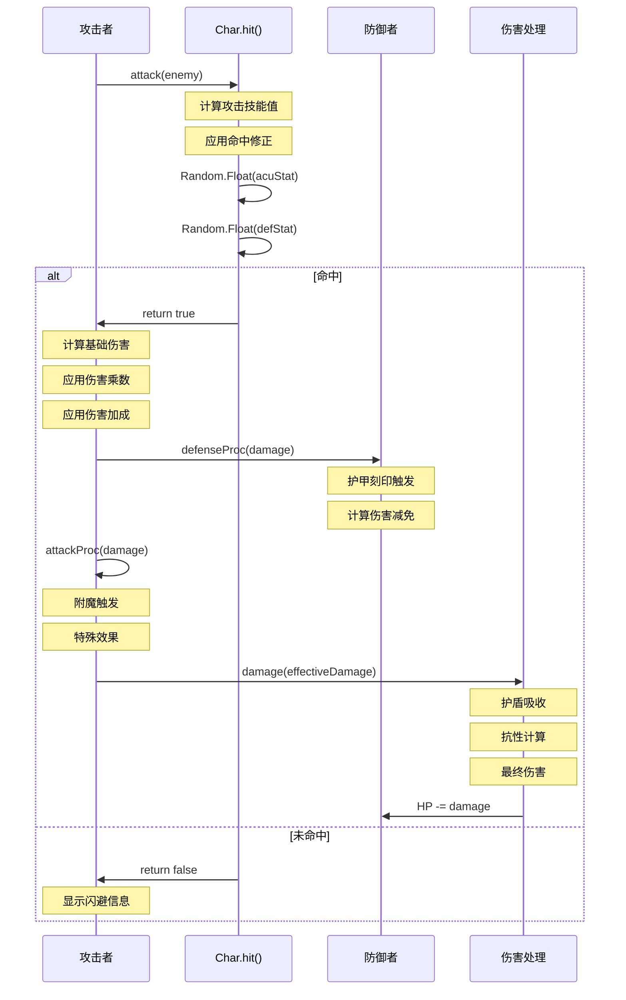

# 战斗系统详细文档

## 概述

Shattered Pixel Dungeon 的战斗系统是一个多层次、模块化的回合制战斗框架。本文档详细说明伤害计算、命中/闪避机制、暴击系统、防御系统、元素伤害和状态效果交互。

---

## 1. 伤害计算公式

### 1.1 基础伤害流程

伤害计算遵循以下顺序：

```
基础伤害 → 伤害乘数 → 伤害加成 → 防御减伤 → 最终伤害
```

### 1.2 伤害骰值计算 (damageRoll)

#### 英雄伤害计算

```java
// Hero.damageRoll()
int damage = weapon.damageRoll(this);

// 武器伤害公式 (MeleeWeapon)
int damage = Random.NormalIntRange(min(), max());
// min = tier + level()      (最低伤害)
// max = tier * (level() + 1) * 2 + level() (最高伤害)
```

**武器伤害公式详解：**

| 武器等级 | 最低伤害 (tier=1) | 最高伤害 (tier=1) | 最低伤害 (tier=5) | 最高伤害 (tier=5) |
|---------|------------------|------------------|------------------|------------------|
| +0 | 1 | 2 | 5 | 10 |
| +1 | 2 | 5 | 6 | 15 |
| +3 | 4 | 11 | 8 | 25 |
| +5 | 6 | 19 | 10 | 39 |

#### 怪物伤害计算

```java
// Mob.damageRoll() - 由各怪物子类实现
@Override
public int damageRoll() {
    return Random.NormalIntRange(minDamage, maxDamage);
}
```

### 1.3 伤害乘数应用

伤害在计算过程中会经过多个乘数修正：

```java
// Char.attack() 中的伤害乘数链
float damage = damageRoll();

// 1. 基础乘数参数
damage *= dmgMulti;  // 攻击方法传入的乘数

// 2. 固定伤害加成
damage += dmgBonus;  // 攻击方法传入的固定加成

// 3. 狂暴状态 (Berserk)
if (buff(Berserk.class) != null) {
    damage = berserk.damageFactor(damage);
}

// 4. 愤怒状态 (Fury) - +50% 伤害
if (buff(Fury.class) != null) {
    damage *= 1.5f;
}

// 5. 力量共享 (PowerOfMany) - +25%~+35% 伤害
if (buff(PowerOfMany.PowerBuff.class) != null) {
    damage *= 1.25f;  // 基础
    // 或 1.3f + 0.05f * 天赋点数 (有光束加成时)
}

// 6. 冠军敌人乘数
for (ChampionEnemy buff : buffs(ChampionEnemy.class)) {
    damage *= buff.meleeDamageFactor();
}

// 7. 飞升挑战修正
damage *= AscensionChallenge.statModifier(this);

// 8. 忍耐追踪器 (Endure)
if (buff(Endure.EndureTracker.class) != null) {
    damage = endure.damageFactor(damage);
}
```

### 1.4 伤害减免应用

```java
// 1. 挑战竞技场 - 减少33%受到的伤害
if (enemy.buff(ScrollOfChallenge.ChallengeArena.class) != null) {
    damage *= 0.67f;
}

// 2. 防护光环 - 减少10%~20%伤害
if (hero.buff(AuraOfProtection.AuraBuff.class) != null) {
    damage *= 0.9f - 0.1f * pointsInTalent(AURA_OF_PROTECTION);
}

// 3. 冥想状态 - 减少80%伤害
if (buff(MonkEnergy.MonkAbility.Meditate.MeditateResistance.class) != null) {
    damage *= 0.2f;
}

// 4. 虚弱状态 - 减少33%伤害
if (buff(Weakness.class) != null) {
    damage *= 0.67f;
}
```

---

## 2. 命中/闪避机制

### 2.1 命中判定核心公式

```java
// Char.hit() - 静态命中判定方法
public static boolean hit(Char attacker, Char defender, float accMulti, boolean magic) {
    float acuStat = attacker.attackSkill(defender);
    float defStat = defender.defenseSkill(attacker);
    
    // 无限命中/闪避检查
    if (defStat >= INFINITE_EVASION) return false;
    if (acuStat >= INFINITE_ACCURACY) return true;
    
    // 随机骰值
    float acuRoll = Random.Float(acuStat) * accuracyModifiers;
    float defRoll = Random.Float(defStat) * evasionModifiers;
    
    return acuRoll >= defRoll;
}
```

### 2.2 命中技能值计算 (attackSkill)

#### 英雄命中技能值

```java
// Hero.attackSkill()
int accuracy = attackSkill;  // 基础值 = 10

// 戒指加成
accuracy *= RingOfAccuracy.accuracyMultiplier(this);

// 天赋加成 (精确突袭)
if (hasTalent(PRECISE_ASSAULT)) {
    accuracy *= 1f + 0.1f * pointsInTalent(PRECISE_ASSAULT);
}

// 武器准确率修正
accuracy *= weapon.accuracyFactor(this, target);

// 力量不足惩罚
int encumbrance = weapon.STRReq() - hero.STR;
if (encumbrance > 0) {
    accuracy /= Math.pow(1.5, encumbrance);
}
```

**力量不足惩罚表：**

| 力量差距 | 命中率修正 |
|---------|-----------|
| -1 | 66.7% |
| -2 | 44.4% |
| -3 | 29.6% |
| -4 | 19.8% |

#### 怪物命中技能值

```java
// Mob.attackSkill() - 由各怪物子类实现
@Override
public int attackSkill(Char target) {
    return attackSkill;  // 怪物特有的攻击技能值
}
```

### 2.3 防御技能值计算 (defenseSkill)

#### 英雄防御技能值

```java
// Hero.defenseSkill()
float evasion = defenseSkill;  // 基础值 = 5

// 戒指加成
evasion *= RingOfEvasion.evasionMultiplier(this);

// 天赋加成 (液体敏捷)
if (buff(LiquidAgilEVATracker.class) != null) {
    evasion *= 3f;  // 或 INFINITE_EVASION
}

// 武器防御姿态
if (buff(Quarterstaff.DefensiveStance.class) != null) {
    evasion *= 3;
}

// 麻痹状态惩罚
if (paralysed > 0) {
    evasion /= 2;
}

// 护甲修正
evasion = armor.evasionFactor(this, evasion);
```

### 2.4 命中/闪避修正因子

| 状态 | 命中修正 | 闪避修正 |
|------|---------|---------|
| 祝福 (Bless) | +25% | +25% |
| 厄运 (Hex) | -20% | -20% |
| 晕眩 (Daze) | -50% | -50% |
| 麻痹 (Paralysis) | - | -50% |
| 隐形 (Invisible) | 无限命中 | - |

### 2.5 无限命中与无限闪避

```java
public static int INFINITE_ACCURACY = 1_000_000;
public static int INFINITE_EVASION = 1_000_000;
```

**触发无限命中的情况：**
- 攻击者处于隐形状态且可以进行偷袭攻击
- 精确突袭天赋3级
- 液体敏捷天赋2级

**触发无限闪避的情况：**
- 武僧专注状态 (Focus)
- 格挡追踪器 (ParryTracker)
- 护盾防御追踪器 (GuardTracker)
- 液体敏捷天赋2级

---

## 3. 暴击系统

### 3.1 刺客预备暴击 (Preparation)

刺客职业的预备机制提供暴击伤害加成：

```java
// Preparation.damageRoll()
public int damageRoll(Char attacker) {
    int damage = attacker.damageRoll();
    
    // 根据预备等级增加暴击伤害
    damage *= 1 + preparationBonus;
    
    return damage;
}
```

**预备等级与伤害加成：**

| 预备等级 | 伤害倍数 | 说明 |
|---------|---------|------|
| 1 | 1.25x | 基础暴击 |
| 2 | 1.50x | 中等暴击 |
| 3 | 1.75x | 强力暴击 |
| 4 | 2.00x | 完美暴击 |
| 5+ | 2.00x+ | 超级暴击 |

### 3.2 暗杀机制

```java
// 当预备等级足够时可以触发暗杀
if (prep != null && prep.canKO(enemy)) {
    enemy.HP = 0;  // 直接击杀
    if (!enemy.isAlive()) {
        enemy.die(this);
    }
}
```

**暗杀触发条件：**
1. 目标不是Boss或小Boss
2. 预备等级足够高
3. 目标生命值低于阈值

### 3.3 致命连击 (Combined Lethality)

```java
// Combined Lethality 天赋追踪器
if (buff(CombinedLethalityAbilityTracker.class) != null) {
    float hpThreshold = 0.4f * pointsInTalent(COMBINED_LETHALITY) / 3f;
    if (enemy.HP / (float)enemy.HT <= hpThreshold) {
        enemy.HP = 0;  // 处决
        enemy.die(this);
    }
}
```

---

## 4. 防御系统

### 4.1 伤害减免 (Damage Reduction)

#### 护甲伤害减免

```java
// Armor.DRMax() - 最大伤害减免
public int DRMax(int lvl) {
    int max = tier * (2 + lvl) + augment.defenseFactor(lvl);
    if (lvl > max) {
        return ((lvl - max) + 1) / 2;
    }
    return max;
}

// Armor.DRMin() - 最小伤害减免
public int DRMin(int lvl) {
    int max = DRMax(lvl);
    if (lvl >= max) {
        return (lvl - max);
    }
    return lvl;
}
```

**护甲伤害减免计算：**

| 护甲等级 | Tier 1 | Tier 3 | Tier 5 |
|---------|--------|--------|--------|
| +0 | 2-2 | 6-6 | 10-10 |
| +3 | 5-5 | 15-15 | 25-25 |
| +5 | 7-7 | 21-21 | 35-35 |

#### 英雄伤害减免计算

```java
// Hero.drRoll()
public int drRoll() {
    int dr = super.drRoll();  // 树皮术等
    
    // 护甲伤害减免
    if (armor != null) {
        int armDr = Random.NormalIntRange(armor.DRMin(), armor.DRMax());
        if (STR < armor.STRReq()) {
            armDr -= 2 * (armor.STRReq() - STR);
        }
        if (armDr > 0) dr += armDr;
    }
    
    // 武器防御加成
    if (weapon != null) {
        int wepDr = Random.NormalIntRange(0, weapon.defenseFactor(this));
        if (STR < weapon.STRReq()) {
            wepDr -= 2 * (weapon.STRReq() - STR);
        }
        if (wepDr > 0) dr += wepDr;
    }
    
    // 坚守姿态
    if (buff(HoldFast.class) != null) {
        dr += buff(HoldFast.class).armorBonus();
    }
    
    return dr;
}
```

### 4.2 护盾系统

```java
// ShieldBuff - 护盾基类
public abstract class ShieldBuff extends Buff {
    public abstract int shielding();
    
    // 处理护盾伤害吸收
    public static int processDamage(Char ch, int damage, Object src) {
        for (ShieldBuff shield : ch.buffs(ShieldBuff.class)) {
            if (damage <= 0) break;
            damage = shield.absorbDamage(damage);
        }
        return damage;
    }
}
```

**护盾类型：**

| 护盾来源 | 护盾量 | 持续时间 |
|---------|-------|---------|
| 招架附魔 | 2+等级 | 5回合 |
| 战士印章 | 基于等级 | 非冷却时持续 |
| 屏障 | 可变 | 可变 |
| 生命链接 | 伤害分担 | 链接持续期间 |

### 4.3 护甲刻印效果

刻印在受到攻击时触发：

```java
// Armor.proc() - 护甲刻印处理
public int proc(Char attacker, Char defender, int damage) {
    if (glyph != null) {
        damage = glyph.proc(this, attacker, defender, damage);
    }
    return damage;
}
```

**主要刻印效果：**

| 刻印 | 效果 | 触发几率 |
|------|------|---------|
| 粘稠 | 延迟伤害 | (等级+1)/(等级+6) |
| 狱火 | 火焰免疫 | 被动 |
| 磐岩 | 伤害减免 | 被动(闪避=0) |
| 荆棘 | 反弹流血 | (等级+2)/(等级+12) |
| 魅惑 | 魅惑攻击者 | (等级+3)/(等级+20) |
| 敌法 | 魔法抗性 | 被动 |

### 4.4 易伤状态

```java
// 易伤在护甲减伤后应用
if (enemy.buff(Vulnerable.class) != null) {
    effectiveDamage *= 1.33f;  // +33% 伤害
}
```

---

## 5. 元素伤害

### 5.1 元素伤害类型

#### 火焰伤害

```java
// Burning 状态效果
public boolean act() {
    int damage = Random.NormalIntRange(1, 3 + Dungeon.scalingDepth() / 4);
    target.damage(damage, this);
    spend(TICK);
    return true;
}
```

**火焰特性：**
- 每回合造成 1~(3+深度/4) 点伤害
- 可点燃相邻草丛
- 站在水中可熄灭
- 狱火刻印提供免疫

#### 寒冷/冰冻伤害

```java
// Chill 状态
public float speedFactor() {
    return 0.67f + 0.05f * left;  // 减速效果
}

// Frost 状态
// 完全冻结角色，无法行动
```

**寒冷特性：**
- 降低行动速度
- 叠加可变成冰冻
- 火焰可立即解除

#### 闪电伤害

```java
// Shocking 附魔效果
public int proc(Weapon weapon, Char attacker, Char defender, int damage) {
    // 连锁闪电至附近敌人
    for (Char ch : Actor.chars()) {
        if (Dungeon.level.distance(defender.pos, ch.pos) <= 2) {
            ch.damage(Math.round(damage * 0.5f), this);
        }
    }
    return damage;
}
```

**闪电特性：**
- 连锁至2格内敌人
- 水中范围增加
- 对水中目标伤害更高

#### 腐蚀/酸性伤害

```java
// Corrosion 状态
public boolean act() {
    int damage = Random.NormalIntRange(minDamage, maxDamage);
    target.damage(damage, this);
    spend(TICK);
    return true;
}

// Ooze 状态 (酸性粘液)
// 持续伤害，可通过水洗去
```

#### 毒素伤害

```java
// Poison 状态
public boolean act() {
    int damage = (int)(left / 3) + 1;
    target.damage(damage, this);
    spend(TICK);
    left -= TICK;
    return true;
}
```

**毒素特性：**
- 伤害随持续时间递减
- 公式: 每回合伤害 = floor(剩余回合数/3) + 1
- 无机生物免疫

### 5.2 元素抗性系统

```java
// Char.resist() - 抗性计算
public float resist(Class effect) {
    float result = 1f;
    for (Class c : resistances) {
        if (c.isAssignableFrom(effect)) {
            result *= 0.5f;  // 每个抗性来源减少50%
        }
    }
    return result * RingOfElements.resist(this, effect);
}
```

**元素戒指抗性：**

| 戒指等级 | 抗性 |
|---------|------|
| +0 | 0% |
| +1 | 10% |
| +3 | 30% |
| +5 | 50% |
| +10 | 100% |

### 5.3 元素免疫

```java
// Char.isImmune()
public boolean isImmune(Class effect) {
    // 检查属性免疫
    for (Property p : properties()) {
        if (p.immunities().contains(effect)) {
            return true;
        }
    }
    // 检查刻印免疫
    if (glyphLevel(Brimstone.class) >= 0) {
        immunities.add(Burning.class);
    }
    return false;
}
```

**属性与免疫对应表：**

| 属性 | 免疫效果 |
|------|---------|
| FIERY | 燃烧、烈焰附魔 |
| ICY | 冰冻、寒冷 |
| ACIDIC | 腐蚀、酸性粘液 |
| INORGANIC | 流血、毒素、毒气 |
| ELECTRIC | 闪电相关 |

---

## 6. 状态效果交互

### 6.1 状态效果类型

```java
public enum buffType {
    POSITIVE,   // 正面效果 (绿色显示)
    NEGATIVE,   // 负面效果 (红色显示)
    NEUTRAL     // 中性效果 (灰色显示)
}
```

### 6.2 状态效果互斥关系

| 状态A | 排除状态B | 原因 |
|-------|----------|------|
| 燃烧 | 寒冷 | 火焰融化冰霜 |
| 冰冻 | 寒冷 | 冰冻覆盖寒冷 |
| 麻痹 | 睡眠 | 麻痹打断睡眠 |
| 恐惧 | 魅惑 | 情绪状态冲突 |
| 祝福 | 厄运 | 正负状态对立 |

### 6.3 状态效果伤害交互

#### 攻击触发状态

```java
// Char.attackProc() - 攻击时触发的状态
public int attackProc(Char enemy, int damage) {
    // 火焰灌注
    if (buff(FireImbue.class) != null) {
        buff(FireImbue.class).proc(enemy);
    }
    
    // 冰霜灌注
    if (buff(FrostImbue.class) != null) {
        buff(FrostImbue.class).proc(enemy);
    }
    
    return damage;
}
```

#### 防御触发状态

```java
// Char.defenseProc() - 防御时触发的状态
public int defenseProc(Char enemy, int damage) {
    // 大地之根护甲
    Earthroot.Armor armor = buff(Earthroot.Armor.class);
    if (armor != null) {
        damage = armor.absorb(damage);
    }
    
    // 护盾防御
    ShieldOfLight.ShieldOfLightTracker shield = buff(ShieldOfLight.ShieldOfLightTracker.class);
    if (shield != null) {
        damage -= Random.NormalIntRange(min, max);
    }
    
    return damage;
}
```

### 6.4 持续伤害状态

| 状态 | 伤害公式 | 持续时间 | 解除方法 |
|------|---------|---------|---------|
| 燃烧 | 1~(3+深度/4)/回合 | 8回合 | 水、冰冻 |
| 毒素 | floor(回合/3)+1 | 可变 | 抗毒素药剂 |
| 流血 | 等级相关 | 可变 | 治疗 |
| 腐蚀 | 递增 | 可变 | 水 |
| 酸性粘液 | 固定 | 可变 | 水 |

### 6.5 控制状态

#### 麻痹 (Paralysis)

```java
// 麻痹时无法行动
if (paralysed > 0) {
    // 无法移动或攻击
    evasion /= 2;  // 闪避减半
}
```

#### 恐惧 (Terror) / 畏惧 (Dread)

```java
// 强制逃跑状态
if (buff(Terror.class) != null || buff(Dread.class) != null) {
    state = FLEEING;  // 强制进入逃跑状态
    speed *= 2f;      // 移动速度翻倍
}
```

#### 魅惑 (Charm)

```java
// 魅惑目标不会攻击魅惑者
if (buff(Charm.class) != null) {
    // 目标选择时排除魅惑来源
    // 受到伤害时恢复
    charm.recover(src);
}
```

### 6.6 属性修正状态

| 状态 | 命中修正 | 闪避修正 | 伤害修正 | 速度修正 |
|------|---------|---------|---------|---------|
| 祝福 | +25% | +25% | - | - |
| 厄运 | -20% | -20% | - | - |
| 晕眩 | -50% | -50% | - | - |
| 虚弱 | - | - | -33% | - |
| 易伤 | - | - | +33%受到 | - |
| 愤怒 | - | - | +50% | - |
| 迟缓 | - | - | - | -50% |
| 迅捷 | - | - | - | +50% |
| 肾上腺素 | - | - | - | +100% |

---

## 7. 战斗流程图



---

## 8. 特殊战斗机制

### 8.1 偷袭攻击

```java
// 隐形角色进行偷袭攻击
if (attacker.invisible > 0 && attacker.canSurpriseAttack()) {
    acuStat = INFINITE_ACCURACY;  // 必定命中
}
```

**偷袭条件：**
- 攻击者处于隐形状态
- 武器允许偷袭 (连枷除外)
- 力量满足武器需求

### 8.2 反击机制

```java
// 角斗士格挡反击
if (buff(Combo.ParryTracker.class) != null) {
    if (canAttack(enemy) && !isCharmedBy(enemy)) {
        Buff.affect(this, Combo.RiposteTracker.class).enemy = enemy;
    }
    return INFINITE_EVASION;  // 必定闪避
}
```

### 8.3 死亡标记系统

```java
// 死亡标记追踪器
if (buff(DeathMark.DeathMarkTracker.class) != null) {
    damage *= 1.25f;  // +25% 伤害
}

// 死亡时处理
if (HP == 0 && buff(DeathMark.DeathMarkTracker.class) != null) {
    DeathMark.processFearTheReaper(this);
}
```

### 8.4 生命链接

```java
// 生命链接伤害分担
if (buff(LifeLink.class) != null) {
    HashSet<LifeLink> links = buffs(LifeLink.class);
    damage = (int)Math.ceil(damage / (float)(links.size() + 1));
    for (LifeLink link : links) {
        Char ch = (Char)Actor.findById(link.object);
        if (ch != null) {
            ch.damage(damage, link);
        }
    }
}
```

---

## 9. 实战示例

### 9.1 完整伤害计算示例

**场景：** 等级5英雄使用+3长剑(武器等级tier=3)攻击普通怪物

```
1. 基础伤害骰值:
   min = 3 + 3 = 6
   max = 3 * (3 + 1) * 2 + 3 = 27
   damageRoll = Random(6, 27) = 假设15

2. 伤害乘数:
   - 无特殊状态
   - dmgMulti = 1.0
   - damage = 15 * 1.0 = 15

3. 防御计算:
   - 怪物DR = Random(0, 5) = 假设3
   - effectiveDamage = max(15 - 3, 0) = 12

4. 最终伤害:
   - HP -= 12
```

### 9.2 命中判定示例

**场景：** 英雄(attackSkill=15, 命中戒指+20%)攻击怪物(defenseSkill=10)

```
1. 计算攻击值:
   acuStat = 15 * 1.2 = 18
   acuRoll = Random(0, 18) = 假设12

2. 计算防御值:
   defRoll = Random(0, 10) = 假设7

3. 判定:
   acuRoll(12) >= defRoll(7) → 命中成功
```

---

## 相关文件

- `Char.java` - 角色基类，核心战斗逻辑
- `Hero.java` - 英雄战斗计算
- `Mob.java` - 怪物战斗计算
- `Weapon.java` - 武器系统
- `Armor.java` - 护甲系统
- `Buff.java` - 状态效果基类
- `enchantments/*.java` - 各武器附魔
- `glyphs/*.java` - 各护甲刻印
- `buffs/*.java` - 各状态效果实现