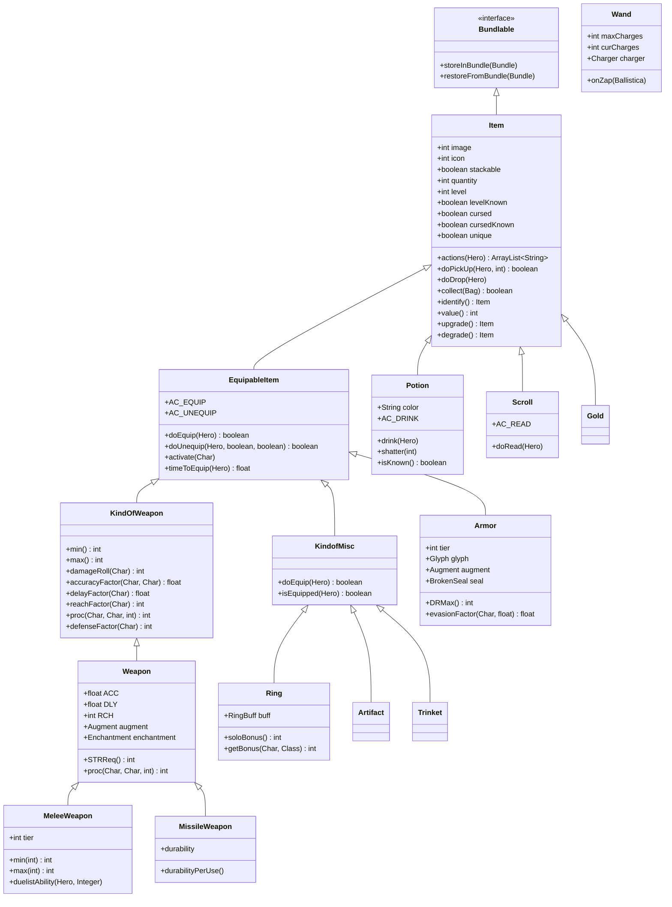

# 物品系统文档

## 概述

Shattered Pixel Dungeon 中的物品系统为管理游戏中所有可收集、可消耗和可装备的物品提供了一个全面的框架。这包括武器、护甲、药剂、卷轴、法杖、戒指、神器等。

**核心文件**: `com.shatteredpixel.shatteredpixeldungeon.items.Item`

---

## 类层次结构



---

## 物品基类

`Item` 类是游戏中所有物品的基础。

### 核心属性

| 属性 | 类型 | 描述 |
|----------|------|-------------|
| `image` | int | 可视化的精灵索引 |
| `icon` | int | 随机图像的标识符（-1 = 静态） |
| `stackable` | boolean | 物品是否在物品栏中合并 |
| `quantity` | int | 堆叠中的物品数量（默认：1） |
| `level` | int | 升级等级（私有，通过方法访问） |
| `levelKnown` | boolean | 等级是否已识别 |
| `cursed` | boolean | 物品是否被诅咒 |
| `cursedKnown` | boolean | 诅咒状态是否已识别 |
| `unique` | boolean | 在复活后是否保留 |
| `bones` | boolean | 是否可以出现在英雄的遗骸中 |

### 标准行动

```java
public static final String AC_DROP = "DROP";   // 丢弃物品
public static final String AC_THROW = "THROW"; // 投掷物品
```

### 关键方法

```java
// 捡起和收集
public boolean doPickUp(Hero hero, int pos);
public boolean collect(Bag container);
public Item detach(Bag container);
public Item split(int amount);

// 等级管理
public int level();           // 带修正的当前等级
public int trueLevel();       // 原始等级值
public int buffedLvl();       // 带临时增益/减益状态的等级
public Item upgrade();        // 等级增加 1
public Item degrade();        // 等级减少 1

// 识别
public boolean isIdentified();
public Item identify(boolean byHero);

// 价值
public int value();           // 金币价值
public int energyVal();       // 能量水晶价值
```

---

## 生成器系统

`Generator` 类使用基于卡组的概率系统为物品创建提供了工厂模式。

### 类别枚举

```java
public enum Category {
    TRINKET  ( 0, 0, Trinket.class),
    WEAPON   ( 2, 2, MeleeWeapon.class),
    ARMOR    ( 2, 1, Armor.class),
    MISSILE  ( 1, 2, MissileWeapon.class),
    WAND     ( 1, 1, Wand.class),
    RING     ( 1, 0, Ring.class),
    ARTIFACT ( 0, 1, Artifact.class),
    FOOD     ( 0, 0, Food.class),
    POTION   ( 8, 8, Potion.class),
    SEED     ( 1, 1, Plant.Seed.class),
    SCROLL   ( 8, 8, Scroll.class),
    STONE    ( 1, 1, Runestone.class),
    GOLD     (10, 10, Gold.class);
}
```

### 按楼层集的等级分布

```java
// 武器/护甲等级按楼层集的概率百分比
private static final float[][] floorSetTierProbs = new float[][] {
    {0, 75, 20,  4,  1},   // 楼层集 1（楼层 1-5）
    {0, 25, 50, 20,  5},   // 楼层集 2（楼层 6-10）
    {0,  0, 40, 50, 10},   // 楼层集 3（楼层 11-15）
    {0,  0, 20, 40, 40},   // 楼层集 4（楼层 16-20）
    {0,  0,  0, 20, 80}    // 楼层集 5（楼层 21-25）
};
```

### 生成方法

```java
// 从任何类别生成随机物品
public static Item random();

// 从特定类别生成
public static Item random(Category cat);

// 特定类别的生成
public static Armor randomArmor(int floorSet);
public static MeleeWeapon randomWeapon(int floorSet);
public static MissileWeapon randomMissile(int floorSet);
public static Artifact randomArtifact();  // 强制唯一性
```

---

## 武器

位于 `items.weapon/` - 30+种近战武器分布在 5 个等级。

### 近战武器等级

| 等级 | 力量需求 | 基础伤害 | 武器 |
|------|---------|-------------|---------|
| 1 | 10 | 1-10 | 破旧短剑、匕首、手套、细剑、短棒、法师权杖 |
| 2 | 12 | 2-15 | 短剑、手斧、长矛、短柄斧、德克弯刀、镰刀 |
| 3 | 14 | 3-20 | 剑、钉头锤、弯刀、圆盾、叉指拳刃、鞭子 |
| 4 | 16 | 4-25 | 长剑、战斧、连枷、符文剑、刺客之刃、十字弩、武士刀 |
| 5 | 18 | 5-30 | 大剑、战锤、戟、巨斧、大盾、拳套、战争镰刀 |

### 伤害公式

```java
// 近战武器伤害计算
public int min(int lvl) {
    return tier + lvl;    // 基础 + 等级缩放
}

public int max(int lvl) {
    return 5 * (tier + 1) + lvl * (tier + 1);  // 基础 + 等级缩放
}
```

### 力量需求公式

```java
// 力量需求在 +1、+3、+6、+10 等时减少
protected static int STRReq(int tier, int lvl) {
    lvl = Math.max(0, lvl);
    return (8 + tier * 2) - (int)(Math.sqrt(8 * lvl + 1) - 1) / 2;
}
```

### 强化

```java
public enum Augment {
    SPEED   (0.7f, 2/3f),   // -30% 伤害，-33% 延迟
    DAMAGE  (1.5f, 5/3f),   // +50% 伤害，+67% 延迟
    NONE    (1.0f, 1.0f);   // 正常
}
```

---

## 投掷武器

位于 `items.weapon.missiles/` - 15+种投掷武器具有耐久度。

### 投掷武器等级

| 等级 | 武器 |
|------|---------|
| 1 | 投石、投掷小刀、投掷尖刺、飞镖 |
| 2 | 钓鱼矛、投掷棒、手里剑 |
| 3 | 投掷矛、苦无、流星锤 |
| 4 | 标枪、战斧、重型回旋镖 |
| 5 | 三叉戟、投掷锤、力量立方 |

### 特殊类型
- **带毒飞镖**: 12 种变体带有状态效果（中毒、麻痹、燃烧等）
- **耐久度系统**: 投掷武器会随着使用而磨损

---

## 护甲

位于 `items.armor/` - 5 种标准护甲加上 6 种职业专属护甲。

### 标准护甲等级

| 护甲 | 等级 | 基础 DR | 力量需求 |
|-------|------|---------|---------|
| 布甲 | 1 | 2 | 10 |
| 皮甲 | 2 | 4 | 12 |
| 链甲 | 3 | 6 | 14 |
| 鳞甲 | 4 | 8 | 16 |
| 板甲 | 5 | 10 | 18 |

### 伤害减免公式

```java
public int DRMax(int lvl) {
    int max = tier * (2 + lvl) + augment.defenseFactor(lvl);
    if (lvl > max) {
        return ((lvl - max) + 1) / 2;  // 边际收益递减
    }
    return max;
}
```

### 职业护甲

| 职业 | 护甲 | 特殊能力 |
|-------|-------|-----------------|
| 战士 | 战士护甲 | 盾牌猛击 |
| 法师 | 法师护甲 | 元素攻击 |
| 盗贼 | 盗贼护甲 | 影子分身 |
| 女猎手 | 女猎手护甲 | 精灵弓增强 |
| 决斗者 | 决斗者护甲 | 武器能力刷新 |
| 牧师 | 牧师护甲 | 治疗光环 |

### 护甲强化

```java
public enum Augment {
    EVASION (+2 闪避, -1 防御),
    DEFENSE (-2 闪避, +1 防御),
    NONE    (无变化);
}
```

---

## 附魔系统

武器可以拥有附魔，在命中时提供特殊效果。

### 附魔稀有度

| 稀有度 | 附魔 | 概率 |
|--------|--------------|--------|
| 普通 | Blazing（燃烧）、Chilling（冰霜）、Kinetic（动能）、Shocking（电击） | 50%（每种 12.5%） |
| 不常见 | Blocking（格挡）、Blooming（绽放）、Elastic（弹性）、Lucky（幸运）、Projecting（投射）、Unstable（不稳定） | 40%（每种 6.67%） |
| 稀有 | Corrupting（腐化）、Grim（凶兆）、Vampiric（吸血） | 10%（每种 3.33%） |

### 附魔列表

| 附魔 | 效果 |
|-------------|--------|
| Blazing | 火焰伤害，点燃敌人 |
| Chilling | 寒冷伤害，减慢敌人 |
| Kinetic | 命中失败时储存伤害 |
| Shocking | 闪电伤害，连锁 |
| Blocking | 命中时提供护盾 |
| Blooming | 命中时生成植物 |
| Elastic | 命中时击退 |
| Lucky | 双倍战利品几率 |
| Projecting | 延伸攻击范围 |
| Unstable | 随机附魔效果 |
| Corrupting | 有机会使敌人成为盟友 |
| Grim | 有机会立即杀死 |
| Vampiric | 命中时治疗 |

### 附魔接口

```java
public static abstract class Enchantment implements Bundlable {
    public abstract int proc(Weapon weapon, Char attacker, Char defender, int damage);
    public boolean curse() { return false; }
    public abstract ItemSprite.Glowing glowing();
}
```

---

## 刻印系统

护甲可以拥有刻印，提供防御效果。

### 刻印稀有度

| 稀有度 | 刻印 | 概率 |
|--------|--------|--------|
| 普通 | Obfuscation（隐蔽）、Swiftness（迅捷）、Viscosity（粘滞）、Potential（潜能） | 50%（每种 12.5%） |
| 不常见 | Brimstone（硫磺）、Stone（石化）、Entanglement（缠绕）、Repulsion（排斥）、Camouflage（伪装）、Flow（流动） | 40%（每种 6.67%） |
| 稀有 | Affection（亲和）、AntiMagic（反魔法）、Thorns（荆棘） | 10%（每种 3.33%） |

### 刻印列表

| 刻印 | 效果 |
|-------|--------|
| Obfuscation | 额外闪避 |
| Swiftness | 不攻击时移动速度 |
| Viscosity | 延迟伤害随时间生效 |
| Potential | 命中时充能法杖 |
| Brimstone | 对火焰免疫，命中时造成伤害 |
| Stone | 将伤害转化为护甲 |
| Entanglement | 命中时根固定攻击者 |
| Repulsion | 击退攻击者 |
| Camouflage | 在草丛中隐身 |
| Flow | 在水中移动速度 |
| Affection | 迷惑攻击者 |
| AntiMagic | 减少魔法伤害 |
| Thorns | 伤害攻击者 |

---

## 诅咒系统

### 武器诅咒

位于 `items.weapon.curses/` - 8 种诅咒类型。

| 诅咒 | 效果 |
|-------|--------|
| Annoying | 大喊，警觉敌人 |
| Displacing | 随机传送目标 |
| Dazzling | 命中时使使用者失明 |
| Explosive | 命中时爆炸（伤害使用者） |
| Sacrificial | 攻击时伤害使用者 |
| Wayward | -80% 准确率 |
| Polarized | 50% 几率为 0 或双倍伤害 |
| Friendly | 有时治疗敌人 |

### 护甲诅咒

位于 `items.armor.curses/` - 8 种诅咒类型。

| 诅咒 | 效果 |
|-------|--------|
| AntiEntropy | 命中时灼烧使用者 |
| Corrosion | 释放腐蚀性气体 |
| Displacement | 命中时随机传送 |
| Metabolism | 为护盾消耗饥饿值 |
| Multiplicity | 生成镜像分身 |
| Overgrowth | 生成随机植物 |
| Stench | 释放有毒气体 |
| Bulk | 无法通过狭窄空间 |

### 诅咒生成

```java
// 武器/护甲有 30% 的诅咒几率
if (Random.Float() < 0.3f * ParchmentScrap.curseChanceMultiplier()) {
    enchant(Enchantment.randomCurse());
    cursed = true;
}

// 升级时有 33% 的几率移除诅咒
if (hasCurseEnchant() && Random.Int(3) == 0) {
    enchant(null);
}
```

---

## 药剂

位于 `items.potions/` - 12 种标准 + 13 种异域变体。

### 标准药剂

| 药剂 | 效果 |
|--------|--------|
| Healing | 恢复生命值 |
| Strength | +1 力量 |
| Experience | 获得经验值 |
| Invisibility | 变得隐身 |
| Haste | 移动更快 |
| Levitation | 悬浮越过地形 |
| Mind Vision | 看穿墙壁 |
| Frost | 冻结区域（投掷） |
| Liquid Flame | 火焰伤害（投掷） |
| Toxic Gas | 毒气云（投掷） |
| Paralytic Gas | 瘫痪区域（投掷） |
| Purity | 清除毒气云 |

### 药剂系统

- **颜色系统**: 每种药剂在每次游戏中都有随机颜色
- **识别**: 使用药剂时识别
- **异域变体**: 通过炼金术获得的增强版本
- **酿造**: 区域效果药剂（7 种类型）
- **灵药**: 赋予增益/减益状态的药剂（8 种类型）

---

## 卷轴

位于 `items.scrolls/` - 12 种标准 + 14 种异域变体。

### 标准卷轴

| 卷轴 | 效果 |
|--------|--------|
| Upgrade | 物品 +1 等级 |
| Identify | 揭示所有物品属性 |
| Remove Curse | 净化被诅咒的物品 |
| Teleportation | 随机传送 |
| Magic Mapping | 揭示关卡布局 |
| Mirror Image | 创建诱饵 |
| Lullaby | 使附近敌人睡眠 |
| Rage | 激怒附近敌人 |
| Recharging | 充能法杖 |
| Retribution | 伤害所有可见敌人 |
| Terror | 恐吓附近敌人 |
| Transmutation | 改变物品类型 |

---

## 法杖

位于 `items.wands/` - 13 种类型具有充能机制。

### 法杖类型

| 法杖 | 效果 |
|------|--------|
| Magic Missile | 伤害，增强其他法杖 |
| Lightning | 连锁闪电 |
| Fireblast | 火焰锥形 |
| Frost | 冻结和减速 |
| Disintegration | 穿透光束 |
| Corrosion | 酸液喷射 |
| Corruption | 转换敌人 |
| Blast Wave | 击退 |
| Living Earth | 创造守护者 |
| Prismatic Light | 光伤害，揭示 |
| Warding | 创造哨兵 |
| Transfusion | 治疗盟友 |
| Regrowth | 生长植物 |

### 法杖机制

```java
public abstract class Wand extends Item {
    public int maxCharges = initialCharges();  // 基础：2
    public int curCharges;
    public float partialCharge;
    
    public abstract void onZap(Ballistica attack);
    public abstract void onHit(MagesStaff staff, Char attacker, Char defender, int damage);
    
    public int initialCharges() { return 2; }
    protected int chargesPerCast() { return 1; }
    
    // 充能随等级增加
    public void updateLevel() {
        maxCharges = Math.min(initialCharges() + level(), 10);
    }
}
```

---

## 戒指

位于 `items.rings/` - 12 种类型具有被动加成。

### 戒指类型

| 戒指 | 效果 |
|------|--------|
| Accuracy | +命中几率 |
| Arcana | +附魔威力 |
| Elements | +元素抗性 |
| Energy | +法杖充能速度 |
| Evasion | +闪避几率 |
| Force | +徒手伤害 |
| Furor | +攻击速度 |
| Haste | +移动速度 |
| Might | +力量 |
| Sharpshooting | +投掷武器伤害 |
| Tenacity | +低生命值时的伤害 |
| Wealth | +物品掉落 |

### 戒指加成公式

```java
public int soloBonus() {
    if (cursed) {
        return Math.min(0, Ring.this.level() - 2);  // 被诅咒：惩罚
    } else {
        return Ring.this.level() + 1;  // 正常：加成
    }
}

// 同一类型的多个戒指叠加
public static int getBonus(Char target, Class<? extends RingBuff> type) {
    int bonus = 0;
    for (RingBuff buff : target.buffs(type)) {
        bonus += buff.level();
    }
    return bonus;
}
```

---

## 神器

位于 `items.artifacts/` - 13 件独特物品具有特殊机制。

### 神器列表

| 神器 | 能力 |
|----------|---------|
| Alchemist's Toolkit | 炼金术加成 |
| Chalice of Blood | 生命值再生（消耗经验值） |
| Cloak of Shadows | 隐身 |
| Dried Rose | 召唤盟友 |
| Ethereal Chains | 拉拽/推动效果 |
| Holy Tome | 治疗法术 |
| Horn of Plenty | 生成食物 |
| Master Thieves' Armband | 潜行和偷窃 |
| Sandals of Nature | 植物加成 |
| Skeleton Key | 打开门 |
| Talisman of Foresight | 揭示秘密 |
| Timekeeper's Hourglass | 时间停止 |
| Unstable Spellbook | 随机卷轴 |

---

## 饰品

位于 `items.trinkets/` - 17 件独特物品具有被动效果。

### 示例饰品

| 饰品 | 效果 |
|---------|--------|
| Rat Skull | 更多怪物生成 |
| Parchment Scrap | 更多附魔/诅咒 |
| Petrified Seed | 更多种子 |
| Exotic Crystals | 异域消耗品几率 |
| Mossy Clump | 更多草丛 |
| Dimensional Sundial | 昼夜效果 |
| Thirteen Leaf Clover | 幸运修正 |
| Trap Mechanism | 陷阱效率 |
| Mimic Tooth | 模仿者生成 |
| Wondrous Resin | 被诅咒法杖效果 |
| Eye of Newt | 更好视野 |
| Salt Cube | 食物效率 |
| Vial of Blood | 更好治疗 |
| Shard of Oblivion | 识别 |
| Chaotic Censer | 随机效果 |
| Ferret Tuft | 移动速度 |
| Cracked Spyglass | 准确率 |

---

## 物品价值

### 金币价值公式

```java
// 近战武器
public int value() {
    int price = 20 * tier;
    if (hasGoodEnchant()) price *= 1.5;
    if (cursedKnown && (cursed || hasCurseEnchant())) price /= 2;
    if (levelKnown && level() > 0) price *= (level() + 1);
    return Math.max(1, price);
}

// 护甲
public int value() {
    int price = 20 * tier;
    if (hasGoodGlyph()) price *= 1.5;
    if (cursedKnown && (cursed || hasCurseGlyph())) price /= 2;
    if (levelKnown && level() > 0) price *= (level() + 1);
    return Math.max(1, price);
}
```

### 基础价值

| 物品类型 | 基础价值 | 能量价值 |
|-----------|------------|--------------|
| 药剂 | 30 | 6 |
| 卷轴 | 40 | 8 |
| 法杖 | 75 | - |
| 戒指 | 75 | - |
| 神器 | 变化 | - |

---

## 识别系统

物品需要识别才能揭示其属性。

### 识别方法

1. **使用**: 武器、护甲、法杖通过使用识别
   - 武器: 20 次命中识别
   - 护甲: 10 次命中识别
   - 法杖: 10 次使用识别

2. **经验值**: 戒指通过获得经验值识别
   - 1 级经验值识别

3. **识别卷轴**: 立即识别

4. **学者直觉**: 天赋加速识别

### 识别字段

```java
protected int usesToID() { return 20; }        // 武器
protected float usesLeftToID = usesToID();     // 剩余使用次数
protected float availableUsesToID = usesToID()/2f;  // 可用使用次数

// 戒指识别
private float levelsToID = 1;
```

---

## 物品栏系统

`Belongings` 类管理英雄的装备槽位。

```java
public class Belongings {
    // 武器槽位（冠军可以双持）
    public KindOfWeapon weapon = null;
    public KindOfWeapon secondWep = null;
    
    // 护甲槽位
    public Armor armor = null;
    
    // 配饰槽位（从 3 个中选择 2 个）
    public Artifact artifact = null;
    public Ring ring = null;
    public KindofMisc misc = null;
    
    // 物品栏
    public Bag backpack;
}
```

### 装备限制

- **武器**: 1 件（或决斗者子职业 2 件）
- **护甲**: 1 件
- **配饰**: 2 件（从神器、戒指1、戒指2中选择）
- **背包**: 基础 19 个槽位，可通过袋子扩展

---

## 相关文件

### 基础类
- `Item.java` - 基础物品类
- `EquipableItem.java` - 可装备物品
- `KindOfWeapon.java` - 武器基础
- `KindofMisc.java` - 戒指/神器基础

### 物品类别
- `items.weapon/` - 所有武器
- `items.armor/` - 所有护甲
- `items.potions/` - 药剂、酿造、灵药
- `items.scrolls/` - 卷轴和法术
- `items.wands/` - 所有法杖
- `items.rings/` - 所有戒指
- `items.artifacts/` - 所有神器
- `items.trinkets/` - 所有饰品
- `items.food/` - 食物物品
- `items.stones/` - 符文石

### 附魔/刻印
- `items.weapon.enchantments/` - 13 种附魔
- `items.weapon.curses/` - 8 种武器诅咒
- `items.armor.glyphs/` - 13 种刻印
- `items.armor.curses/` - 8 种护甲诅咒

### 工具
- `Generator.java` - 物品工厂
- `ItemStatusHandler.java` - 药剂/卷轴/戒指的随机化
- `Heap.java` - 地面上的物品堆