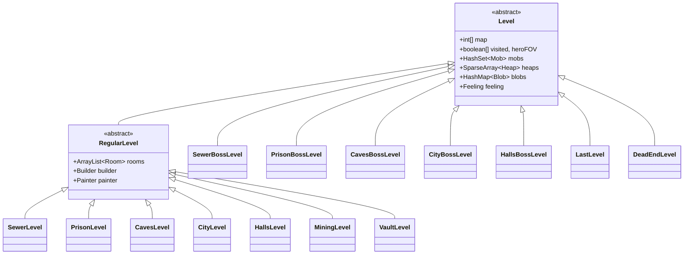
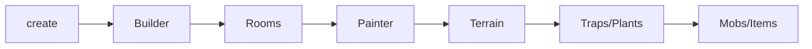
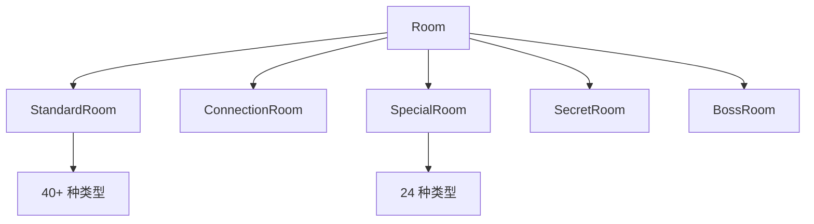
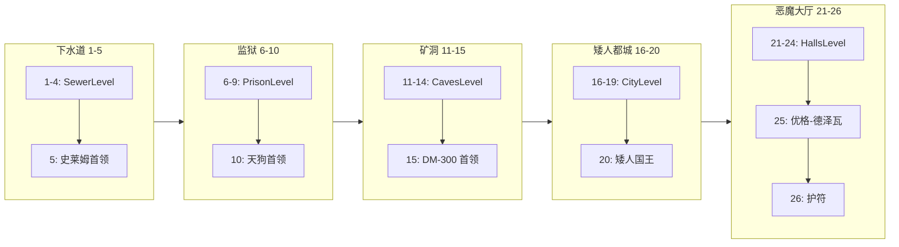

# 关卡系统文档

关卡系统处理 Shattered Pixel Dungeon 中的程序化地牢生成、地形管理和实体放置。

**源码**: `core/src/main/java/com/shatteredpixel/shatteredpixeldungeon/levels/Level.java`

---

## 类层次结构



---

## 生成管道

```
1. 构建器阶段 → 创建房间布局（基于图）
2. 绘画器阶段 → 用地形填充房间
3. 陷阱放置 → 按深度分布的 33 种陷阱类型
4. 植物放置 → 11 种植物类型
5. 怪物生成 → 按深度分布的敌人
6. 物品生成 → 生成器类
```



---

## 构建器系统

**位置**: `levels/builders/`

| 构建器 | 描述 |
|---------|-------------|
| `Builder` | 带有放置工具的抽象基类 |
| `RegularBuilder` | 标准关卡的扩展构建器 |
| `LoopBuilder` | 环形布局 |
| `LineBuilder` | 线性布局 |
| `FigureEightBuilder` | 8字形布局 |
| `BranchesBuilder` | 分支布局 |
| `GridBuilder` | 网格布局 |

```java
public abstract class Builder {
    public abstract ArrayList<Room> build(ArrayList<Room> rooms);
    protected static Rect findFreeSpace(Point start, ArrayList<Room> collision, int maxSize);
    protected static float placeRoom(ArrayList<Room> collision, Room prev, Room next, float angle);
}
```

---

## 绘画器系统

**位置**: `levels/painters/`

| 绘画器 | 关卡类型 | 主题 |
|---------|------------|-------|
| `Painter` | 基类 | 工具方法 |
| `RegularPainter` | 标准关卡 | 基础绘画 |
| `SewerPainter` | 下水道 (1-4) | 下水道主题 |
| `PrisonPainter` | 监狱 (6-9) | 监狱主题 |
| `CavesPainter` | 矿洞 (11-14) | 洞穴主题 |
| `CityPainter` | 矮人都城 (16-19) | 矮人都城 |
| `HallsPainter` | 恶魔大厅 (21-24) | 恶魔大厅 |
| `MiningLevelPainter` | 矿脉分支 | 水晶矿洞 |

```java
public abstract class Painter {
    public abstract boolean paint(Level level, ArrayList<Room> rooms);
    public static void set(Level level, int cell, int value);
    public static void fill(Level level, int x, int y, int w, int h, int value);
    public static void fillEllipse(Level level, Rect rect, int value);
    public static void fillDiamond(Level level, Rect rect, int value);
}
```

---

## 房间系统

**位置**: `levels/rooms/`



### 标准房间 (40 种类型)
`EmptyRoom`, `CaveRoom`, `HallwayRoom`, `RingRoom`, `PillarsRoom`, `StatuesRoom`, `PlatformRoom`, `ChasmRoom`, `FissureRoom`, `AquariumRoom`, `PlantsRoom`, `GrassyGraveRoom`, `LibraryHallRoom`, `RitualRoom`, `SkullsRoom`, `BurnedRoom`, `SegmentedRoom`, `SewerPipeRoom`, `CellBlockRoom`, `MinefieldRoom`, `RuinsRoom`, `StripedRoom`, `StudyRoom`, `StandardBridgeRoom`, `WaterBridgeRoom`, `ChasmBridgeRoom`, etc.

### 特殊房间 (24 种类型)
| 房间 | 用途 |
|------|---------|
| `ShopRoom` | 小鬼商人 |
| `LaboratoryRoom` | 炼金锅 |
| `LibraryRoom` | 书籍/卷轴 |
| `ArmoryRoom` | 武器 |
| `CryptRoom` | 不死生物/宝藏 |
| `GardenRoom` | 植物/种子 |
| `TreasuryRoom` | 金币/宝石 |
| `PitRoom` | 掉落挑战 |
| `MagicWellRoom` | 恢复井 |
| `PoolRoom` | 水域特色 |
| `SacrificeRoom` | 祭坛 |
| `StorageRoom` | 补给品 |
| `TrapsRoom` | 陷阱试炼 |

---

## 地形系统

**位置**: `levels/Terrain.java`

### 地形类型

| ID | 常量 | 标志 | 描述 |
|----|----------|-------|-------------|
| 0 | `CHASM` | AVOID, PIT | 无底深渊 |
| 1 | `EMPTY` | PASSABLE | 基础地板 |
| 2 | `GRASS` | PASSABLE, FLAMABLE | 草地瓦片 |
| 4 | `WALL` | LOS_BLOCKING, SOLID | 实体墙壁 |
| 5 | `DOOR` | PASSABLE, SOLID | 关闭的门 |
| 6 | `OPEN_DOOR` | PASSABLE, FLAMABLE | 打开的门 |
| 7 | `ENTRANCE` | PASSABLE | 关卡入口 |
| 8 | `EXIT` | PASSABLE | 关卡出口 |
| 10 | `LOCKED_DOOR` | SOLID | 钥匙锁定的门 |
| 15 | `HIGH_GRASS` | PASSABLE, LOS_BLOCKING | 高草 |
| 16 | `SECRET_DOOR` | SOLID, SECRET | 隐藏门 |
| 17 | `SECRET_TRAP` | PASSABLE, SECRET | 隐藏陷阱 |
| 18 | `TRAP` | AVOID | 可见陷阱 |
| 24 | `WELL` | AVOID | 水井 |
| 25 | `STATUE` | SOLID | 石像 |
| 28 | `ALCHEMY` | SOLID | 炼金锅 |
| 29 | `WATER` | PASSABLE, LIQUID | 水瓦片 |
| 31 | `CRYSTAL_DOOR` | SOLID | 水晶屏障 |

### 地形标志

| 标志 | 十六进制 | 用途 |
|------|-----|---------|
| `PASSABLE` | 0x01 | 可行走 |
| `LOS_BLOCKING` | 0x02 | 阻挡视野 |
| `FLAMABLE` | 0x04 | 可燃烧 |
| `SECRET` | 0x08 | 隐藏 |
| `SOLID` | 0x10 | 不可通过 |
| `AVOID` | 0x20 | AI 避免 |
| `LIQUID` | 0x40 | 水 |
| `PIT` | 0x80 | 深渊 |

---

## 深度结构



### 分支关卡
| 分支 | 深度 | 描述 |
|--------|--------|-------------|
| 矿脉 | 11-14 | `MiningLevel` (水晶矿洞) |
| 宝库 | 16-19 | `VaultLevel` (宝藏宝库) |

### 关卡感觉
```java
public enum Feeling {
    NONE, CHASM, WATER, GRASS, DARK, LARGE, TRAPS, SECRETS
}
```

---

## 陷阱系统

**位置**: `levels/traps/` (33 种陷阱类型)

### 伤害陷阱
`BurningTrap`, `BlazingTrap`, `ChillingTrap`, `FrostTrap`, `ShockingTrap`, `StormTrap`, `ExplosiveTrap`, `GrimTrap`, `DisintegrationTrap`, `PoisonDartTrap`, `WornDartTrap`

### 控制陷阱
`GrippingTrap`, `PitfallTrap`, `RockfallTrap`, `GeyserTrap`, `FlashingTrap`, `ConfusionTrap`, `WeakeningTrap`, `CursingTrap`

### 召唤陷阱
`AlarmTrap`, `SummoningTrap`, `GuardianTrap`, `FlockTrap`

### 移动陷阱
`TeleportationTrap`, `WarpingTrap`, `DistortionTrap`, `GatewayTrap`, `DisarmingTrap`

### 环境陷阱
`ToxicTrap`, `CorrosionTrap`, `OozeTrap`

### 特殊陷阱
`TenguDartTrap` (首领战斗), `GnollRockfallTrap` (豺狼地质法师)

---

## 关键关卡字段

```java
public abstract class Level implements Bundlable {
    // 尺寸
    protected int width, height, length;
    
    // 地图数据
    public int[] map;              // 地形 ID
    public boolean[] visited;      // 已探索瓦片
    public boolean[] heroFOV;      // 当前视野
    
    // 移动标志
    public boolean[] passable, losBlocking, flamable, solid, water, pit;
    
    // 实体
    public HashSet<Mob> mobs;
    public SparseArray<Heap> heaps;
    public HashMap<Class<? extends Blob>,Blob> blobs;
    public SparseArray<Plant> plants;
    public SparseArray<Trap> traps;
    
    // 状态
    public Feeling feeling;
    public int entrance, exit;
    public boolean locked;
}
```

---

## 使用示例

```java
Level level = Dungeon.newLevel();

// 检查地形
int terrain = level.map[cell];
if ((Terrain.flags[terrain] & Terrain.PASSABLE) != 0) {
    // 瓦片可行走
}

// 路径查找
PathFinder.setDistanceLevel(level);
int dist = PathFinder.getDistance(from, to);

// 可见性
boolean[] visible = level.heroFOV;
```

---

## 相关系统

- **行动者系统**: 实体/回合管理
- **区域效果系统**: `plants/` (11 种类型)
- **植物系统**: `actors/mobs/`
- **怪物系统**: `items/Generator.java`